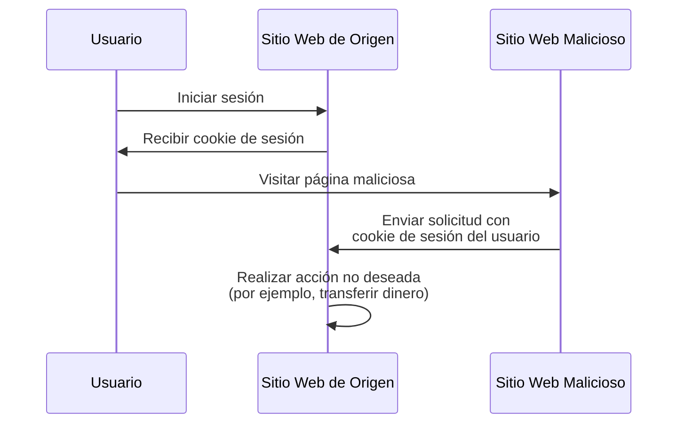

## ¿Qué es la falsificación de solicitud de sitio cruzado (CSRF)?

Al desarrollar aplicaciones web, CSRF es un término que a menudo se escucha y que genera temor entre los desarrolladores y los profesionales de seguridad. Es un tipo de ataque que engaña a los usuarios autenticados para que ejecuten acciones no deseadas en una aplicación web sin su consentimiento.

CSRF también es conocido como un "ataque de un clic" o "secuestración de sesión" porque se basa en la sesión activa del usuario para realizar acciones maliciosas.

## ¿Cómo funciona CSRF?

El ataque CSRF funciona explotando la confianza que una aplicación web tiene en el navegador del usuario. Así es como sucede típicamente:



Puedes tener algunas preguntas sobre esta secuencia. Vamos a explorar las razones detrás.

### ¿Por qué el sitio web malicioso puede enviar una solicitud al sitio web de origen?

La Política de Igual Origen (Same-Origin Policy, SOP) es una característica de seguridad en los navegadores web que restringe cómo un documento o script cargado desde un origen puede interactuar con un recurso (por ejemplo, cookies, DOM) de otro origen. Sin embargo, la SOP no impide que el navegador envíe solicitudes a otro origen.

Por lo tanto, aunque el sitio web malicioso no puede leer o modificar directamente la cookie de sesión, aún puede enviar solicitudes al sitio web de origen utilizando la sesión activa del usuario.

Podrías argumentar que la mayoría de las aplicaciones web también utilizan [CORS](https://developer.mozilla.org/en-US/docs/Web/HTTP/CORS) para prevenir solicitudes de otros orígenes no autorizadas, pero CSRF aún tiene una forma de eludirlo:

1. Ataques basados en GET: El sitio web malicioso puede engañar al usuario para que visite una URL que realiza una acción en el sitio web de origen:

    - Una redirección a `https://example.com/transfer?amount=1000&to=attacker`.
    - Una etiqueta de imagen que carga `https://example.com/transfer?amount=1000&to=attacker`.

    Esa es una razón importante por la que las solicitudes GET no deben tener efectos secundarios.

2. Ataques basados en formularios: El sitio web malicioso puede crear un formulario oculto que envía datos al sitio web de origen. Por ejemplo, una solicitud POST a `https://example.com/transfer` con campos de formulario ocultos.

### ¿Por qué el sitio web malicioso tiene la cookie de sesión del usuario?

El navegador del usuario envía automáticamente las cookies al sitio web de origen al hacer solicitudes. Así es como el sitio web de origen sabe que el usuario está autenticado y puede realizar acciones en su nombre.

De hecho, el sitio web malicioso no "tiene" la cookie de sesión; simplemente explota el comportamiento del navegador para enviar la cookie junto con la solicitud.

## ¿Cómo prevenir ataques CSRF?

Prevenir ataques CSRF requiere un enfoque en varias capas que involucra tanto al servidor como al cliente. Aquí hay algunas técnicas comunes para mitigar las vulnerabilidades de CSRF:

### Usar tokens anti-CSRF

Los tokens anti-CSRF son valores aleatorios generados por el servidor e incrustados en los formularios de la aplicación web. Cuando se envía el formulario, el servidor valida el token para asegurarse de que la solicitud sea legítima.

Por ejemplo, un campo de entrada oculto en un formulario HTML:

```html
<form action="/transfer" method="post">
  <input type="hidden" name="csrf_token" value="random_token_here" />
  <!-- Otros campos del formulario -->
  <button type="submit">Transferir</button>
</form>
```

Con este enfoque, el sitio web malicioso no puede falsificar una solicitud porque no conoce el token anti-CSRF. El parámetro `state` en <Ref slug="redirect-uri" /> es un concepto similar.

### Usar cookies SameSite

El atributo `SameSite` en las cookies puede prevenir ataques CSRF al restringir cuándo se envían las cookies al servidor:

| Valor de `SameSite` | Descripción                                                                          |
|---------------------|--------------------------------------------------------------------------------------|
| `Strict`            | Las cookies solo se envían en un contexto de primera parte.                          |
| `Lax`               | Las cookies se envían en un contexto de primera parte y con solicitudes GET de sitios externos. |
| `None`              | Las cookies se envían en todos los contextos. Requiere el atributo `Secure`.         |

Al establecer el atributo `SameSite` en `Strict` o `Lax` sin efectos secundarios en tus solicitudes GET, puedes prevenir ataques CSRF.

Además, el atributo `Secure` siempre debe establecerse para garantizar que la cookie solo se envíe a través de conexiones HTTPS.

### Verificar los encabezados

1. **Encabezado Origin**: El encabezado `Origin` es enviado por el navegador para indicar el origen de la solicitud. El servidor puede verificar este encabezado para asegurarse de que la solicitud provenga de un origen esperado.
2. **Encabezado Referer**: El encabezado `Referer` contiene la URL de la página anterior. Aunque puede ser falsificado, aún puede utilizarse como una capa adicional de protección.

<SeeAlso slugs={["authorization-code-flow", "redirect-uri"]} />

<Resources
  urls={[
    'https://blog.logto.io/csrf',
    "https://cheatsheetseries.owasp.org/cheatsheets/Cross-Site_Request_Forgery_Prevention_Cheat_Sheet.html",
  ]}
/>
