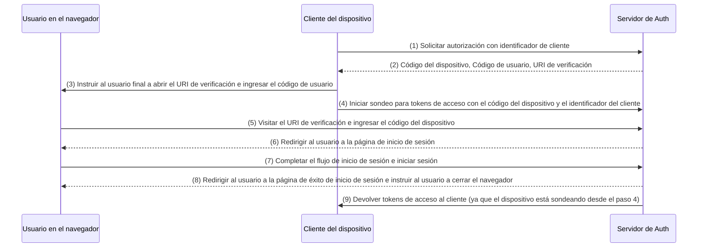

## ¿Qué es el flujo de dispositivos?

El [Flujo de autorización de dispositivos de OAuth](https://www.rfc-editor.org/rfc/rfc8628), también conocido como flujo de dispositivos, es una implementación de [OAuth 2.0](https://oauth.net/2/) diseñada para dispositivos con capacidades de entrada limitadas (por ejemplo, televisores inteligentes, dispositivos IoT, consolas de juegos) o aplicaciones sin interfaz gráfica (por ejemplo, herramientas CLI). Permite a los usuarios iniciar solicitudes de autorización en estos dispositivos y luego completar el proceso utilizando un dispositivo con más capacidades de entrada, como un teléfono inteligente o un ordenador portátil.

## ¿Cuándo usar el flujo de dispositivos?

1. **Dispositivos con restricciones de entrada**
    - Iniciar sesión en televisores inteligentes (por ejemplo, aplicaciones de medios)
    - Iniciar sesión en consolas de juegos (por ejemplo, sistemas de juegos o aplicaciones de medios)
    - Iniciar sesión en dispositivos de reunión (por ejemplo, aplicaciones oficiales o aplicaciones de videoconferencias)
    - Iniciar sesión en dispositivos portátiles (por ejemplo, relojes inteligentes con entrada limitada)
    - Acceso a dispositivos IoT (por ejemplo, impresoras, codificadores de video o altavoces)
2. **Aplicaciones sin interfaz gráfica**
    - Inicio de sesión en línea de comandos (por ejemplo, CLI de GitHub o CLI de Stripe)
3. **Inicio de sesión con código QR para aplicaciones de escritorio**
    - Iniciar sesión rápida y de forma segura en aplicaciones de escritorio escaneando un código QR con tu smartphone (por ejemplo, Telegram, Steam en el escritorio). Este flujo de inicio de sesión con código QR puede considerarse como una variante del flujo de dispositivos tradicional de OAuth 2.0.

## ¿Cómo luce el flujo de usuario final en el flujo de dispositivos?

Ignorando la variante de inicio de sesión con código QR, centrémonos en el flujo de dispositivos estándar de OAuth 2.0. Hay dos tipos de dispositivos involucrados:

### Dispositivo de visualización de código de dispositivo

Este es el dispositivo con entrada limitada o aplicación sin interfaz gráfica donde el usuario necesita autorizar el acceso. Muestra el [código de dispositivo y URI de verificación](#what-does-device-flow-workflow-look-like), guiando al usuario sobre cómo proceder.

La interfaz básica es:


Para mejorar la experiencia del usuario, los servicios a menudo generan un código QR para la URL de verificación:


Para aún más eficiencia, reemplaza el recurso del código QR en el `verification_uri` (por ejemplo, `https://example.com/device`) con `verification_uri_complete` (por ejemplo, `https://example.com/device?user_code=WDJB-MJHT`), que incluye el código del dispositivo en la URL, ayudando a los usuarios a pre-rellenar el código del dispositivo en los campos.

### Dispositivo de autorización

Siguiendo las instrucciones en el dispositivo objetivo de inicio de sesión, el usuario lo hará:

1. Usar otro dispositivo con acceso a navegador y capacidades de entrada para abrir la URL de verificación.
2. Introducir el código de dispositivo mostrado (que podría estar pre-rellenado) y continuar.
3. Si no hay sesiones existentes en el navegador, el usuario primero iniciará sesión en el servicio.
4. Una página de consentimiento invitará a los usuarios a autorizar el inicio de sesión del dispositivo.
5. Finalmente, se mostrará una página de éxito después de la autorización.

Aquí hay algunas URLs de verificación de flujo de dispositivos de productos establecidos para tus pruebas:

- Iniciar sesión en [YouTube en televisores inteligentes](https://www.youtube.com/watch?v=yTcuazSy5Cs): [youtube.com/activate](https://youtube.com/activate)
- Iniciar sesión en Disney+ en TV inteligente: [disneyplus.com/begin](https://disneyplus.com/begin)
- Iniciar sesión en [Shopify en reloj Galaxy de Samsung](https://www.drmare.com/spotify-music/spotify-on-galaxy-watch.html): [spotify.com/pair](https://spotify.com/pair)
- Iniciar sesión en [Zoom en dispositivos de reunión](https://developers.zoom.us/blog/device-authorization/): [zoom.us/oauth_device](https://zoom.us/oauth_device)
- Iniciar sesión en [GitHub CLI](https://docs.github.com/en/apps/oauth-apps/building-oauth-apps/authorizing-oauth-apps#device-flow): [github.com/login/device](https://github.com/login/device)
- Utilizar [flujo de dispositivos de Google](https://www.oauth.com/oauth2-servers/device-flow/user-flow/): https://www.google.com/device

## ¿Cómo se ve el flujo de trabajo del flujo de dispositivos?

Primero, debes entender los parámetros de respuesta de autorización de dispositivos, que se utilizan para manejar la información mostrada en el dispositivo de visualización de código de dispositivo:

| Parámetro                             | Descripción                                                                                                                                                                    |
| ------------------------------------- | ------------------------------------------------------------------------------------------------------------------------------------------------------------------------------ |
| `device_code`                         | El código de verificación del dispositivo.                                                                                                                                      |
| `user_code`                           | El código de verificación del usuario final.                                                                                                                                    |
| `verification_uri`                    | El URI de verificación del usuario final en el servidor de autorización. El URI debe ser corto y fácil de recordar, ya que se pedirá a los usuarios finales que lo escriban manualmente en su agente de usuario. |
| `verification_uri_complete` (opcional) | Un URI de verificación que incluye el "user_code" (u otra información con la misma función que el "user_code"), que está diseñado para la transmisión no textual.               |
| `expires_in`                          | La vida útil en segundos del "device_code" y "user_code".                                                                                                                      |
| `interval`                            | La cantidad mínima de tiempo en segundos que el cliente DEBE esperar entre solicitudes de sondeo al endpoint de token. Si no se proporciona ningún valor, los clientes DEBEN usar 5 como el valor predeterminado.|

```json
{
    "device_code": "GmRhmhcxhwAzkoEqiMEg_DnyEysNkuNhszIySk9eS",
    "user_code": "WDJBMJHT",
    "verification_uri": "https://custom.domain.com/device",
    "verification_uri_complete":
        "https://custom.domain.com/device?user_code=WDJB-MJHT",
    "expires_in": 900,
    "interval": 5
}
```

Cuando un usuario utiliza el flujo de dispositivos para la autenticación, incluye principalmente los siguientes pasos:



1. El cliente del dispositivo solicita autorización del servidor de auth con un identificador de cliente (generalmente el id del cliente en la plataforma del servidor de auth).
2. El servidor de auth responde al cliente del dispositivo con el código del dispositivo, el código de usuario y el URI de verificación.
3. El cliente del dispositivo muestra el URI de verificación y el código de usuario al usuario en forma de texto (o un código QR, etc.), instruyendo al usuario a visitar el URI e ingresar el código.
4. Al mismo tiempo que el paso 3, el cliente del dispositivo comienza a sondear tokens de acceso con el código del dispositivo y el identificador del cliente del servidor de auth y comienza a esperar que el usuario revise la solicitud de autorización y complete la autorización del usuario.
5. El usuario visita el URI de verificación alojado por el servidor de auth, a través de un navegador en otro dispositivo, e ingresa el código de usuario.
6. El servidor de auth redirige al usuario a la página de inicio de sesión e instruye al usuario a completar el inicio de sesión.
7. El usuario completa el flujo de inicio de sesión e inicia sesión exitosamente.
8. El servidor de auth redirige al usuario a la página de éxito de inicio de sesión e instruye al usuario a cerrar el navegador.
9. Al mismo tiempo que el paso 8, el servidor de auth devuelve tokens de acceso al cliente del dispositivo ya que el cliente ha estado sondeando desde el paso 4.

Después de estos procesos, ¡el cliente del dispositivo podrá obtener el token de acceso para servicios subsecuentes!

Para más detalles, lee [RFC 8628 OAuth 2.0 Device Authorization Grant](https://datatracker.ietf.org/doc/html/rfc8628#autoid-3).

<SeeAlso slugs={['authorization-code-flow', 'implicit-flow', 'client-credentials-flow']} />

<Resources urls={['https://blog.logto.io/a-brief-introduction-to-oauth2-device-flow', 'https://datatracker.ietf.org/doc/html/rfc8628']} />
