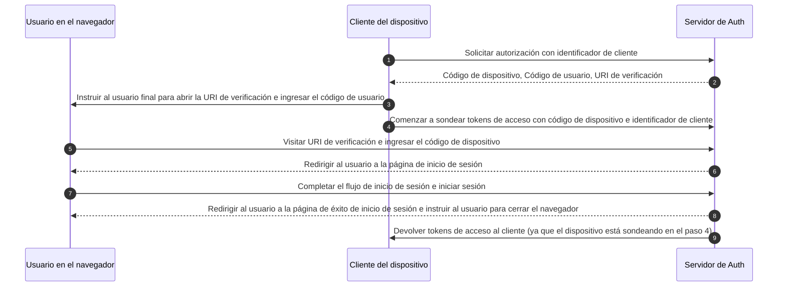

## ¿Qué es el flujo de dispositivo (device flow)?

El [Flujo de Autorización de Dispositivo de OAuth](https://www.rfc-editor.org/rfc/rfc8628), también conocido como flujo de dispositivo (device flow), es un <Ref slug="oauth-2.0-grant" /> diseñado para dispositivos con capacidades de entrada limitadas (por ejemplo, televisores inteligentes, dispositivos IoT, consolas de juegos) o aplicaciones sin interfaz (por ejemplo, herramientas CLI). Permite a los usuarios iniciar <Ref slug="authorization-request">solicitudes de autorización</Ref> en estos dispositivos y luego completar el proceso utilizando un dispositivo con más capacidad de entrada, como un teléfono inteligente o una computadora portátil.

## ¿Cuándo usar el flujo de dispositivo (device flow)?

1. **Dispositivos con restricciones de entrada**
    - Iniciar sesión en televisores inteligentes (por ejemplo, aplicaciones de medios)
    - Iniciar sesión en consolas de juegos (por ejemplo, sistema de juegos o aplicaciones de medios)
    - Iniciar sesión en dispositivos de reunión (por ejemplo, aplicaciones oficiales o aplicaciones de videoconferencia)
    - Iniciar sesión en dispositivos portátiles (por ejemplo, relojes inteligentes con entrada limitada)
    - Acceder a dispositivos IoT (por ejemplo, impresoras, codificadores de video o altavoces)
2. **Aplicaciones sin interfaz**
    - Inicio de sesión en la interfaz de línea de comandos (por ejemplo, GitHub CLI o Stripe CLI)
3. **Inicio de sesión con código QR para aplicaciones de escritorio**
    - Iniciar sesión rápida y seguramente en aplicaciones de escritorio escaneando un código QR con tu teléfono inteligente (por ejemplo, Telegram, inicios de sesión de Steam en escritorio). Este flujo de inicio de sesión con código QR puede considerarse como una variante del flujo de dispositivo tradicional de OAuth 2.0.

## ¿Cómo se ve el flujo de usuario final del flujo de dispositivo (device flow)?

Ignorando la variante de inicio de sesión con código QR, centrémonos en el flujo de dispositivo estándar de OAuth 2.0. Hay dos tipos de dispositivos involucrados:

### Dispositivo de visualización de código de dispositivo

Este es el dispositivo con entrada limitada o la aplicación sin interfaz donde el usuario necesita autorizar el acceso. Muestra el [código de dispositivo y la URI de verificación](#what-does-device-flow-workflow-look-like), guiando al usuario sobre cómo proceder.

La interfaz básica es:


Para mejorar la experiencia del usuario, los servicios a menudo generan un código QR para la URL de verificación:


Para aún más eficiencia, reemplaza el recurso del código QR en la `verification_uri` (por ejemplo, `https://example.com/device`) con `verification_uri_complete` (por ejemplo, `https://example.com/device?user_code=DSHP-SNCT`), que incluye el código de dispositivo en la URL, ayudando a los usuarios a prellenar el código de dispositivo en los campos.

### Dispositivo de autorización

Siguiendo las instrucciones en el dispositivo de destino de inicio de sesión, el usuario:

1. Usará otro dispositivo con acceso a navegador y capacidades de entrada para abrir la URL de verificación.
2. Ingresará el código de dispositivo mostrado (que podría estar prellenado) y continuará.
3. Si no hay sesiones existentes en el navegador, el usuario primero iniciará sesión en el servicio.
4. Una página de consentimiento solicitará a los usuarios que autoricen el inicio de sesión del dispositivo.
5. Finalmente, se mostrará una página de éxito después de la autorización.


Aquí hay algunas URLs de verificación de flujo de dispositivo de productos establecidos para tus pruebas:

- Iniciar sesión en [Youtube en televisores inteligentes](https://www.youtube.com/watch?v=yTcuazSy5Cs): [youtube.com/activate](https://youtube.com/activate)
- Iniciar sesión en Disney+ en TV inteligente: [disneyplus.com/begin](https://disneyplus.com/begin)
- Iniciar sesión en [Shopify en Samsun Galaxy Watch](https://www.drmare.com/spotify-music/spotify-on-galaxy-watch.html): [spotify.com/pair](https://spotify.com/pair)
- Iniciar sesión en [Zoom en dispositivos de reunión](https://developers.zoom.us/blog/device-authorization/): [zoom.us/oauth_device](https://zoom.us/oauth_device)
- Iniciar sesión en [GitHub CLI](https://docs.github.com/en/apps/oauth-apps/building-oauth-apps/authorizing-oauth-apps#device-flow): [github.com/login/device](https://github.com/login/device)
- Utilizar [flujo de dispositivo de Google](https://www.oauth.com/oauth2-servers/device-flow/user-flow/): https://www.google.com/device

## ¿Cómo se ve el flujo de trabajo del flujo de dispositivo (device flow)?

Primero, debes entender los parámetros de la respuesta de autorización de dispositivo, que se utilizan para manejar la información mostrada en el dispositivo de visualización de código de dispositivo:

| Parámetro                              | Descripción                                                                                                                                                                    |
| -------------------------------------- | ------------------------------------------------------------------------------------------------------------------------------------------------------------------------------ |
| `device_code`                          | El código de verificación del dispositivo.                                                                                                                                     |
| `user_code`                            | El código de verificación del usuario final.                                                                                                                                   |
| `verification_uri`                     | La URI de verificación del usuario final en el servidor de autorización. La URI debe ser corta y fácil de recordar, ya que se pedirá a los usuarios finales que la escriban manualmente en su agente de usuario. |
| `verification_uri_complete` (opcional) | Una URI de verificación que incluye el "user_code" (u otra información con la misma función que el "user_code"), diseñada para transmisión no textual.                          |
| `expires_in`                           | La duración en segundos del "device_code" y "user_code".                                                                                                                       |
| `interval`                             | La cantidad mínima de tiempo en segundos que el cliente DEBE esperar entre solicitudes de sondeo al endpoint de token. Si no se proporciona ningún valor, los clientes DEBEN usar 5 como valor predeterminado. |

```json
{
    "device_code": "GmRhmhcxhwAzkoEqiMEg_DnyEysNkuNhszIySk9eS",
    "user_code": "WDJBMJHT",
    "verification_uri": "https://custom.domain.com/device",
    "verification_uri_complete":
        "https://custom.domain.com/device?user_code=WDJB-MJHT",
    "expires_in": 900,
    "interval": 5
}
```

Cuando un usuario utiliza el flujo de dispositivo para la autenticación, principalmente incluye los siguientes pasos:



1. El cliente del dispositivo solicita autorización del servidor de auth con un identificador de cliente (generalmente el id del cliente en la plataforma del servidor de auth).
2. El servidor de auth responde al cliente del dispositivo con código de dispositivo, código de usuario y URI de verificación.
3. El cliente del dispositivo muestra la URI de verificación y el código de usuario al usuario en forma de texto (o un código QR, etc.), instruyendo al usuario para visitar la URI e ingresar el código.
4. Al mismo tiempo que el paso 3, el cliente del dispositivo comienza a sondear tokens de acceso con código de dispositivo e identificador de cliente del servidor de auth y comienza a esperar que el usuario revise la <Ref slug="authorization-request" /> y complete la autorización del usuario.
5. El usuario visita la URI de verificación alojada por el servidor de auth, a través de un navegador en otro dispositivo, e ingresa el código de usuario.
6. El servidor de auth redirige al usuario a la página de inicio de sesión e instruye al usuario para completar el inicio de sesión.
7. El usuario completa el flujo de inicio de sesión e inicia sesión con éxito.
8. El servidor de auth redirige al usuario a la página de éxito de inicio de sesión e instruye al usuario para cerrar el navegador.
9. Al mismo tiempo que el paso 8, el servidor de auth devuelve tokens de acceso al cliente del dispositivo ya que el cliente ha estado sondeando desde el paso 4.

Después de estos procesos, el cliente del dispositivo podrá obtener el <Ref slug="access-token" /> para servicios posteriores.

Para más detalles, lee [RFC 8628 OAuth 2.0 Device Authorization Grant](https://datatracker.ietf.org/doc/html/rfc8628#autoid-3).

## ¿Cuáles son las consideraciones de seguridad para el flujo de dispositivo (device flow)?

El flujo de dispositivo involucra interacción entre dos dispositivos, exponiéndolo a posibles riesgos de seguridad como la exposición del código de dispositivo, ataques de fuerza bruta o ataques de intermediario (MitM).

Aunque obtener un código de dispositivo por sí solo no otorga autorización inmediatamente (ya que el usuario aún debe autenticarse y autorizar), un atacante podría intentar reproducir una solicitud de código de dispositivo durante su período de validez. Esto podría resultar en acceso repetido no autorizado. Para mejorar la seguridad, considera las siguientes precauciones:

- **Acortar la duración de `expires_in`:** Reduce la ventana de oportunidad para ataques minimizando el período de validez del código de dispositivo.
- **Limitar intentos fallidos:** Restringe el número de entradas de código incorrectas para prevenir ataques de fuerza bruta.
- **Imponer HTTPS:** Asegúrate de que toda la comunicación entre el dispositivo y el servidor de autorización esté cifrada usando HTTPS para prevenir ataques de intermediario.
- **Limitar códigos de dispositivo de un solo uso:** Restringe cada código de dispositivo a **una sola sesión** para prevenir su reutilización por partes no autorizadas.

Ten en cuenta que el uso único para códigos de dispositivo no es un requisito incorporado del Flujo de Dispositivo de OAuth 2.0. Es una práctica recomendada opcional. Algunos desarrolladores pueden diseñar intencionalmente autorizaciones de dispositivo concurrentes con el mismo código (por ejemplo, en cientos de dispositivos), pero este enfoque aumenta los riesgos de seguridad y debe evaluarse cuidadosamente.

## ¿Los proveedores de OIDC soportan el flujo de dispositivo (device flow)?

Aunque el flujo de dispositivo está tradicionalmente asociado con OAuth, los proveedores de <Ref slug="openid-connect" /> también pueden soportarlo. OIDC ofrece ventajas adicionales más allá del enfoque principal de OAuth en la autorización. Se extiende a la autenticación, permitiendo a las aplicaciones obtener tanto <Ref slug="access-token" /> como <Ref slug="id-token" /> en un solo flujo.

La gestión de identidad unificada y robusta de OIDC, incluyendo la validación de tokens y <Ref slug="refresh-token">actualización</Ref>, lo hace bien adecuado para <Ref slug="authentication" /> y <Ref slug="authorization" /> seguras y confiables entre dispositivos y aplicaciones, particularmente aquellas con capacidades de entrada limitadas.

<SeeAlso slugs={['oauth-2.0-grant', 'authorization-code-flow', 'implicit-flow', 'client-credentials-flow']} />

<Resources urls={['https://blog.logto.io/a-brief-introduction-to-oauth2-device-flow', 'https://datatracker.ietf.org/doc/html/rfc8628']} />