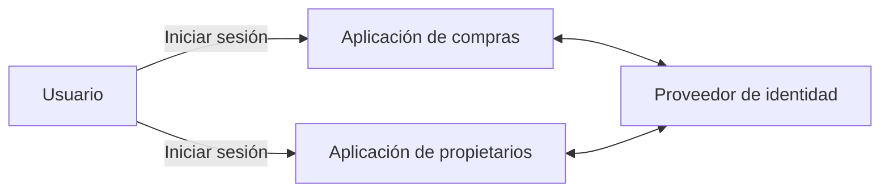
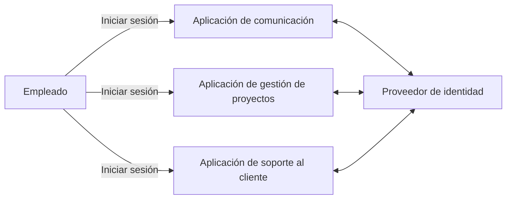
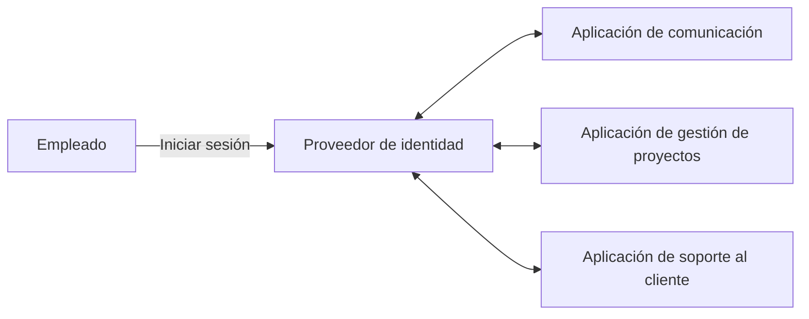
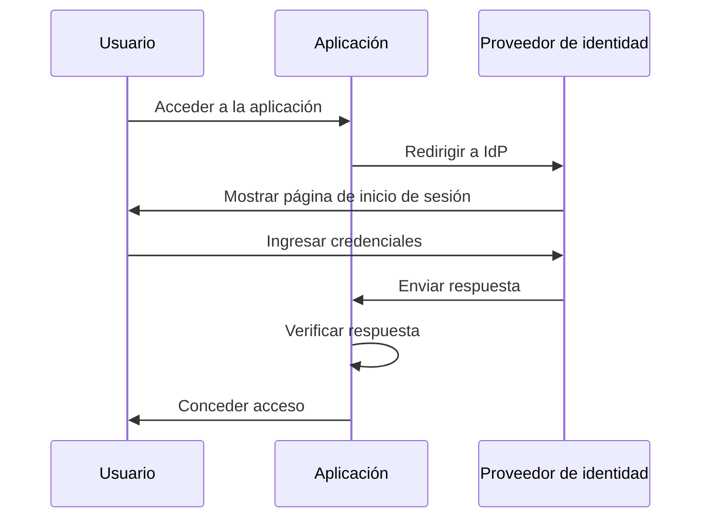
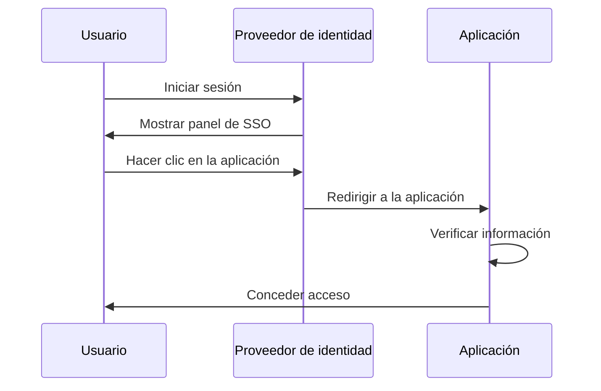
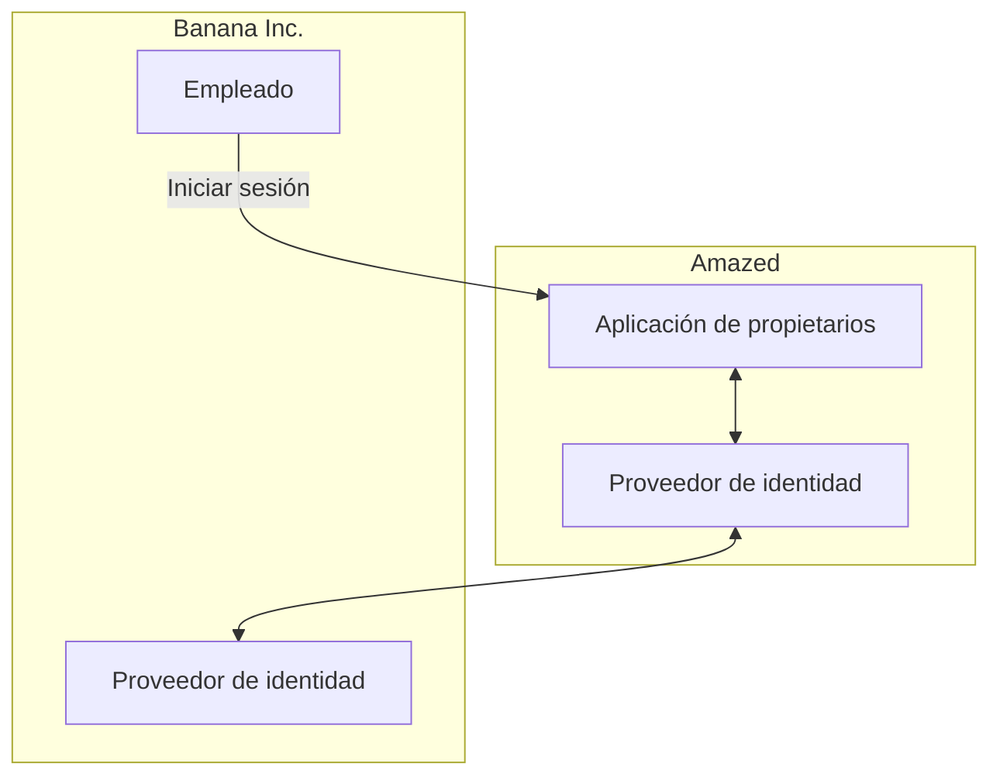

## ¿Qué es el Enterprise SSO?

Antes de profundizar en la definición, es importante aclarar la diferencia entre SSO y Enterprise SSO, ya que esto puede causar confusión con frecuencia.

- <Ref slug="single-sign-on" /> es un término general que se refiere a la capacidad de un usuario de iniciar sesión una vez y acceder a múltiples aplicaciones o recursos sin necesidad de iniciar sesión nuevamente.
- El Enterprise SSO es un tipo específico de SSO diseñado para empleados dentro de una organización.

¿Todavía no estás seguro? Veamos un ejemplo:

Un sitio web de compras en línea llamado _Amazed_ tiene dos aplicaciones web: una para clientes y otra para propietarios de tiendas. Los clientes inician sesión en la aplicación de compras para comprar productos, mientras que los propietarios de tiendas inician sesión en la aplicación de propietarios para administrar sus tiendas. Ambas aplicaciones utilizan el mismo proveedor de identidad para la autenticación. Como resultado, los usuarios solo necesitan iniciar sesión una vez para acceder a ambas aplicaciones, proporcionando una experiencia de inicio de sesión único.

Internamente, _Amazed_ utiliza múltiples aplicaciones para la comunicación del equipo, la gestión de proyectos y el soporte al cliente. Para agilizar el flujo de trabajo diario, _Amazed_ implementa el SSO empresarial para sus empleados. Con el SSO empresarial, los empleados pueden acceder a todas las aplicaciones internas con un solo inicio de sesión.

Típicamente, las soluciones de SSO empresarial también proporcionan un panel centralizado para que los empleados accedan a todas las aplicaciones con un solo clic. Este panel a menudo se denomina panel de SSO.

En resumen, ambos escenarios son ejemplos de inicio de sesión único. La diferencia es que el primer ejemplo es un SSO genérico, mientras que el segundo es SSO empresarial. Estos son casos de uso típicos para IAM del cliente (Gestión de Identidad y Acceso) y IAM de la fuerza laboral, respectivamente.

## ¿Cómo funciona el Enterprise SSO?

El Enterprise SSO funciona conectando múltiples aplicaciones a un proveedor de identidad centralizado. La conexión puede ser unidireccional (de la aplicación al proveedor de identidad) o bidireccional (entre la aplicación y el proveedor de identidad). Se utilizan varios estándares y protocolos, como SAML, OpenID Connect y OAuth 2.0, para estas conexiones.

Independientemente del protocolo, el flujo de trabajo básico suele ser similar:

1. El usuario accede a una aplicación (por ejemplo, la aplicación de comunicación) que requiere autenticación.
2. La aplicación redirige al usuario al proveedor de identidad para autenticarse.
3. El usuario inicia sesión en el proveedor de identidad.
4. El proveedor de identidad envía una respuesta de autenticación de vuelta a la aplicación.
5. La aplicación verifica la respuesta y le concede al usuario acceso.

Cuando el usuario accede a otra aplicación (por ejemplo, la aplicación de gestión de proyectos) conectada al mismo proveedor de identidad, se inicia sesión automáticamente sin necesidad de ingresar sus credenciales nuevamente. En este caso, se omite el paso 3, y dado que los pasos 2, 4 y 5 ocurren en segundo plano, el usuario puede ni siquiera notar el proceso de autenticación.

Este proceso se llama SSO iniciado por el proveedor de servicios (SP), donde la aplicación (SP) inicia el proceso de autenticación.

En otro escenario, el proveedor de identidad proporciona un panel centralizado para que los usuarios accedan a todas las aplicaciones conectadas. Un flujo de trabajo simplificado es:

1. El usuario inicia sesión en el proveedor de identidad.
2. El proveedor de identidad muestra una lista de aplicaciones a las que el usuario puede acceder.
3. El usuario hace clic en una aplicación (por ejemplo, la aplicación de soporte al cliente) para acceder a ella.
4. El proveedor de identidad redirige al usuario a la aplicación con la información de autenticación.
5. La aplicación verifica la información y le concede al usuario acceso.

Este proceso se llama SSO iniciado por el proveedor de identidad (IdP), donde el proveedor de identidad (IdP) inicia el proceso de autenticación.

## ¿Por qué es importante el Enterprise SSO?

### Enterprise SSO en la IAM de la fuerza laboral

#### Gestión centralizada

El beneficio principal del SSO empresarial no es solo la conveniencia para los empleados, sino también la mejora de la seguridad y el cumplimiento para las organizaciones. En lugar de gestionar múltiples credenciales para diferentes aplicaciones y configurar la autenticación y autorización por separado para cada una, las organizaciones pueden centralizar la gestión de identidades de usuarios, políticas de control de acceso y registros de auditoría.

Por ejemplo, cuando un empleado deja la empresa, el departamento de TI puede desactivar la cuenta del empleado en el proveedor de identidad, revocando inmediatamente el acceso a todas las aplicaciones. Esto es crucial para prevenir el acceso no autorizado y los incidentes de seguridad, un proceso conocido como gestión del ciclo de vida.

#### Control de acceso

Las soluciones de SSO empresarial a menudo incluyen características de control de acceso, como el control de acceso basado en roles (RBAC) y el control de acceso basado en atributos (ABAC). Estas características permiten a las organizaciones definir políticas de acceso detalladas basadas en roles de usuario, atributos y otra información contextual, asegurando que los empleados tengan el nivel de acceso adecuado a los recursos correctos.

Para una comparación detallada entre RBAC y ABAC, consulta [RBAC y ABAC: Los modelos de control de acceso que debes conocer](https://blog.logto.io/rbac-and-abac).

#### Seguridad mejorada

Otro beneficio es la capacidad de imponer métodos de autenticación sólida, como la autenticación multifactor (MFA), la autenticación sin contraseña y la autenticación adaptativa, en todas las aplicaciones. Estos métodos ayudan a proteger los datos sensibles y cumplir con las normativas de la industria.

Para más información sobre MFA, consulta [Explorando MFA: Mirando la autenticación desde una perspectiva de producto](https://blog.logto.io/elaborate-mfa).

### Enterprise SSO en la IAM del cliente

El término "Enterprise SSO" también aparece en soluciones de IAM del cliente. ¿Qué significa en este contexto? Volvamos al ejemplo de _Amazed_: Algunos propietarios de tiendas están constituidos como empresas. Un propietario de tienda, _Banana Inc._, implementa el SSO empresarial para sus empleados. Como parte del acuerdo, _Banana Inc._ requiere que _Amazed_ imponga el SSO empresarial para todas las direcciones de correo electrónico de _Banana Inc._ (por ejemplo, `*@banana.com`) al acceder a la aplicación de propietarios de tiendas.

En este caso, _Amazed_ necesita integrar su proveedor de identidad con el proveedor de identidad de _Banana Inc._ para habilitar el SSO empresarial para los empleados de _Banana Inc._ Esta integración, a menudo realizada a través de protocolos estándar como SAML, OpenID Connect o OAuth, se conoce comúnmente como conexión de SSO empresarial, conector de SSO empresarial o federación de SSO.

Para una explicación detallada de la IAM del cliente, consulta la serie CIAM:

- [CIAM 101: Autenticación, Identidad, SSO](https://blog.logto.io/ciam-101-intro-authn-sso)
- [CIAM 102: Autorización y Control de Acceso Basado en Roles](https://blog.logto.io/ciam-102-authz-and-rbac)

#### Listo para la empresa

En escenarios B2B (business-to-business), el SSO empresarial es una característica imprescindible para los proveedores de SaaS como _Amazed_ para apoyar a sus clientes empresariales. No se trata solo de conveniencia; se trata de seguridad y cumplimiento para ambas partes. El SSO empresarial puede exigir que todas las identidades gestionadas por el cliente empresarial se autentiquen a través del proveedor de identidad empresarial, asegurando que la empresa mantenga el control sobre sus usuarios, datos, acceso y políticas de seguridad.

El SSO empresarial es un factor clave para lograr la _preparación empresarial_, lo que significa la capacidad de satisfacer las necesidades de los clientes empresariales. Sin embargo, la gestión de identidad y acceso, especialmente en el contexto de los clientes empresariales, es compleja y requiere una inversión significativa de tiempo, recursos y experiencia. Los proveedores de SaaS modernos a menudo eligen plataformas de IAM para manejar estas complejidades.

<SeeAlso slugs={['single-sign-on']} />