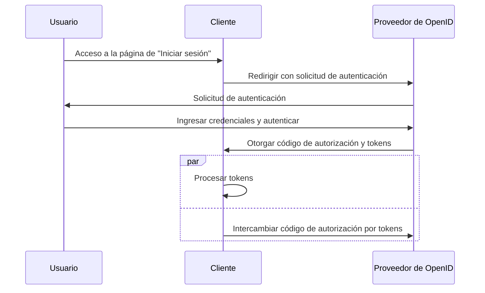

## ¿Qué es el flujo híbrido?

El flujo híbrido es un proceso de autenticación (authentication) que combina las características del <Ref slug="authorization-code-flow" /> y del <Ref slug="implicit-flow" />. Es importante destacar que el flujo híbrido no forma parte de la especificación de <Ref slug="oauth-2.0" />, sino que es una extensión proporcionada por <Ref slug="openid-connect" />.

Este flujo está diseñado para proporcionar un equilibrio entre seguridad y usabilidad para la autenticación (authentication) del usuario. Sin embargo, el flujo híbrido no es recomendado para nuevas aplicaciones debido a las [consideraciones de seguridad](#security-considerations) asociadas con el flujo implícito. Una alternativa popular al flujo híbrido es usar el flujo de código de autorización con <Ref slug="pkce" /> para una mejor seguridad.

## ¿Cómo funciona el flujo híbrido?

Estos son los pasos principales del flujo híbrido:

1. Similar a otros flujos de OIDC, el flujo híbrido comienza con el <Ref slug="client" /> iniciando una <Ref slug="authentication-request" /> al <Ref slug="openid-connect" headingId="openid-provider-op" />.

    Nota: El cliente debe incluir el parámetro `response_type` con la combinación de `code` y al menos uno de `id_token` o `token`, lo que significa que hay tres combinaciones posibles:

      - `code id_token`: El cliente espera un código de autorización y un ID token.
      - `code token`: El cliente espera un código de autorización y un access token.
      - `code id_token token`: El cliente espera un código de autorización, un ID token, y un access token.

    El requisito es autoexplicativo: el cliente espera tanto un código de autorización como uno o más tokens, que se corresponden con el flujo de código de autorización y el flujo implícito, respectivamente.
2. El usuario se autentica en el <Ref slug="openid-connect" headingId="openid-provider-op" />.
3. El <Ref slug="openid-connect" headingId="openid-provider-op" /> redirige al usuario de vuelta a la aplicación cliente con el código de autorización y los tokens solicitados.
4. La aplicación cliente procesa los tokens y puede usarlos para acceder a recursos protegidos en nombre del usuario; también puede usar el código de autorización para obtener tokens adicionales a través de la <Ref slug="token-request" />.

Aquí hay un diagrama de secuencia simplificado del flujo híbrido:



Aquí hay un ejemplo no normativo de una solicitud de autenticación de flujo híbrido:

```http
GET /authorize?response_type=code%20id_token
  &client_id=YOUR_CLIENT_ID
  &redirect_uri=https%3A%2F%2Fclient.example.com%2Fcallback
  &scope=openid%20profile%20email
  &nonce=123456
  &state=abc123 HTTP/1.1
Host: your-openid-provider.com
```

### Parámetros clave en una solicitud de autenticación de flujo híbrido

La solicitud de autenticación de flujo híbrido incluye los siguientes parámetros clave:

- **`response_type`**: El valor debe ser una combinación de `code` y al menos uno de `id_token` o `token`. Por ejemplo, `code id_token` o `code token`.
- **`client_id`**: El identificador del cliente emitido por el <Ref slug="openid-connect" headingId="openid-provider-op" /> (servidor de autorización).
- **`redirect_uri`**: La URI donde el servidor de autorización envía al usuario después del proceso de autenticación.
- **`scope`**: Los <Ref slug="scope">alcances</Ref> solicitados (permisos) para los tokens.
- **`resource`**: El parámetro opcional que especifica el <Ref slug="resource-indicator" /> para los recursos solicitados. El servidor de autorización necesita soportar [RFC 8707](https://datatracker.ietf.org/doc/html/rfc8707) para usar este parámetro.

Para la lista completa de parámetros y sus descripciones, ve [Autenticación usando el Flujo Híbrido](https://openid.net/specs/openid-connect-core-1_0.html#HybridFlowAuth).

## Consideraciones de seguridad

El flujo híbrido incluye el flujo implícito, que es conocido por sus limitaciones de seguridad. Los tokens aún se transmiten a través del canal frontal (navegador), lo que puede exponerlos a posibles ataques. El flujo implícito será obsoleto en <Ref slug="oauth-2.1" /> debido a estas preocupaciones.

El <Ref slug="authorization-code-flow" /> con <Ref slug="pkce" /> es la alternativa recomendada al flujo híbrido. Proporciona una forma más segura de autenticar (authenticate) a los usuarios sin exponer tokens en el canal frontal.

<SeeAlso slugs={["openid-connect", "oauth-2.1", "authorization-code-flow", "pkce", "implicit-flow"]} />

<Resources
  urls={[
    "https://blog.logto.io/implicit-flow-is-dead",
    "https://blog.logto.io/oauth-2-1",
    "https://openid.net/specs/openid-connect-core-1_0.html#HybridFlowAuth",
  ]}
/>
