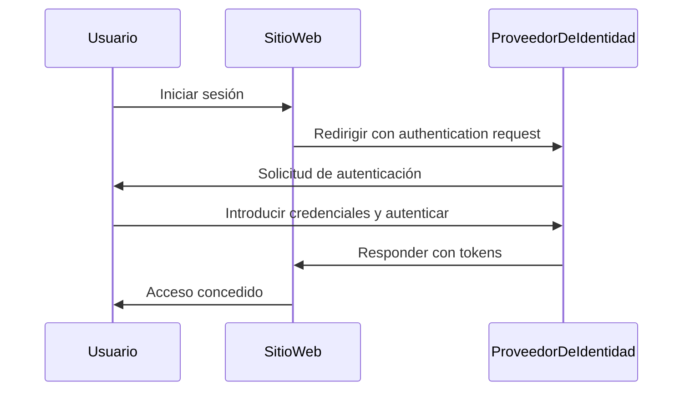

## ¿Qué es la gestión de identidades y access (IAM)?

Como sugiere la definición, la gestión de identidades y access (IAM) es un concepto amplio que involucra muchos aspectos de la gestión de identidades digitales y la realización de <Ref slug="access-control" />. Primero desglosaremos los términos:

- **Identidad**: Una representación digital de un usuario, servicio o dispositivo. Una identidad puede incluir atributos como identificadores, roles y permisos.
- **Acceso**: La capacidad de interactuar con los recursos, realizar acciones o utilizar servicios. En resumen, el acceso (access) se refiere a qué acciones realizar en ciertos recursos.

### Gestión de identidades

La gestión de identidades es el proceso de gestionar, autenticar y asegurar identidades digitales. Involucra las siguientes actividades clave:

- **Registro de identidad**: Creación de nuevas identidades para usuarios, servicios o dispositivos.
- **Autenticación de identidad**: Verificación de la propiedad de una identidad a través de varios mecanismos, como contraseñas, biometría o autenticación multifactor (MFA).
- **Seguridad de identidad**: Protección de identidades contra el acceso no autorizado, el mal uso o la divulgación.

Cada tema es vasto y puede subdividirse en subtemas como la gestión de contraseñas, la federación de identidades y la gestión del ciclo de vida de las identidades.

### Gestión de access

La gestión de access (access) (o <Ref slug="access-control" />) es el proceso de controlar quién puede realizar qué acciones en ciertos recursos. Involucra las siguientes actividades clave:

- **Políticas de control de access**: Definición de reglas y políticas que dictan quién puede acceder a qué recursos y qué acciones puede realizar.
- **Aplicación del access**: Aplicar políticas de control de access a través de mecanismos como autenticación, autorización y auditoría.
- **Gobernanza del access**: Supervisión y gestión de derechos de access para garantizar el cumplimiento de regulaciones y mejores prácticas de seguridad.

Cada actividad desempeña un papel importante en aplicaciones y sistemas modernos para asegurar que solo identidades autorizadas (usuarios, servicios o dispositivos) puedan acceder a los recursos según las políticas definidas.

## ¿Cuáles son los componentes de IAM?

En aplicación, IAM se implementa utilizando una combinación de software, servicios y mejores prácticas. Dos componentes importantes de IAM son:

- **<Ref slug="identity-provider" />**: Un servicio que gestiona las identidades de usuario y la autenticación.
- **<Ref slug="service-provider" />**: Un servicio que depende de un identity provider para la autenticación y autorización. En la mayoría de los casos, es la aplicación o servicio que estás desarrollando.

Una clara separación entre el identity provider y el service provider ayudará a desacoplar IAM de la lógica de la aplicación, facilitando su gestión y escalado.

## Gestión de identidades y access en la práctica

Veamos un ejemplo de cómo funciona IAM: cuando inicias sesión en un sitio web, el proceso de verificar quién eres y darte acceso al sitio web se puede considerar como un proceso de gestión de identidades y access.

Normalmente, el proceso de IAM involucra dos pasos principales: autenticación y autorización:

- <Ref slug="authentication" /> responde a la pregunta “¿Qué identidad posees?”
- <Ref slug="authorization" /> responde a la pregunta “¿Qué puedes hacer?”

> A veces, la autenticación se interpretará como "¿Quién eres?" Sin embargo, al discutir identidades digitales, es más preciso demostrar la autenticación como "probar la propiedad de la identidad".

Además, el concepto de gestión de identidades y access (IAM) es lo suficientemente grande como para dar lugar a nuevos conceptos, como WIAM (Workforce IAM) y CIAM (Customer IAM).

Aunque WIAM y CIAM comparten la misma base, tienen casos de uso distintos: WIAM se utiliza típicamente para usuarios internos, mientras que CIAM se utiliza para clientes externos. Algunos ejemplos:

- **WIAM**: Tu empresa tiene un sistema de identidad unificado para empleados, por lo que todos pueden usar la misma cuenta para acceder a recursos de la empresa, como suscripciones de software, servicios de computación en la nube, etc.
- **CIAM**: Tu librería en línea requiere un sistema de identidad de usuario para clientes y vendedores. La experiencia de inicio de sesión es una parte crítica del proceso de integración, ya que está ubicada en la parte superior del embudo de conversión.

Para saber más sobre el concepto de CIAM y temas relacionados, puedes referirte a [CIAM 101: Authentication, Identity, SSO](https://blog.logto.io/ciam-101-intro-authn-sso).

### Autenticación

Aquí hay algunos métodos de autenticación comunes que se utilizan en IAM:

- **Autenticación basada en contraseña**: El método más común, donde los usuarios proporcionan un nombre de usuario y una contraseña para demostrar su identidad.
- **<Ref slug="passwordless" /> authentication**: Un método que permite a los usuarios iniciar sesión sin una contraseña, como usar un código de un solo uso enviado a su correo electrónico o teléfono. Ten en cuenta que la autenticación sin contraseña puede referirse también a otros métodos, como la autenticación biométrica.
- **Inicio de sesión social**: Un método que permite a los usuarios iniciar sesión usando sus cuentas de redes sociales, como Google, Facebook o Twitter.
- **<Ref slug="passkey" /> (WebAuthn)**: Un método que permite a los usuarios iniciar sesión usando una clave de seguridad, como una llave USB o un teléfono inteligente que soporte WebAuthn.
- **Autenticación biométrica**: Un método que utiliza características físicas, como huellas dactilares, reconocimiento facial o reconocimiento de voz, para verificar la identidad de un usuario.
- **<Ref slug="machine-to-machine" /> authentication**: Un método que permite a los servicios o dispositivos autenticarse mutuamente sin intervención humana, como usar API keys o certificados.

Para una capa adicional de seguridad, <Ref slug="mfa" /> se puede utilizar en combinación con estos métodos de autenticación. MFA requiere a los usuarios proporcionar dos o más factores para demostrar su identidad, como algo que saben (contraseña), algo que tienen (clave de seguridad o <Ref slug="totp" />), o algo que son (datos biométricos).

### Autorización

Con la autenticación en su lugar, la autorización determina qué acciones puede realizar una identidad. La autorización puede basarse en varios factores, como el role de la identidad, la pertenencia a un grupo, permisos, atributos, políticas, etc. Hay varios modelos de autorización comunes:

- **<Ref slug="rbac" />**: Un modelo que asigna permisos a roles y luego asigna roles a identidades. Por ejemplo, un role de empleado podría tener acceso a ciertos recursos, mientras que un role de administrador podría tener acceso a todos los recursos.
- **<Ref slug="abac" />**: Un modelo que utiliza atributos (propiedades) de la identidad, el recurso y el entorno para tomar decisiones de control de access. Por ejemplo, una identidad con el atributo "departamento=ingeniería" podría tener access a recursos de ingeniería.
- **Control de access basado en políticas (PBAC)**: Un modelo que utiliza políticas para definir reglas de control de acceso. Las políticas pueden basarse en varios factores, como la hora del día, la ubicación, el tipo de dispositivo, etc.
- **Control de access detallado**: Un modelo que proporciona un control más granular sobre el access, permitiendo establecer permisos a nivel de recursos individuales o acciones.

## ¿Cuáles son los estándares abiertos ampliamente utilizados para IAM?

Hay varios estándares abiertos y protocolos que se utilizan ampliamente en IAM:

- **<Ref slug="oauth-2.0" />**: Un protocolo que permite a las aplicaciones acceder a recursos en nombre de un usuario sin compartir las credenciales del usuario. OAuth 2.0 se utiliza comúnmente para la autorización, como permitir a una aplicación de terceros acceder a los archivos de Google Drive de un usuario.
- **<Ref slug="openid-connect" />**: Una capa de identidad construida sobre OAuth 2.0 que permite a las aplicaciones verificar la identidad de un usuario y obtener información básica del perfil del usuario. El inicio de sesión único (SSO) es un caso de uso común de OpenID Connect. Combinar OAuth 2.0 y OpenID Connect es una práctica común para el IAM moderno.
- **<Ref slug="saml" />**: Un estándar basado en XML para intercambiar datos de autenticación y autorización entre identity providers y service providers. SAML se utiliza comúnmente para SSO en entornos empresariales.
- **SCIM (Sistema para la Gestión de Identidades entre Dominios)**: Un estándar para automatizar el intercambio de información de identidad de usuario entre identity providers y service providers. SCIM se utiliza comúnmente para la provisión y desprovisión de usuarios en aplicaciones basadas en la nube.

## ¿Cuáles son las consideraciones clave de diseño para IAM?

Al diseñar un sistema IAM, hay varias consideraciones clave a tener en cuenta:

- **Seguridad**: La seguridad es fundamental en IAM. Asegúrate de que los métodos de autenticación sigan las mejores prácticas, como el uso de hash de contraseñas fuertes, la implementación de MFA y la protección contra ataques comunes como phishing y fuerza bruta.
- **Privacidad**: Respeta la privacidad del usuario al recopilar solo la información necesaria y obtener el consentimiento del usuario cuando sea necesario.
- **Escalabilidad**: Haz que el sistema IAM sea escalable para manejar un gran número de usuarios y aplicaciones. Considera el uso de identity providers basados en la nube para la escalabilidad.
- **Interoperabilidad**: Un beneficio de usar estándares abiertos es que permite la interoperabilidad entre diferentes sistemas. Por ejemplo, la mayoría de los identity providers populares como Google, Facebook y Microsoft soportan OAuth 2.0 y OpenID Connect.
- **Experiencia de usuario**: La experiencia de usuario para la autenticación y autorización impacta significativamente en la conversión y retención de usuarios. Equilibrar la seguridad con la facilidad de uso es un arte en IAM.

<SeeAlso slugs={['openid-connect', 'oauth-2.0', 'single-sign-on', 'enterprise-sso']} />

<Resources
  urls={[
    "https://blog.logto.io/ciam-101-intro-authn-sso",
    "https://blog.logto.io/ciam-102-authz-and-rbac"
  ]}
/>
