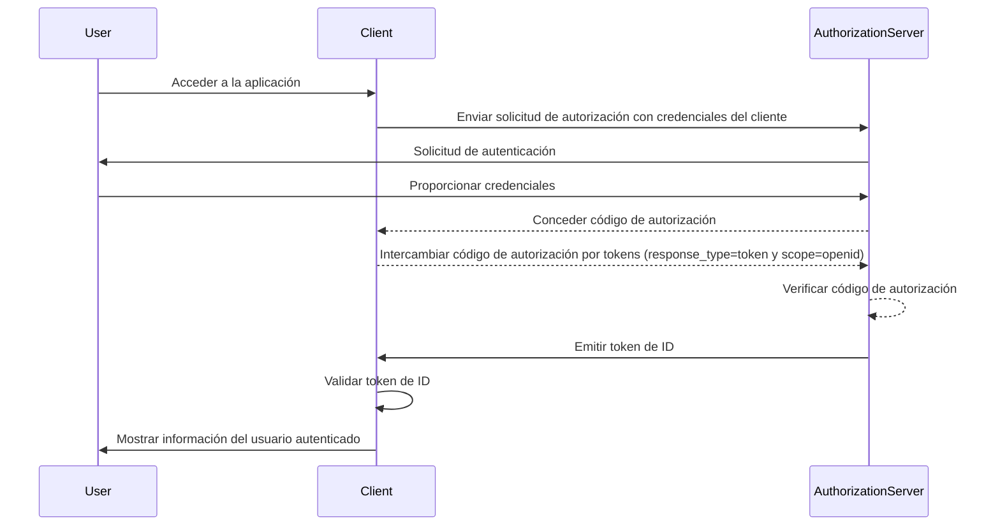

## ¿Qué es un token de ID (ID token)?

Un token de ID (ID token) es un tipo específico de token de seguridad que contiene información sobre el usuario autenticado, entregado a la aplicación cliente después de una <Ref slug="authentication" /> exitosa. El token de ID es la característica clave que distingue a <Ref slug="openid-connect" /> de <Ref slug="oauth-2.0" />. Mientras que OAuth 2.0 se centra únicamente en la autorización, OIDC se basa en él para agregar autenticación de usuario introduciendo el token de ID.

En el proceso de autenticación de OIDC, una aplicación cliente (parte confiable) inicia la autenticación redirigiendo al usuario a un servidor de autorización. Después de una autenticación exitosa, el servidor responde con un token de ID, entre otros tokens como el <Ref slug="access-token" />. El token de ID generalmente se codifica como un <Ref slug="jwt" /> e incluye claims clave como el identificador del usuario (sub), el issuer (iss), audience (aud) y otra información específica del usuario.

La función principal del token de ID es verificar la identidad del usuario y transmitir esta información a la aplicación cliente. Esto permite que la aplicación autentique al usuario sin manejar directamente las credenciales. Como el cliente solo recibe el token de ID después de que el usuario ha sido autenticado por el servidor de autorización, el token de ID puede usarse como una forma segura de verificar la identidad del usuario.

## ¿Cómo funciona el token de ID (ID token)?

La aplicación cliente inicia el proceso de autenticación redirigiendo al usuario al servidor de autorización. El usuario se autentica con el servidor, que luego emite un token de ID junto con otros tokens como el access token. El token de ID se devuelve a la aplicación cliente, que luego puede usarlo para verificar la identidad del usuario.

Dado que OIDC es un protocolo popular y estandarizado, muchas bibliotecas y frameworks ofrecen soporte integrado para manejar tokens de ID. Esto hace que los tokens de ID sean fáciles de integrar en aplicaciones cliente y ampliamente utilizados en escenarios de <Ref slug="single-sign-on" /> e identidad federada.

## Claims en un token de ID (ID token)

Un token de ID (ID token) es un JWT que contiene un conjunto de <Ref slug="claim" /> sobre el usuario autenticado. Estos claims incluyen tanto claims estándar de JWT que están definidos en la [especificación JWT](https://datatracker.ietf.org/doc/html/rfc7519#section-4), como claims específicos de OIDC que se utilizan para transmitir información de identidad del usuario.

Claims estándar de token JWT:

- **iss (Issuer)**: OBLIGATORIO. El claim del issuer identifica al issuer del token de ID. Esto es típicamente la URL del servidor de autorización que emitió el token.
- **sub (Subject)**: OBLIGATORIO. El claim del subject identifica al usuario sobre el cual trata el token de ID. Esto es típicamente un identificador único para el usuario.
- **aud (Audience)**: OBLIGATORIO. El claim del audience identifica al <Ref slug="audience" /> para el token de ID. Esto es típicamente la aplicación cliente que solicitó el token.
- **exp (Expiration time)**: OBLIGATORIO. El claim del tiempo de expiración identifica el momento en el que el token expira. Después de este tiempo, el token no debe ser aceptado para su procesamiento.
- **iat (Issued at)**: OBLIGATORIO. El claim del momento de emisión identifica el momento en el que el token fue emitido.
- **auth_time (Authentication time)**: OPCIONAL. El claim del tiempo de autenticación identifica el momento en que el usuario fue autenticado. Este claim solo está presente si el usuario fue autenticado durante la sesión actual.
- **nonce**: OPCIONAL. El claim nonce se utiliza para asociar una sesión de cliente con un token de ID. Se utiliza típicamente para prevenir ataques de repetición.

Claims estándar de información del usuario en OIDC:

- **name**: El nombre completo del usuario.
- **given_name**: El nombre de pila del usuario.
- **family_name**: El apellido del usuario.
- **middle_name**: El segundo nombre del usuario.
- **nickname**: El apodo u otro nombre corto del usuario.
- **preferred_username**: El nombre de usuario preferido del usuario.
- **profile**: Una URL que apunta a la página de perfil del usuario.
- **picture**: Una URL que apunta a la foto de perfil del usuario.
- **website**: Una URL que apunta al sitio web del usuario.
- **email**: La dirección de correo electrónico del usuario.
- **email_verified**: Un valor booleano que indica si la dirección de correo electrónico del usuario ha sido verificada.
- **gender**: El género del usuario.
- **birthdate**: La fecha de nacimiento del usuario. Representada como una cadena en el formato YYYY-MM-DD.
- **zoneinfo**: La zona horaria del usuario. Cadena del [IANA Time Zone Database](https://www.iana.org/time-zones).
- **locale**: La configuración regional del usuario. Representa el idioma y la región preferidos del usuario para formatear fechas, horas y números.
- **phone_number**: El número de teléfono del usuario.
- **phone_number_verified**: Un valor booleano que indica si el número de teléfono del usuario ha sido verificado.
- **address**: La dirección postal del usuario. El valor es un objeto JSON que contiene la información de la dirección del usuario.
- **updated_at**: El momento en que la información del usuario fue actualizada por última vez.

Estos claims proporcionan una forma estandarizada de transmitir información de identidad del usuario en el token de ID. Aunque la especificación solo define un conjunto de claims estándar, también se pueden incluir claims personalizados en el token de ID para transmitir información adicional específica del usuario según sea necesario.

## Validación del token de ID (ID token)

Cuando la aplicación cliente recibe un token de ID, debe validar el token para asegurar su autenticidad e integridad. El proceso de validación generalmente involucra los siguientes pasos:

1. **Verificar la firma**: El cliente debe verificar la firma del token de ID utilizando la clave pública del servidor de autorización. Esto asegura que el token no ha sido manipulado y fue emitido por la parte esperada.
2. **Verificar el issuer**: El cliente debe verificar que el claim `iss` en el token de ID coincida con la URL del servidor de autorización que emitió el token. Esto ayuda a prevenir ataques de sustitución de tokens.
3. **Verificar el audience**: El cliente debe verificar que el claim `aud` en el token de ID coincida con el `client_id` de la aplicación cliente. Esto asegura que el token fue emitido para la aplicación cliente.
4. **Verificar el tiempo de expiración**: El cliente debe verificar que el claim `exp` en el token de ID no haya pasado. Si el token ha expirado, no debe ser aceptado. Las implementaciones pueden proporcionar un margen para tener en cuenta la desincronización de relojes.
5. **Verificar el nonce**: Si el cliente incluyó un parámetro `nonce` en la solicitud de autenticación, debe verificar que el claim `nonce` en el token de ID coincida con el valor del parámetro `nonce`. Esto ayuda a prevenir ataques de repetición.

## Token de ID (ID token) vs token de acceso (access token)

Aunque tanto los tokens de ID como los tokens de acceso son ampliamente utilizados en OIDC, tienen diferentes propósitos y características distintas:

|              | Token de ID (ID token)                                                                 | Token de acceso (access token)                                                                                               |
| ------------ | -------------------------------------------------------------------------------------- | ---------------------------------------------------------------------------------------------------------------------------- |
| **Propósito**| Verifica la identidad del usuario y transmite información del usuario a la aplicación cliente. | Proporciona acceso a recursos protegidos en nombre del usuario.                                                               |
| **Formato**  | Típicamente un JWT que contiene claims de identidad del usuario.                        | Puede ser un JWT o un <Ref slug="opaque-token" />.                                                                            |
| **Audience** | Destinado a la aplicación cliente que solicitó el token.                                | Destinado al servidor de recursos que aloja los recursos protegidos.                                                          |
| **Duración** | Token de corta duración que típicamente es válido por unos pocos minutos. Uso único.    | Token de mayor duración que es válido por un período más largo (por ejemplo, horas). Puede reutilizarse múltiples veces dentro de su período de validez. |
| **Contenido**| Contiene información de identidad del usuario como nombre, correo electrónico y otros datos específicos del usuario. | Contiene información sobre los permisos (scopes) del usuario para recursos específicos.                                       |

## Mejores prácticas para usar tokens de ID (ID tokens)

Al trabajar con tokens de ID en OIDC, es importante seguir las mejores prácticas para asegurar la seguridad e integridad del proceso de autenticación. Algunas prácticas clave incluyen:

1. **Validar tokens de ID**: Siempre valida el token de ID recibido del servidor de autorización para asegurar su autenticidad e integridad. Esto ayuda a prevenir ataques de sustitución de tokens y acceso no autorizado.
2. **Usar canales seguros**: Asegúrate de que los tokens de ID se transmitan a través de canales seguros (por ejemplo, HTTPS) para prevenir la interceptación y manipulación.
3. **Proteger información sensible**: Dado que los JWT generalmente están codificados pero no cifrados, lo que hace que el contenido sea transparente. Evita incluir información sensible en la carga útil del token de ID para prevenir la exposición de datos sensibles en caso de fuga de tokens.
4. **No para autorización**: Los tokens de ID están destinados a la autenticación de usuario y no deben usarse para propósitos de autorización. Usa tokens de acceso para la autorización para acceder a recursos protegidos.
5. **Uso único**: Los tokens de ID generalmente están destinados a un solo uso. Una vez que una aplicación cliente ha validado un token de ID, no debe reutilizarse para solicitudes posteriores o preservación del estado de la sesión. Para mantener el estado de la sesión del usuario, las aplicaciones cliente deben emplear mecanismos como <Ref slug="refresh-token" /> y solicitudes de intercambio de tokens. (Los refresh tokens son tokens opacos de larga duración que pueden usarse para obtener nuevos tokens de acceso y tokens de ID cuando expiran.)

<SeeAlso slugs={["openid-connect", "jwt", "signing-key", "access-token"]} />