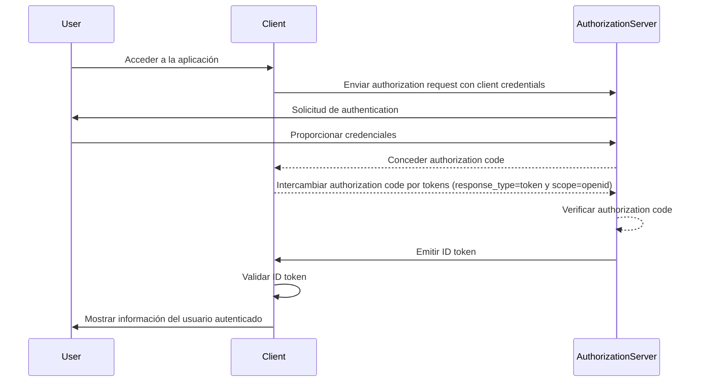

## ¿Qué es un ID token?

Un ID token es un tipo específico de token de seguridad que contiene información sobre el usuario autenticado, entregado a la aplicación cliente después de una autenticación exitosa. El ID token es la característica clave que distingue a OpenID Connect (OIDC) de OAuth 2.0. Mientras que OAuth 2.0 se centra únicamente en la authorization, OIDC se basa en él para agregar la authentication del usuario mediante la introducción del ID token.

En el proceso de authentication de OIDC, una aplicación cliente (parte confiable) inicia la authentication redireccionando al usuario a un authorization server. Después de una authentication exitosa, el servidor responde con un ID token, entre otros tokens como el access token. El ID token suele estar codificado como un JWT (JSON Web Token) e incluye claims clave como el identificador del usuario (sub), el issuer (iss), audience (aud) y otra información específica del usuario.

La función principal del ID token es verificar la identidad del usuario y transmitir esta información a la aplicación cliente. Esto permite que la aplicación autentique al usuario sin manejar directamente las credenciales. Como el cliente solo recibe el ID token después de que el usuario ha sido autenticado por el authorization server, el ID token puede utilizarse como una forma segura de verificar la identidad del usuario.

## ¿Cómo funciona un ID token?

La aplicación cliente inicia el proceso de authentication redireccionando al usuario al authorization server. El usuario se autentica con el servidor, que luego emite un ID token junto con otros tokens como el access token. El ID token se devuelve a la aplicación cliente, que luego puede usarlo para verificar la identidad del usuario.

Dado que OIDC es un protocolo popular y estandarizado, muchas bibliotecas y frameworks ofrecen soporte incorporado para manejar ID tokens. Esto hace que los ID tokens sean fáciles de integrar en aplicaciones cliente y ampliamente utilizados en escenarios de single sign-on (SSO) e identidad federada.

## Claims en un ID token

Un ID token es un JWT (JSON Web Token) que contiene un conjunto de claims sobre el usuario autenticado. Estos claims incluyen tanto claims estándar de JWT que se definen en la [especificación de JWT](https://datatracker.ietf.org/doc/html/rfc7519#section-4), como claims específicos de OIDC que se utilizan para transmitir información de identidad del usuario.

Claims de tokens estándar de JWT:

- **iss (Issuer)**: OBLIGATORIO. El issuer claim identifica al issuer del ID token. Este es típicamente la URL del authorization server que emitió el token.
- **sub (Subject)**: OBLIGATORIO. El subject claim identifica al usuario sobre el que trata el ID token. Este es típicamente un identificador único para el usuario.
- **aud (Audience)**: OBLIGATORIO. El audience claim identifica a la audience para el ID token. Este es típicamente la aplicación cliente que solicitó el token.
- **exp (Expiration time)**: OBLIGATORIO. El expiration time claim identifica el momento en que expira el token. Después de este momento, el token no debería ser aceptado para su procesamiento.
- **iat (Issued at)**: OBLIGATORIO. El issued at claim identifica el momento en que se emitió el token.
- **auth_time (Authentication time)**: OPCIONAL. El authentication time claim identifica el momento en que el usuario fue autenticado. Este claim solo está presente si el usuario fue autenticado durante la sesión actual.
- **nonce**: OPCIONAL. El nonce claim se utiliza para asociar una sesión cliente con un ID token. Se utiliza típicamente para prevenir ataques de repetición.

Claims estándar de información del usuario en OIDC:

- **name**: El nombre completo del usuario.
- **given_name**: El nombre de pila del usuario.
- **family_name**: El apellido del usuario.
- **middle_name**: El segundo nombre del usuario.
- **nickname**: El apodo u otro nombre corto del usuario.
- **preferred_username**: El nombre de usuario preferido del usuario.
- **profile**: Una URL que apunta a la página de perfil del usuario.
- **picture**: Una URL que apunta a la imagen de perfil del usuario.
- **website**: Una URL que apunta al sitio web del usuario.
- **email**: La dirección de correo electrónico del usuario.
- **email_verified**: Un valor booleano que indica si la dirección de correo electrónico del usuario ha sido verificada.
- **gender**: El género del usuario.
- **birthdate**: La fecha de nacimiento del usuario. Se representa como una cadena en el formato AAAA-MM-DD.
- **zoneinfo**: La zona horaria del usuario. Cadena del [IANA Time Zone Database](https://www.iana.org/time-zones).
- **locale**: La configuración regional del usuario. Representa el idioma y la región preferidos del usuario para formatear fechas, horas y números.
- **phone_number**: El número de teléfono del usuario.
- **phone_number_verified**: Un valor booleano que indica si el número de teléfono del usuario ha sido verificado.
- **address**: La dirección postal del usuario. El valor es un objeto JSON que contiene la información de la dirección del usuario.
- **updated_at**: El momento en que la información del usuario fue actualizada por última vez.

Estos claims proporcionan una manera estandarizada de transmitir información de identidad del usuario en el ID token. Si bien la especificación solo define un conjunto de claims estándar, también se pueden incluir claims personalizados en el ID token para transmitir información adicional específica del usuario según sea necesario.

## Validación del ID token

Cuando la aplicación cliente recibe un ID token, debe validar el token para asegurar su autenticidad e integridad. El proceso de validación generalmente implica los siguientes pasos:

1. **Verificar la firma**: El cliente debe verificar la firma del ID token utilizando la clave pública del authorization server. Esto asegura que el token no ha sido alterado y fue emitido por la parte esperada.
2. **Verificar el issuer**: El cliente debe verificar que el claim `iss` en el ID token coincida con la URL del authorization server que emitió el token. Esto ayuda a prevenir ataques de sustitución de tokens.
3. **Verificar el audience**: El cliente debe verificar que el claim `aud` en el ID token coincida con el `client_id` de la aplicación cliente. Esto asegura que el token fue emitido para la aplicación cliente.
4. **Verificar el tiempo de expiración**: El cliente debe verificar que el claim `exp` en el ID token no haya expirado. Si el token ha expirado, no debería ser aceptado. Las implementaciones pueden proporcionar un margen para tener en cuenta la desincronización del reloj.
5. **Verificar el nonce**: Si el cliente incluyó un parámetro `nonce` en el authentication request, debería verificar que el claim `nonce` en el ID token coincida con el valor del parámetro `nonce`. Esto ayuda a prevenir ataques de repetición.

## ID token vs access token

Mientras que ambos ID tokens y access tokens se utilizan ampliamente en OIDC, sirven para propósitos diferentes y tienen características distintas:

|              | ID token                                                                               | Access token                                                                                                                 |
| ------------ | -------------------------------------------------------------------------------------- | ---------------------------------------------------------------------------------------------------------------------------- |
| **Propósito**  | Verifica la identidad del usuario y transmite información del usuario a la aplicación cliente. | Proporciona acceso a recursos protegidos en nombre del usuario.                                                               |
| **Formato**   | Típicamente un JWT que contiene claims de identidad del usuario.                      | Puede ser un JWT o un opaque token (cadena aleatoria).                                                                         |
| **Audience** | Destinado a la aplicación cliente que solicitó el token.                                | Destinado al resource server que alberga los recursos protegidos.                                                            |
| **Duración** | Token de corta duración que es típicamente válido por unos pocos minutos. Uso único.   | Token de mayor duración que es válido por un período más largo (por ejemplo, horas). Puede ser reutilizado múltiples veces dentro de su período de validez. |
| **Contenido** | Contiene información de identidad del usuario, como nombre, correo electrónico y otros datos específicos del usuario. | Contiene información sobre los permisos (scopes) del usuario a recursos específicos.                                            |

## Mejores prácticas para usar ID tokens

Cuando trabajes con ID tokens en OIDC, es importante seguir las mejores prácticas para asegurar la seguridad e integridad del proceso de authentication. Algunas de las mejores prácticas clave incluyen:

1. **Validar ID tokens**: Siempre valida el ID token recibido del authorization server para asegurar su autenticidad e integridad. Esto ayuda a prevenir ataques de sustitución de tokens y acceso no autorizado.
2. **Usar canales seguros**: Asegúrate de que los ID tokens se transmitan a través de canales seguros (por ejemplo, HTTPS) para prevenir la interceptación y alteración.
3. **Proteger la información sensible**: Dado que los JWTs están típicamente codificados pero no encriptados, lo que hace que el contenido sea transparente. Evita incluir información sensible en la carga del ID token para prevenir la exposición de datos sensibles en caso de fuga del token.
4. **No para autorización**: Los ID tokens están destinados a la authentication del usuario y no deberían ser utilizados para propósitos de authorization. Usa access tokens para autorizar el acceso a recursos protegidos.
5. **Uso único**: Los ID tokens están generalmente destinados a un solo uso. Una vez que una aplicación cliente ha validado un ID token, no debería reutilizarse para solicitudes subsecuentes o preservación del estado de la sesión. Para mantener el estado de la sesión del usuario, las aplicaciones cliente deberían emplear mecanismos como refresh tokens y solicitudes de intercambio de tokens. (Los refresh tokens son opaque tokens de larga duración que pueden utilizarse para obtener nuevos access tokens e ID tokens cuando expiran.)

<SeeAlso slugs={["openid-connect", "jwt", "signing-key", "access-token"]} />