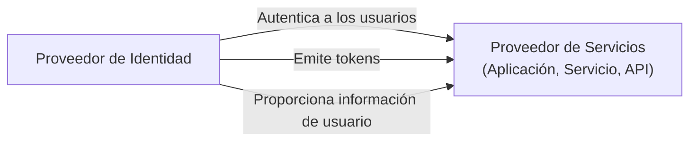
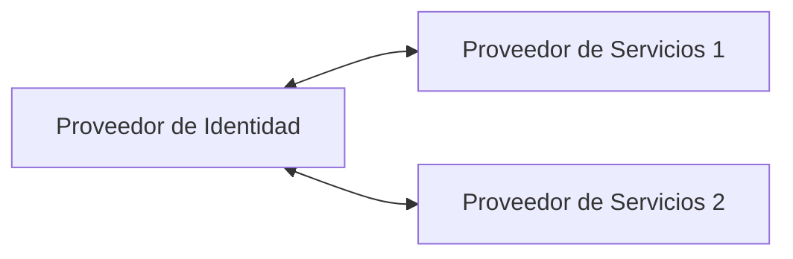

## ¿Qué es un proveedor de identidad (IdP)?

En el ámbito de <Ref slug="iam" />, un proveedor de identidad (IdP) es el servicio central para gestionar identidades. Se encarga de autenticar a los usuarios, emitir tokens de identidad y proporcionar información de usuario a <Ref slug="service-provider">proveedores de servicios</Ref> (por ejemplo, aplicaciones, servicios, APIs).

Además de <Ref slug="authentication" />, los proveedores de identidad modernos también son responsables de <Ref slug="authorization" /> (aplicación de políticas de <Ref slug="access-control" />) y el soporte de funciones avanzadas como <Ref slug="single-sign-on" /> y <Ref slug="multi-tenancy" />.

## Normas de los proveedores de identidad

Debido a la naturaleza de la gestión de identidades y la necesidad de interoperabilidad, sería poco práctico e ineficiente construir proveedores de identidad sin normas. Aquí hay algunos escenarios típicos:

- Dos proveedores de identidad necesitan comunicarse entre sí para intercambiar información de usuario (por ejemplo, inicio de sesión social).
- Una aplicación necesita autenticar usuarios utilizando múltiples proveedores de identidad (por ejemplo, identidad federada).
- Un proveedor de identidad necesita admitir múltiples tipos de clientes (por ejemplo, web, móvil, IoT).

Para abordar estos escenarios, la industria ha desarrollado varios estándares populares para proveedores de identidad:

- <Ref slug="oauth-2.0" />: Un marco de autorización ampliamente utilizado que permite a las aplicaciones obtener acceso en nombre de los usuarios o servicios.
- <Ref slug="openid-connect" />: Una capa de identidad construida sobre OAuth 2.0 que proporciona autenticación e información del usuario.
- <Ref slug="saml" />: Un estándar para intercambiar datos de autenticación y autorización entre dominios de seguridad.

Para nuevas aplicaciones, OpenID Connect (OIDC) es el estándar recomendado para usar, ya sea para construir un proveedor de identidad o integrarse con proveedores de identidad existentes.

## Arquitectura del proveedor de identidad

El término "proveedor de identidad" no especifica una arquitectura o implementación particular. Es decir, un proveedor de identidad también puede ser una aplicación monolítica, un microservicio o un servicio en la nube.

Debido a la complejidad y criticidad de la gestión de identidades, las aplicaciones modernas tienden a utilizar proveedores de identidad especializados que son servicios independientes o soluciones de proveedor.

## Características del proveedor de identidad

Los proveedores de identidad modernos ofrecen una amplia gama de características para soportar diversos casos de uso y requisitos. Aquí hay algunas características comunes:

- <Ref slug="authentication" />: Verificar la identidad de los usuarios utilizando varios métodos (por ejemplo, nombre de usuario/contraseña, inicio de sesión social, <Ref slug="mfa" />).
- <Ref slug="authorization" />: Aplicar políticas de <Ref slug="access-control" /> y gestionar los permisos de usuario (por ejemplo, <Ref slug="rbac" />, <Ref slug="abac" />).
- **Gestión de usuarios**: Crear, actualizar y eliminar cuentas y perfiles de usuario; proporcionar datos de usuario a <Ref slug="service-provider">proveedores de servicios</Ref>.
- **Gestión de tokens**: Emitir y gestionar tokens de identidad (por ejemplo, ID token, access token, refresh token).
- <Ref slug="single-sign-on" />: Permitir a los usuarios autenticarse una vez y acceder a múltiples aplicaciones.
- <Ref slug="multi-tenancy" />: Soportar múltiples organizaciones o arrendatarios con datos y configuraciones de usuario aislados.

<SeeAlso slugs={["service-provider", "iam", "openid-connect", "oauth-2.0"]} />

<Resources
  urls={[
    "https://blog.logto.io/secure-cloud-apps-with-oauth-and-openid-connect",
    "https://blog.logto.io/incorporate-identity-solution",
    "https://blog.logto.io/centralized-identity-system"
  ]}
/>
