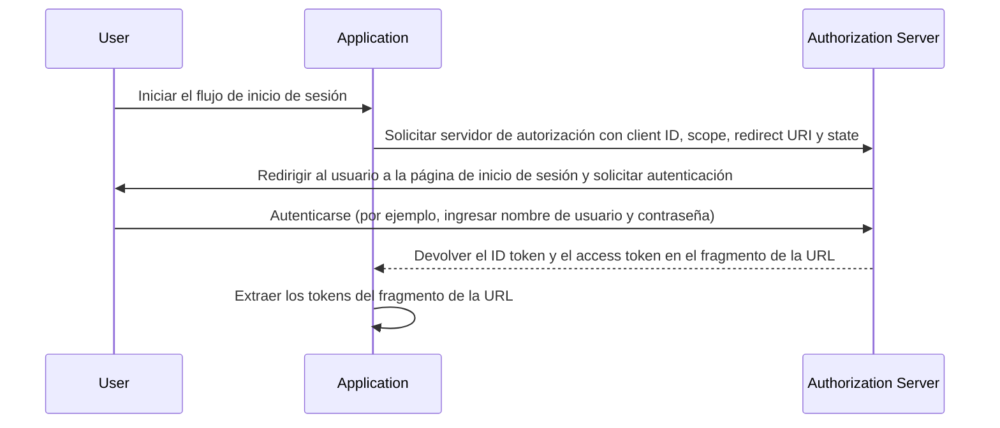

## ¿Qué es el flujo implícito (implicit flow)?

El flujo implícito (implicit flow) de OIDC (OpenID Connect) es un proceso de autenticación utilizado principalmente por aplicaciones cliente implementadas en un navegador usando un lenguaje de secuencias de comandos, por ejemplo, aplicaciones de una sola página (SPAs). Permite que las aplicaciones cliente obtengan directamente tokens de ID (id tokens) y tokens de acceso (access tokens) del servidor de autorización sin realizar la autenticación del cliente.

## ¿Cómo funciona el flujo implícito (implicit flow)?

Los pasos principales del flujo implícito (implicit flow) son los siguientes:

1. **Envío de solicitud de autenticación (authentication request)**: El usuario inicia el flujo generalmente haciendo clic en un enlace o botón en la aplicación para iniciar sesión. La aplicación envía una solicitud de autenticación (authentication request) al endpoint de autorización del servidor de autorización. El servidor de autorización valida los parámetros y redirige al usuario para que se autentique en la página de inicio de sesión del servidor de autorización.
2. **Autenticación del usuario**: El usuario se autentica en el servidor de autorización (por ejemplo, ingresando nombre de usuario y contraseña).
3. **El servidor de autorización responde**: El servidor de autorización devuelve un token de ID (id token) y, si se solicita, un token de acceso (access token) a la aplicación cliente como fragmento de URL.
4. **La aplicación cliente procesa los tokens**: La aplicación cliente extrae los tokens del fragmento de URL.



### Solicitud de autenticación (Authentication request)

Los parámetros de la solicitud son los siguientes:
- **client_id**: OBLIGATORIO. Identificador de cliente válido en OAuth 2.0, que está disponible en Logto como el ID de la aplicación (o app ID).
- **scope**: OBLIGATORIO. Este valor especifica un conjunto de recursos que el usuario solicita del servidor de autorización. Por ejemplo, `openid profile email`.
- **response_type**: OBLIGATORIO. El valor es `id_token` o `id_token token`. Ningún token de acceso (access token) se devuelve cuando el valor es `id_token`.
- **redirect_uri**: OBLIGATORIO. El URI al cual se enviará la respuesta de autenticación, y debe coincidir exactamente con el redirect URI que el cliente pre-registró en el <Ref slug="openid-connect" headingId="openid-provider-op" />. Por ejemplo, `Sign-in redirect URI` en Logto Admin Console.
- **nonce**: OBLIGATORIO. Una cadena aleatoria utilizada para mitigar ataques de repetición, que se pasa sin modificar desde la solicitud de autenticación (authentication request) a la declaración de token de ID (ID token claim).

### Ejemplo de una solicitud de autenticación (Authentication request)

```bash
curl -X GET "https://authorization-server.com/auth" \
  -d "response_type=id_token token" \
  -d "client_id=YOUR_APPLICATION_ID" \
  -d "redirect_uri=https://yourapp.com/callback" \
  -d "scope=openid profile email" \
  -d "nonce=RANDOM_STRING"
```

## Limitaciones

El flujo implícito (implicit flow) se desarrolló en una época en que los navegadores no adoptaban de manera generalizada el Compartir Recursos de Origen Cruzado (CORS). Por lo tanto, está prohibido enviar solicitudes POST al servidor de autorización alojado en un dominio diferente.

Debido a esta limitación, el servidor de autorización devuelve directamente los tokens en el fragmento de la URL, lo que puede exponerlos al usuario final y a las aplicaciones que tienen acceso al agente de usuario (User Agent) del usuario final.

Además, la autenticación del cliente no se realiza en el flujo implícito (implicit flow), lo que significa que cualquier aplicación puede pretender ser ese cliente que solicita la autenticación, ya que el client ID siempre está expuesto en aplicaciones basadas en navegador.

Debido a las limitaciones mencionadas anteriormente, el flujo implícito (implicit flow) se considera generalmente menos seguro que el Flujo de Código de Autorización (Authorization Code Flow).

## Alternativas al flujo implícito (implicit flow)

Dadas las limitaciones de seguridad del flujo implícito (implicit flow), a menudo se recomiendan otros flujos:
- **Flujo de Código de Autorización (Authorization Code Flow)**: Este flujo implica un paso adicional donde el cliente intercambia un código de autorización por tokens, proporcionando una capa extra de seguridad.
- **PKCE (Proof Key for Code Exchange)**: Una extensión del Flujo de Código de Autorización que agrega una capa adicional de seguridad al usar un verificador de código y un desafío de código.

<SeeAlso slugs={['device-flow', 'authorization-code-flow', 'client-credentials-flow']} />

<Resources
  urls={[
    "https://blog.logto.io/implicit-flow-is-dead",
    {
      url: "https://tools.ietf.org/html/rfc6749#section-4.2",
      result: {
        ogTitle: "The OAuth 2.0 Authorization Framework: Implicit Grant",
        ogDescription: "The implicit grant type is used to obtain access tokens (it does not support the issuance of refresh tokens) and is optimized for public clients known to operate a particular redirection URI. These clients are typically implemented in a browser using a scripting language such as JavaScript."
      }
    },
    "https://openid.net/specs/openid-connect-core-1_0.html",
  ]}
/>