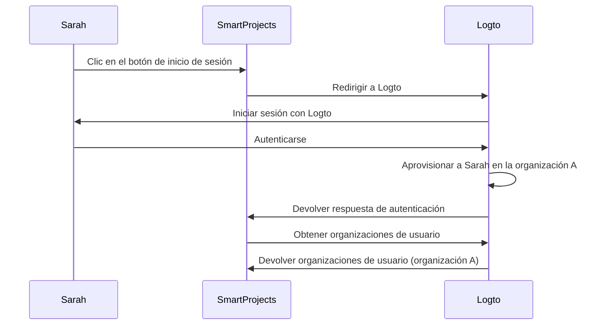
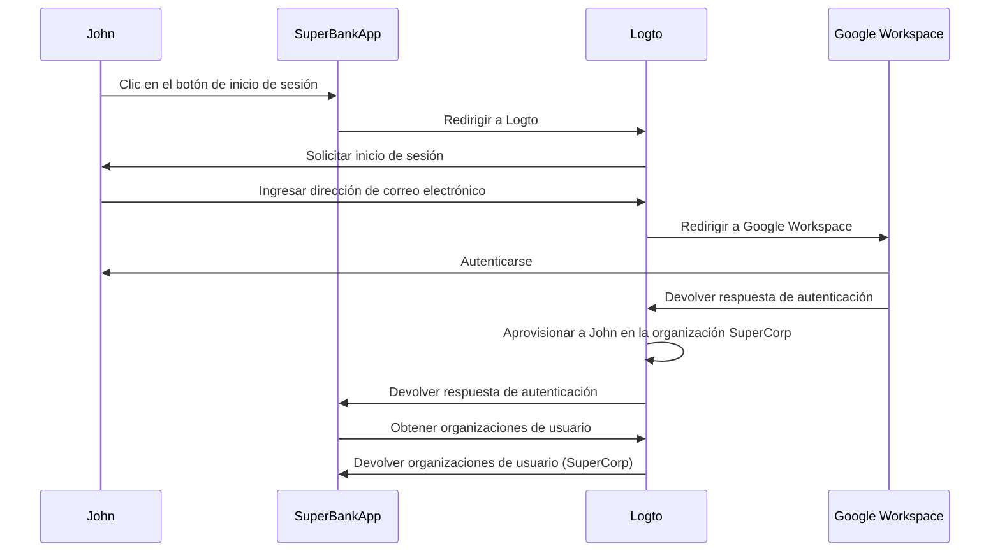

## ¿Qué es el aprovisionamiento just-in-time?

El aprovisionamiento Just-in-time (JIT) es un proceso utilizado en <Ref slug="iam" /> donde las cuentas de usuario se aprovisionan de acuerdo con la identidad del usuario y la configuración del sistema de manera instantánea cuando el usuario intenta iniciar sesión por primera vez.

## ¿Cuáles son los casos de uso del aprovisionamiento just-in-time?

Estos casos son comunes al construir una aplicación B2B que involucra arquitectura multi-tenant, Enterprise SSO (Enterprise SSO), o que requiere características de incorporación de equipos. Aquí hay algunos escenarios de ejemplo que tú o tu cliente pueden encontrar.

### Incorporación de empleados

Imagina que uno de tus clientes, *SuperFantasy*, está experimentando contrataciones frecuentes o un rápido crecimiento y puede usar el aprovisionamiento JIT para configurar rápidamente cuentas de usuario para nuevos empleados. *SuperFantasy* utiliza Logto para la gestión de identidades y acceso y SmartProjects para la gestión de proyectos. Cuando un nuevo empleado, Sarah, inicia sesión en SmartProjects por primera vez, su cuenta se crea y configura automáticamente en base a sus credenciales de Logto.

Según el diagrama anterior, cuando Sarah inicia sesión en SmartProjects por primera vez, su cuenta se aprovisiona automáticamente en la organización A en Logto. Este proceso asegura que Sarah tenga el acceso necesario a SmartProjects sin requerir intervención manual del equipo de TI.

### Incorporación de clientes empresariales

Imagina que otro cliente, *SuperBank*, es una institución financiera que proporciona servicios de banca en línea a sus clientes. *SuperBank* utiliza Logto para la gestión de identidades y acceso y SuperBankApp para la banca en línea. *SuperBank* ha firmado recientemente un contrato con un nuevo cliente empresarial, *SuperCorp*, para proporcionar servicios de banca en línea a sus empleados.

*SuperCorp* utiliza Google Workspace para las cuentas de sus empleados. SuperBankApp necesita asegurarse de que cuando un empleado de *SuperCorp* inicie sesión por primera vez, su cuenta se agregue automáticamente a la organización *SuperCorp* en Logto.

En el diagrama anterior, cuando John inicia sesión en SuperBankApp por primera vez, su cuenta se aprovisiona automáticamente en la organización SuperCorp en Logto según su identidad de Google Workspace.

## ¿Es específico de SAML y Enterprise SSO?

El aprovisionamiento Just-in-time (JIT) a menudo se asocia con <Ref slug="enterprise-sso" /> en la autenticación SAML, pero no es exclusivo de <Ref slug="saml" />. El aprovisionamiento JIT también se puede utilizar con otros protocolos de autenticación como <Ref slug="oauth-2.0" /> y <Ref slug="openid-connect" />, y no siempre requiere una configuración de <Ref slug="enterprise-sso" />.

Por ejemplo, el aprovisionamiento JIT basado en correo electrónico se puede utilizar cuando tu <Ref slug="identity-provider" /> admite esta función. En este caso, la dirección de correo electrónico del usuario es el único atributo requerido para el aprovisionamiento, independientemente del protocolo de autenticación o la configuración de SSO.

## ¿Se aplica a usuarios nuevos o existentes de la aplicación?

El aprovisionamiento Just-in-time (JIT) generalmente se refiere al primer intento de acceder a una aplicación. Sin embargo, diferentes productos perciben esta funcionalidad de manera diferente. Algunos utilizan el aprovisionamiento JIT solo para la creación de identidad y cuenta, mientras que otros también incluyen actualizaciones de cuenta just-in-time, como reprovisionamiento y sincronización de atributos.

Por ejemplo, el aprovisionamiento JIT de SAML permite otorgar y revocar membresías de grupo como parte del aprovisionamiento. También puede actualizar usuarios aprovisionados para mantener sus atributos en el almacén del <Ref slug="service-provider" /> sincronizados con los atributos del almacén de usuarios del <Ref slug="identity-provider" />.

Si deseas considerar el escenario de inicio de sesión de usuario existente posterior, asegúrate de tener un sistema de aprovisionamiento robusto junto con tu sistema JIT. Por ejemplo:

- **Resolución de conflictos**: Tu sistema debe tener una estrategia para manejar conflictos si ya existe una cuenta con información diferente a la proporcionada por el IdP durante el proceso JIT. Esto puede requerir un control detallado de las políticas de tu organización y la configuración del IdP.
- **Rastros de auditoría**: Es importante mantener registros tanto de las nuevas creaciones de cuentas como de las actualizaciones de cuentas existentes a través de procesos JIT por razones de seguridad y cumplimiento.
- **Rendimiento**: Aunque el aprovisionamiento JIT ocurre rápidamente, considera el impacto potencial en los tiempos de inicio de sesión, especialmente para usuarios existentes si estás actualizando su información en cada inicio de sesión.
- **Consistencia de datos**: Asegúrate de que tu proceso de aprovisionamiento JIT mantenga la consistencia de los datos, especialmente al actualizar cuentas de usuario existentes.

## ¿Cuál es la diferencia entre JIT y el Sistema para la Gestión de Identidades entre Dominios (SCIM)?

SCIM es un protocolo estándar abierto diseñado para simplificar y automatizar la gestión de identidades de usuario a través de diferentes sistemas y dominios. Se utiliza comúnmente en escenarios de sincronización de directorios.

La principal diferencia entre JIT y SCIM es que JIT a menudo se refiere al primer intento de acceder a una aplicación (o incorporación de nuevos usuarios), y es un término amplio que describe el proceso de aprovisionamiento dinámico de cuentas de usuario; mientras que SCIM es un protocolo específico para gestionar el ciclo de vida del usuario a través de sistemas y no se limita al primer inicio de sesión.

Además, JIT carece de una implementación estandarizada a través de sistemas, mientras que SCIM es un protocolo estandarizado definido por [RFC 7644](https://datatracker.ietf.org/doc/html/rfc7644) para la gestión de identidades.

Algunas organizaciones más grandes utilizan SCIM para el aprovisionamiento de cuentas, integrándolo con sus propios sistemas. Esto puede ser muy complejo y variar caso por caso. Para la mayoría de los casos de uso, el aprovisionamiento JIT es un enfoque más simple y directo.

<Resources urls={['https://blog.logto.io/jit-provisioning', 'https://datatracker.ietf.org/doc/html/rfc7644']} />