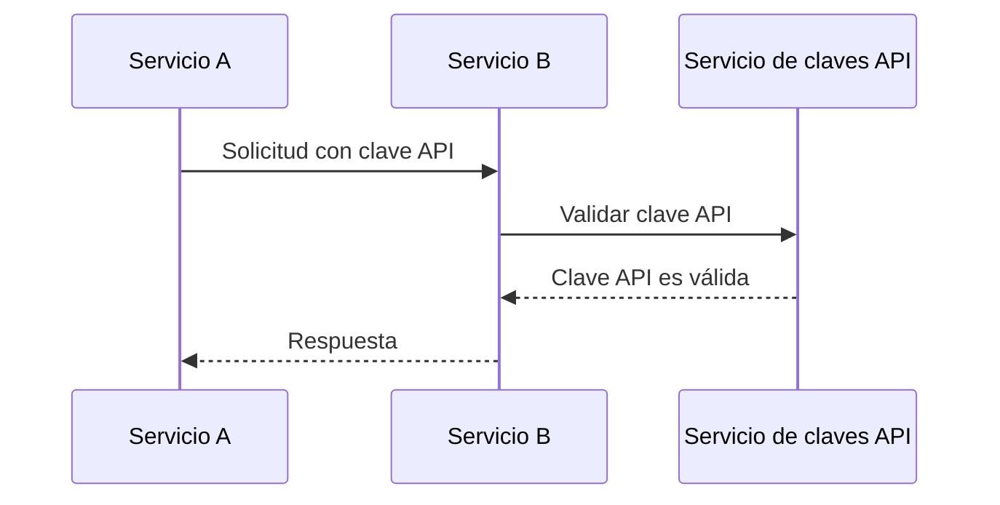
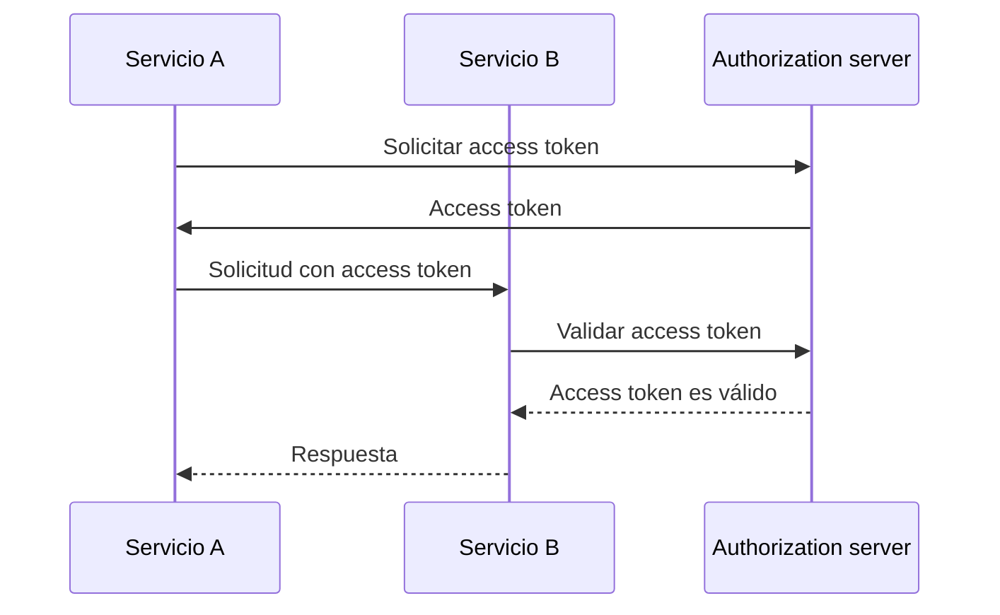
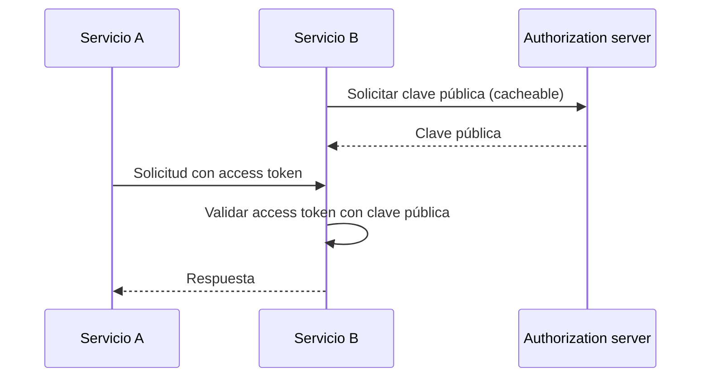

## ¿Qué es la comunicación máquina a máquina?

La comunicación máquina a máquina (M2M) se refiere al intercambio automatizado de datos entre dispositivos sin intervención humana. En el contexto de la autenticación (authentication) y autorización (authorization), la comunicación M2M a menudo involucra una aplicación cliente que necesita acceder a recursos, donde la aplicación cliente es una máquina (servicio) o una máquina actuando en nombre de un usuario.

## ¿Por qué necesitamos manejar la comunicación máquina a máquina?

Cuando solo tienes un servicio sin dependencias, probablemente no necesita comunicarse con otros servicios. A medida que tu sistema crece, o deseas integrarte con un sistema de gestión de identidad y acceso (IAM), necesitas manejar la comunicación máquina a máquina.

Sin embargo, todavía parece simple: todo lo que necesitas hacer es identificar el servicio y autenticarlo. Pero en realidad, hay varios desafíos que necesitas abordar:

### 1. Autenticación (Authentication)

¿Cómo autenticas el servicio? No puedes usar un nombre de usuario y contraseña, ya que no hay un humano para ingresarlos. Necesitas usar un mecanismo diferente, como claves API (api keys), certificados de cliente o credenciales de cliente OAuth (client credentials).

### 2. Autorización (Authorization)

Una vez que autenticas el servicio, ¿cómo determinas qué puede hacer el servicio? Necesitas definir los permisos y roles para el servicio, de manera similar a cómo los defines para los usuarios. Lo último que deseas es codificar los permisos en tu código.

### 3. Seguridad

¿Cómo aseguras que la comunicación entre servicios sea segura? ¿Se actualizarán las credenciales regularmente? ¿Cómo monitoreas y auditas la comunicación?

### 4. Escalabilidad

A medida que crece el número de servicios, ¿cómo gestionas la autenticación y autorización para cada servicio?

## Enfoques comunes para la comunicación máquina a máquina

Con los desafíos en mente, hay varios enfoques comunes en la industria:

### 1. Claves API (API keys)

<Ref slug="api-key">Las claves API</Ref> son una forma sencilla de autenticar servicios. Cada servicio puede tener una o más claves API, que se utilizan para la autenticación (y a veces autorización). Puedes ver algunos servicios pidiéndote que proporciones una clave API en el encabezado de la solicitud, como `X-API-Key: your-api-key`.

Un ejemplo no normativo de cómo funcionan las claves API:

Ventajas:

- Sencillo de implementar y usar.
- Con generación aleatoria segura y lo suficientemente largas, las claves API son difíciles de adivinar.
- La validación es dinámica, lo que significa que puedes revocar una clave API en cualquier momento.

Desventajas:

- Requiere comunicación de red para validar la clave API.
- No es independiente, lo que significa que se requiere un servicio para la introspección.
- El otro servicio tiene el mismo nivel de acceso que el servicio que posee la clave API (esto podría mitigarse parcialmente usando una puerta de enlace API).
- Es difícil gestionar un gran número de claves API en todos los servicios.

### 2. Credenciales de cliente OAuth (OAuth client credentials)

OAuth (o OIDC, ya que OpenID Connect se basa en OAuth 2.0) <Ref slug="client-credentials-flow" /> es una forma más avanzada de autenticar servicios. Se basa en el marco de trabajo OAuth 2.0, que es ampliamente utilizado para la autenticación (authentication) y autorización (authorization) de usuarios. Con credenciales de cliente OAuth, un servicio puede obtener un access token presentando su ID de cliente y secreto de cliente al authorization server.

Un ejemplo no normativo de cómo funcionan las credenciales de cliente OAuth:

Por lo general, el access token es un JSON Web Token (JWT), que contiene información sobre el servicio y sus permisos. Luego, el otro servicio puede validar el access token sin comunicarse con el authorization server (siempre que tenga la clave pública para verificar la firma del JWT). El flujo de trabajo se convierte en:

Para más información sobre JSON Web Tokens, consulta <Ref slug="jwt" />.

Ventajas (con JWT):

- Independiente, lo que significa que el otro servicio puede conocer inmediatamente la información necesaria, como permisos, sin comunicación de red adicional.
- El access token puede ser de corta duración, reduciendo el riesgo de mal uso.
- El otro servicio no necesita conocer el secreto del cliente, solo la clave pública para verificar la firma del JWT.
- El access token se puede usar para auditar las acciones del servicio (por ejemplo, qué servicio accedió a qué recurso).
- Es más fácil gestionar un gran número de servicios, ya que establece un límite claro entre servicios y permisos.

Desventajas:

- Un poco más complejo de implementar y usar que las claves API.
- Si el otro servicio solo realiza validación offline, puede que no sepa si el access token ha sido revocado.

### 3. TLS Mutuo (Mutual TLS)

TLS Mutuo (mTLS) es una forma de autenticar servicios usando certificados de cliente. Con mTLS, cada servicio posee un certificado de cliente con una clave privada, y el otro servicio verifica el certificado utilizando la clave pública. Sin embargo, mTLS se centra en la capa TLS, lo que significa que por sí solo generalmente no es adecuado para la autenticación (authentication) y autorización (authorization) a nivel de aplicación.

Para casos de uso avanzados, mTLS puede combinarse con access tokens vinculados a certificados para asegurar aún más la comunicación. Consulta [RFC 8705: OAuth 2.0 Mutual-TLS Client Authentication and Certificate-Bound Access Tokens](https://datatracker.ietf.org/doc/html/rfc8705) para más información.

Ventajas:

- Autenticación fuerte, ya que se basa en criptografía de clave pública.
- La comunicación está encriptada y es segura por defecto.
- El certificado de cliente puede usarse para identificar el servicio, de manera similar a cómo funciona un JWT.

Desventajas:

- Más complejo de implementar y gestionar que claves API y credenciales de cliente OAuth.
- El certificado de cliente necesita ser actualizado regularmente.
- Se requiere más conocimiento técnico para gestionar correctamente los certificados de cliente.
- El otro servicio puede no soportar mTLS, lo que significa que necesitas tener un mecanismo de reserva.

<SeeAlso slugs={["api-key", "client-credentials-flow", "jwt"]} />
