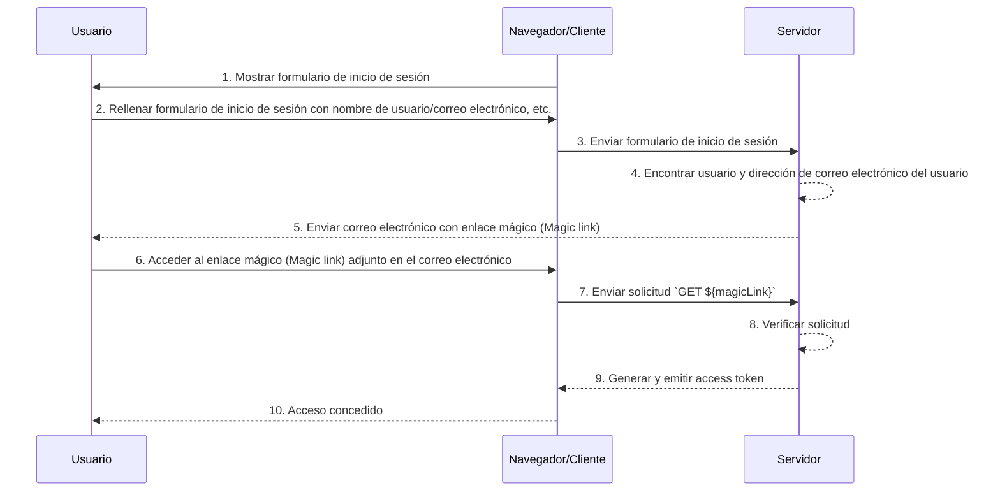

## ¿Qué son los enlaces mágicos (Magic links)?

Un enlace mágico (Magic link) es un enlace de un solo uso enviado al usuario durante el proceso de autenticación (authentication).

Al acceder a este enlace, el usuario completa el flujo de autorización (authorization) necesario para acceder al recurso deseado y se le otorga el acceso adecuado a los recursos. Después, el enlace mágico (Magic link) se vuelve inválido.

## ¿Cuál es la diferencia entre el enlace mágico (Magic link) y la contraseña de un solo uso (OTP)?

Supongamos que el usuario usa el correo electrónico para recibir un enlace mágico (Magic link) o un OTP.

En muchos casos, los usuarios usan el correo electrónico para recibir un OTP para verificar el inicio de sesión o como un factor de verificación adicional para MFA. ¿Cuál es la diferencia entre usar un enlace mágico (Magic link) por correo electrónico y un OTP por correo electrónico?

Con OTP, el usuario necesita revisar su correo electrónico, recordar el OTP y luego ingresarlo en el proceso de inicio de sesión/verificación. Esto requiere que el usuario cambie manualmente y repetidamente entre diferentes aplicaciones o páginas.

Usando un enlace mágico (Magic link) por correo electrónico, el usuario solo necesita abrir el correo electrónico que contiene el enlace mágico (Magic link) en su aplicación de correo y hacer clic en el enlace. Esto proporciona una experiencia de usuario más sencilla.

Además, usar un enlace mágico (Magic link) permite incluir información más allá de un token de un solo uso en el enlace, como información relacionada con la sesión para el inicio de sesión. Esto puede mejorar tanto la seguridad como la experiencia del usuario.

## ¿Cómo funcionan los enlaces mágicos (Magic links)?

En este diagrama de secuencia, ilustramos cómo un usuario inicia sesión y obtiene acceso a los recursos adecuados utilizando un enlace mágico (Magic link).

En este diagrama de secuencia, suponemos que el enlace mágico (Magic link) se envía por correo electrónico. Sin embargo, hay otros métodos posibles para enviar un enlace mágico (Magic link), como enviarlo por mensaje de texto a un teléfono móvil. Estas alternativas no se cubrirán aquí, ya que los flujos son prácticamente iguales.

1. **Mostrar formulario de inicio de sesión**
   El navegador/cliente inicia el proceso de autenticación (authentication) mostrando al usuario un formulario de inicio de sesión.
2. **El usuario rellena el formulario de inicio de sesión**
   El usuario ingresa su identificador, como nombre de usuario, dirección de correo electrónico o número de teléfono, en el formulario de inicio de sesión.
   La información proporcionada debe ser suficiente para ayudar al sistema a identificar un usuario único. Por ejemplo, en la mayoría de los sistemas, los nombres de usuario utilizados para iniciar sesión son únicos. En tales sistemas, los usuarios solo necesitan proporcionar su nombre de usuario para ayudar al sistema a identificar de manera única la cuenta a la que desean acceder.
3. **Enviar formulario de inicio de sesión**
   El navegador/cliente envía el formulario al servidor, conteniendo la información del usuario descrita en el paso 2.
4. **Encontrar usuario y correo electrónico**
   El servidor procesa la solicitud localizando al usuario único en la base de datos y recuperando la dirección de correo electrónico asociada del usuario.
5. **Enviar correo electrónico con enlace mágico (Magic link)**
   El servidor envía un correo electrónico a la dirección de correo electrónico del usuario. Este correo electrónico contiene un enlace mágico (Magic link) para la autenticación (authentication).
6. **El usuario accede al enlace mágico (Magic link)**
   El usuario recibe el correo electrónico y hace clic en el enlace mágico (Magic link) proporcionado en él.
7. **Enviar solicitud GET con enlace mágico (Magic link)**
   El navegador/cliente envía una solicitud `GET` al servidor, utilizando la URL del enlace mágico (Magic link).
8. **Verificar solicitud**
   El servidor verifica la solicitud para asegurarse de que el enlace mágico (Magic link) es válido, no se ha utilizado y no ha caducado.
9. **Generar y emitir access token**
   Una vez verificada la solicitud, el servidor genera un access token y lo emite al navegador/cliente.
10. **Conceder acceso**
    El navegador/cliente recibe el access token y permite al usuario acceder al recurso solicitado.

## ¿Cuál es el beneficio de los enlaces mágicos (Magic links)?

Los enlaces mágicos (Magic links) mejoran la arquitectura de seguridad de los sistemas de autenticación (authentication) al emplear un modelo de interacción basado en tokens. Cada enlace está cifrado de manera única y, generalmente, incluye un sello de tiempo de expiración. Dada su naturaleza efímera, incluso si un enlace mágico (Magic link) es interceptado o filtrado, su corta ventana de validez limita la oportunidad de explotación maliciosa.

Además, dado que usar enlaces mágicos (Magic links) requiere un método de recepción controlado por el usuario, como una dirección de correo electrónico o un número de teléfono confiable, proporciona un método de verificación adicional más allá del nombre de usuario y la contraseña, ofreciendo seguridad adicional a la cuenta. Y dado que los enlaces mágicos (Magic links) eliminan la necesidad de ingresar credenciales, la seguridad de las cuentas de los usuarios está mejor protegida y el proceso es más conveniente.