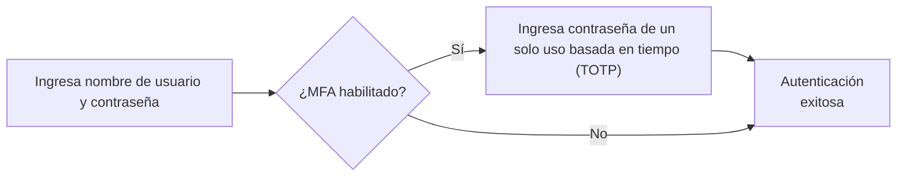

## ¿Qué es la autenticación multifactor (MFA)?

La autenticación multifactor (MFA) mejora la seguridad al requerir que los usuarios proporcionen múltiples formas de identificación para verificar su identidad. Agrega una capa adicional de seguridad al proceso de <Ref slug="authentication" />, lo que hace que sea más difícil para los atacantes obtener acceso no autorizado.

Aquí hay un ejemplo de MFA:

### La definición de "factor"

En el ejemplo anterior, hay dos factores:

1. Nombre de usuario y contraseña
2. <Ref slug="totp" /> desde una aplicación móvil

Cada factor representa una categoría diferente de credenciales que se pueden usar para autenticar a un usuario (demuestra que eres quien dices ser). En la práctica, los factores pueden categorizarse en tres tipos principales:

|            | Lo que significa   | Factores de verificación                                                             |
| ---------- | ------------------ | ------------------------------------------------------------------------------------- |
| Conocimiento  | Algo que sabes     | Contraseña, Código de verificación por correo electrónico, Código de respaldo        |
| Posesión   | Algo que tienes    | Código de verificación por SMS, OTP de la aplicación de autenticación, OTP de hardware (llave de seguridad), Tarjeta inteligente |
| Inherencia | Algo que eres      | Biométricos como huellas dactilares, Face ID                                        |

Una configuración común de MFA involucra la combinación de dos factores de diferentes categorías, como una contraseña (conocimiento) y un <Ref slug="totp" /> de una aplicación de autenticación (posesión).

### ¿Por qué es importante MFA?

> No existe tal cosa como la seguridad perfecta, solo niveles variables de inseguridad. —Salman Rushdie

La importancia de MFA es evidente en los números: MFA reduce el riesgo de compromiso en un 99.22% en toda la población y en un 98.56% en casos de credenciales filtradas[^1]. Con la ayuda de MFA, se pueden tomar acciones más críticas con confianza, como acceder a datos sensibles y realizar transacciones financieras. Es una manera simple pero efectiva de ofrecer un nivel de seguridad mucho más alto que solo una contraseña o autenticación de un solo factor.

## MFA en aplicaciones modernas

Como su nombre lo indica, MFA puede involucrar más de dos factores. A medida que aumenta el número de factores, también lo hace el nivel de seguridad y la complejidad del proceso de autenticación, lo cual puede ser menos amigable para el usuario. Mientras que <Ref slug="totp" /> ha sido una opción popular en los últimos años, nuevas tecnologías como <Ref slug="passkey" /> están surgiendo para proporcionar una experiencia MFA aún más segura y amigable para el usuario.

Por ejemplo, las aplicaciones modernas pueden usar la API <Ref slug="webauthn" /> para implementar MFA con passkeys, que son credenciales resistentes al phishing aseguradas por criptografía de clave pública. Empresas como Apple han integrado las passkeys con la autenticación biométrica (Touch ID, Face ID) para agregar de manera nativa el factor de inherencia al proceso MFA, aumentando la seguridad y la conveniencia del usuario.

Hagamos una comparación rápida para una mejor comprensión. Suponiendo que tenemos un usuario que tiene:

1. Una aplicación de autenticación instalada en su teléfono para generar códigos TOTP.
2. Una passkey integrada con la autenticación biométrica de su dispositivo.

Cuando inician sesión en un sitio web con MFA habilitado en su portátil, los dos procesos se verían así:

```mermaid
graph TD
  subgraph TOTP
    A[Ingresa nombre de usuario y contraseña]
    A -->|MFA habilitado| B[Solicita código TOTP]
    B --> C[Abre aplicación de autenticación]
    C --> D[Encuentra el TOTP para el sitio web]
    D --> E[Ingresa el código TOTP]
    E --> F[Autenticación<br/>exitosa]
  end

  subgraph WebAuthn
    G[Ingresa nombre de usuario y contraseña]
    G -->|MFA habilitado| H[Solicita autenticación biométrica]
    H --> I["Autenticar con biometría (por ejemplo, Touch ID)"]
    I --> J[Autenticación<br/>exitosa]
  end
```

Es claro que el proceso de WebAuthn requiere menos pasos y mucho menos tiempo para los usuarios. Aún más, empresas como Apple admiten la sincronización de passkeys entre dispositivos (por ejemplo, iPhone, iPad, Mac) para hacer que el proceso de MFA sea más fluido mientras se mantiene un alto nivel de seguridad.

## Consideraciones de seguridad

Al implementar MFA, se deben tener en cuenta algunas consideraciones de seguridad:

- Usa una combinación de factores de diferentes categorías para garantizar un mayor nivel de seguridad. Por ejemplo, combinar una contraseña (conocimiento) con un código TOTP (posesión).
- Evita usar SMS como un factor de MFA debido a su susceptibilidad a ataques de intercambio de SIM.
- Las opciones de recuperación no deben eludir MFA. Por ejemplo, si un usuario pierde su aplicación de autenticación, se le debe requerir usar un código de respaldo u otro factor de MFA para recuperar el acceso.
- Impón períodos de enfriamiento entre intentos fallidos de MFA para prevenir ataques de fuerza bruta.

[^1]: [¿Qué tan efectiva es la autenticación multifactor en disuadir ciberataques?](https://query.prod.cms.rt.microsoft.com/cms/api/am/binary/RW166lD)

<SeeAlso slugs={["totp", "webauthn", "passkey"]} />

<Resources
  urls={[
    "https://blog.logto.io/elaborate-mfa",
    "https://blog.logto.io/web-authn-and-passkey-101",
    "https://blog.logto.io/webauthn-base-knowledge",
  ]}
/>
