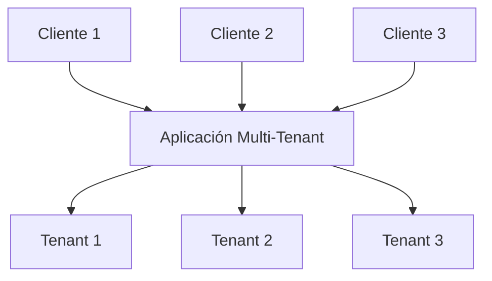
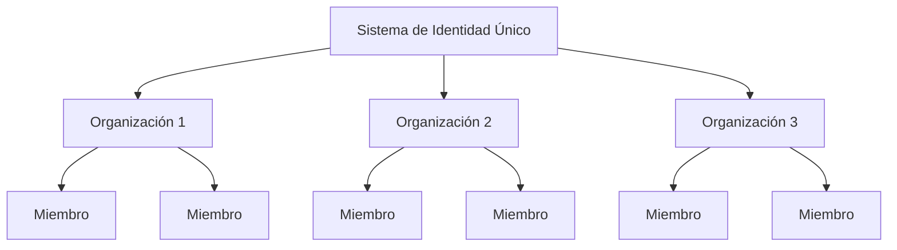

## ¿Qué es la multi-tenancy (multi-tenancy)?

La multi-tenancy (multi-tenancy) de software es un software en el cual una sola instancia de software se ejecuta en un servidor y sirve a múltiples tenants. Los sistemas diseñados de esta manera son "compartidos" (en lugar de "dedicados" o "aislados").

Un tenant es un grupo de usuarios que comparten acceso común con privilegios específicos a la instancia de software.

Por ejemplo, los sistemas CRM (Customer Relationship Management) a menudo utilizan arquitectura multi-tenant para proporcionar el mismo servicio a todos los clientes.

Un principio clave de la multi-tenancy (multi-tenancy) es el "compartir". Esto no significa que **todas** las partes de la solución sean compartidas; significa que al menos **algunos** componentes se reutilizan entre múltiples tenants. Comprender este concepto más amplio puede ayudarte a abordar mejor las necesidades de tus clientes.

## ¿Cuáles son los casos de uso para productos multi-tenant?

Las aplicaciones multi-tenant se utilizan comúnmente en productos de software como servicio (SaaS) como herramientas de productividad, software de colaboración, etc. En esta configuración, cada “tenant” generalmente representa a un cliente empresarial, con múltiples usuarios (típicamente empleados). En diferentes productos, puede referirse como un tenant, espacio de trabajo o proyecto, dependiendo del contexto. Un solo negocio también podría tener múltiples tenants para representar diferentes divisiones u organizaciones.

En casos más complejos, como aplicaciones B2B más allá de SaaS, las aplicaciones multi-tenant proporcionan una plataforma compartida para que varios equipos, clientes empresariales y empresas asociadas accedan a tus servicios.

## ¿Por qué deberías emplear la multi-tenancy (multi-tenancy) en un producto SaaS?

### Escalando con multi-tenancy (multi-tenancy)

Para las empresas, la multi-tenancy (multi-tenancy) es clave para cumplir efectivamente con sus requisitos de disponibilidad, gestión de recursos, gestión de costos y seguridad de datos. A nivel técnico, adoptar un enfoque multi-tenant agiliza tus procesos de desarrollo, minimiza los desafíos técnicos y promueve una expansión sin problemas.

### Creando una experiencia unificada

Al examinar las raíces de los productos SaaS, es similar a un edificio que alberga varios apartamentos. Todos los tenants comparten servicios comunes como agua, electricidad y gas, pero mantienen control independiente sobre la gestión de su propio espacio y recursos. Este enfoque simplifica la gestión de la propiedad.

### Asegurando la seguridad a través del aislamiento de tenants

En una arquitectura de multi-tenancy (multi-tenancy), se introduce el término "tenant" para crear límites que separen y aseguren los recursos y datos de diferentes tenants dentro de una instancia compartida. Esto asegura que los datos y operaciones de cada tenant permanezcan distintos y seguros, incluso si están utilizando los mismos recursos subyacentes.

## ¿Cómo lograr el aislamiento de tenants en una arquitectura multi-tenant?

Al hablar de aplicaciones multi-tenant, siempre es necesario lograr el **aislamiento de tenants**. Esto significa mantener los datos y recursos de diferentes tenants separados y seguros dentro de un sistema compartido (por ejemplo, una infraestructura en la nube o una aplicación multi-tenant). Esto previene cualquier intento no autorizado de acceder a los recursos de otro tenant.

### El aislamiento de tenants se alinea con el concepto “compartido” de la multi-tenancy (multi-tenancy)

Eso se debe a que el aislamiento de tenants no es necesariamente una construcción a nivel de recursos de infraestructura. En el ámbito de la multi-tenancy (multi-tenancy) y el aislamiento, algunos ven el aislamiento como una división estricta entre recursos de infraestructura reales. Esto generalmente conduce a un modelo donde cada tenant tiene bases de datos separadas, instancias de computación, cuentas o nubes privadas. En escenarios de recursos compartidos, como aplicaciones multi-tenant, la forma de lograr el aislamiento puede ser una construcción lógica.

### La autenticación (authentication) y la autorización (authorization) no son iguales a “aislamiento”

Usar autenticación (authentication) y autorización (authorization) para controlar el acceso a tu entorno SaaS es importante, pero no garantiza "aislamiento". El aislamiento significa mantener diferentes usuarios o conjuntos de datos separados para que los datos o acciones de un usuario no interfieran o sean accesibles por otro.

Por ejemplo, incluso si has configurado autenticación (authentication) y autorización (authorization), donde los usuarios inician sesión y reciben un token que define sus permisos, esto mejora la seguridad pero no asegura que los usuarios estén completamente aislados entre sí. Se debe introducir otro contexto para lograr el "aislamiento".

### Usa “organización” como un contexto para representar al tenant del producto SaaS, para lograr el aislamiento de tenants

La autenticación (authentication) y la autorización (authorization) por sí solas no impedirán que un usuario con el rol correcto acceda a los recursos de otro tenant. Para limitar el acceso, necesitamos agregar un contexto de “tenant”, como un ID de tenant, ID de organización o ID de espacio de trabajo. Estos identificadores actúan como paredes, puertas y cerraduras, manteniendo a los tenants separados.

El término “organización” se usa comúnmente para el aislamiento de tenants. Muchos <Ref slug="identity-provider" /> incluyen una función de “organización” para ayudar a aislar a los tenants mientras mantienen un sistema de identidad unificado. El usuario dentro de la organización se llama "miembro".

## ¿Cómo se gestionan las identidades en aplicaciones multi-tenant?

La primera pregunta clave es pensar si partes de tu negocio o producto requieren sistemas de identidad separados. Esto guiará el diseño de tu sistema. Aquí hay dos ejemplos:

1. Un sistema de identidad: Una sola persona puede tener dos identidades dentro del mismo sistema de identidad. Por ejemplo, Sarah podría tener un correo electrónico personal registrado y también usar un correo electrónico corporativo conectado a través de <Ref slug="enterprise-sso" />.
2. Múltiples sistemas de identidad: Los usuarios también pueden tener dos identidades distintas en sistemas de identidad separados para productos completamente no relacionados.

En la mayoría de las aplicaciones multi-tenant, las identidades generalmente se gestionan en un solo grupo, mientras que los recursos de cada tenant se mantienen separados.

## Consideraciones para planificar y construir aplicaciones multi-tenant

1. Enfócate en tu modelo: B2B o B2C.
2. ¿Quién manejará las tareas de gestión de identidad: desarrolladores, el administrador de tu cliente o los clientes finales?
3. Para B2B, ¿necesitan tus clientes gestionar las identidades de su organización?
4. Identifica qué permisos (<Ref slug="scope" />) y <Ref slug="role" /> necesitan definirse para la organización y cuáles no.
5. ¿Tu cliente requiere <Ref slug="enterprise-sso" />?
6. Considera agregar funciones de colaboración, como invitaciones.

<Resources
  urls={[
    "https://blog.logto.io/implement-multi-tenancy",
    "https://blog.logto.io/multi-tenant-ultimate-guide",
    "https://blog.logto.io/case-study-multi-tenancy",
    "https://blog.logto.io/multi-tenancy-explained",
    "https://blog.logto.io/are-multi-tenant-apps-equal-saas",
    "https://blog.logto.io/tenancy-models",
    "https://blog.logto.io/do-you-need-multiple-tenants-identity-model",
  ]}
/>