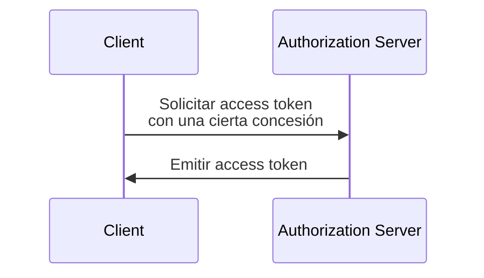

## ¿Qué es una concesión de OAuth 2.0 (OAuth 2.0 grant)?

Una concesión de OAuth 2.0 (OAuth 2.0 grant) es un proceso de autorización que permite a un <Ref slug="client" /> solicitar un <Ref slug="access-token" /> de un <Ref slug="authorization-server" />. También puede escuchar otros términos relacionados con este concepto, así que aclaremos antes de profundizar:

- **Concesión de OAuth 2.0 (OAuth 2.0 grant)**: También conocida como "tipo de concesión de OAuth 2.0", "flujo de OAuth 2.0" o "concesión de autorización de OAuth 2.0". En la mayoría de los contextos, estos términos se refieren al mismo concepto.
- <Ref slug="authorization-server" />: El servidor que emite access tokens (tokens de acceso) al cliente. En OpenID Connect (OIDC), el servidor de autorización es el mismo que el <Ref slug="openid-connect" headingId="openid-provider-op" />.
- <Ref slug="authorization-request" />: La solicitud realizada por el cliente al servidor de autorización para obtener un access token (token de acceso). En OpenID Connect (OIDC), también se refiere a una <Ref slug="authentication-request" />.

Para mayor claridad, usaremos los términos iniciales mencionados anteriormente de manera consistente a lo largo de este artículo.

El proceso general de una concesión de OAuth 2.0 (OAuth 2.0 grant) es bastante simple:

Después de que el cliente recibe el access token (token de acceso), puede usarlo para acceder a recursos protegidos (por ejemplo, APIs) en nombre de un usuario o de sí mismo.

Tenga en cuenta que según la concesión específica, el cliente y el servidor de autorización pueden intercambiar información adicional e involucrar más pasos en el proceso. Por ejemplo, la <Ref slug="authorization-code-flow">concesión de código de autorización</Ref> implica la autenticación y autorización del usuario, la generación de código y el intercambio de tokens.

## Diferentes concesiones de OAuth 2.0 (OAuth 2.0 grants)

La especificación básica de OAuth 2.0 define cuatro concesiones que los clientes pueden usar para obtener access tokens (tokens de acceso):

1. <Ref slug="authorization-code-flow">Concesión de código de autorización</Ref>: La concesión más segura y recomendada para la mayoría de las aplicaciones. Está obligado a usar <Ref slug="pkce" /> para todos los clientes en <Ref slug="oauth-2.1" />.
2. <Ref slug="implicit-flow">Concesión implícita</Ref>: Una concesión simplificada que está en desuso en OAuth 2.1 debido a preocupaciones de seguridad.
3. [Concesión de credenciales de contraseña del propietario del recurso (ROPC)](https://datatracker.ietf.org/doc/html/rfc6749#section-4.3): Una concesión donde las credenciales del usuario se intercambian directamente por un access token (token de acceso). No se recomienda para la mayoría de las aplicaciones debido a riesgos de seguridad.
4. <Ref slug="client-credentials-flow">Concesión de credenciales de cliente</Ref>: Una concesión utilizada por <Ref slug="client" headingId="confidential-clients" /> para obtener un access token (token de acceso) sin la participación del usuario.

A medida que la industria evoluciona, las concesiones implícitas y ROPC están [siendo descontinuadas](https://blog.logto.io/oauth-2-1) en favor de flujos más seguros y estandarizados. Para nuevas aplicaciones, las opciones son claras:

- Para la autenticación y autorización de usuarios, use la concesión de código de autorización con PKCE.
- Para la comunicación <Ref slug="machine-to-machine" />, use la concesión de credenciales de cliente.

### Otras concesiones de OAuth 2.0 (OAuth 2.0 grants)

Además de las cuatro concesiones básicas, existen otras extensiones que definen nuevas concesiones para casos de uso específicos. Por ejemplo:

- La <Ref slug="device-flow">concesión de autorización de dispositivo</Ref> es una concesión diseñada para dispositivos con capacidades de entrada limitadas, como televisores inteligentes y dispositivos IoT.
- El <Ref slug="hybrid-flow">flujo híbrido</Ref> es una concesión de OpenID Connect que combina la concesión de código de autorización con la concesión implícita.

## Concesiones en OpenID Connect (OIDC)

En <Ref slug="openid-connect" />, el concepto de concesiones se amplía para incluir <Ref slug="id-token">ID tokens</Ref> que representan información de identidad del usuario además de los access tokens (tokens de acceso). OIDC extiende dos concesiones de OAuth 2.0 (código de autorización e implícito) para incluir ID tokens, e introduce una nueva concesión llamada <Ref slug="hybrid-flow">flujo híbrido</Ref> que combina ambos.

> Al igual que OAuth 2.0, solo se recomienda usar la concesión de código de autorización con PKCE en OIDC para la autenticación y autorización de usuarios.

Mientras tanto, dado que OIDC está construido sobre OAuth 2.0, otras concesiones como la concesión de credenciales de cliente aún pueden utilizarse en el mismo servidor de autorización, siempre que el servidor las admita.

<SeeAlso slugs={["pkce", "oauth-2.1", "authorization-code-flow", "implicit-flow", "client-credentials-flow", "device-flow"]} />

<Resources
  urls={[
    "https://blog.logto.io/implicit-flow-is-dead",
    "https://datatracker.ietf.org/doc/html/rfc6749",
    "https://openid.net/specs/openid-connect-core-1_0.html"
  ]}
/>
