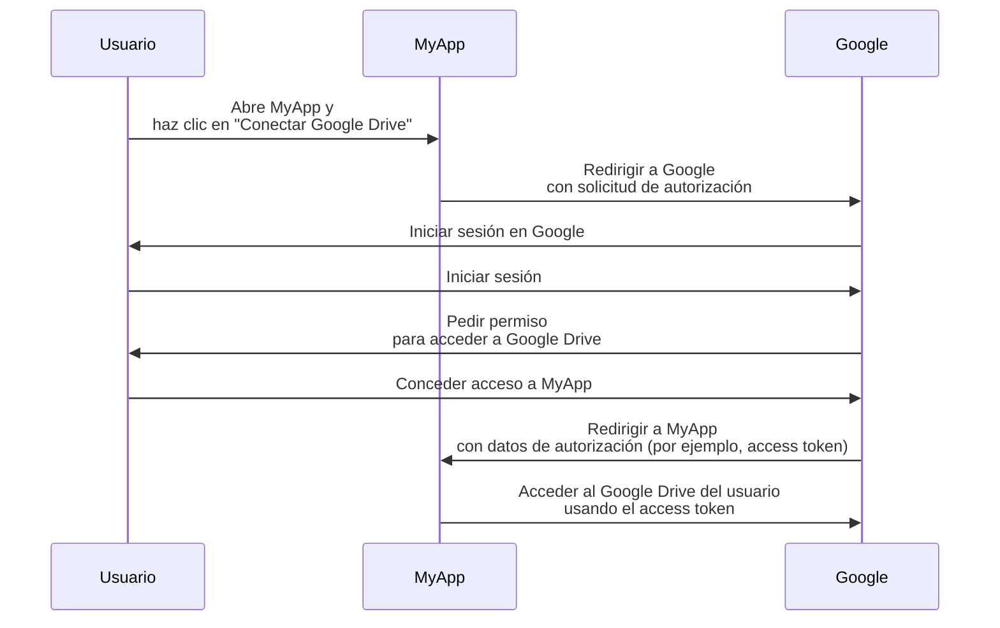
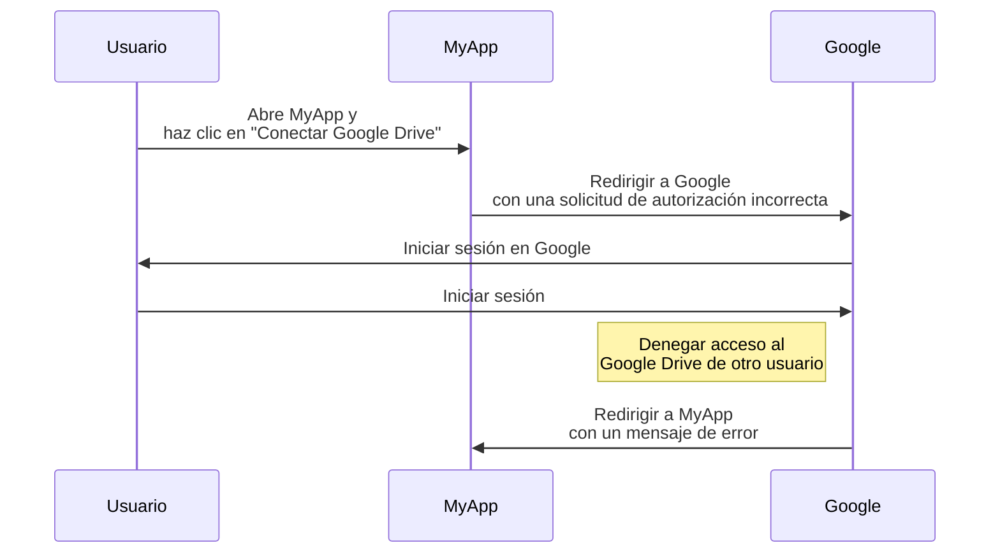
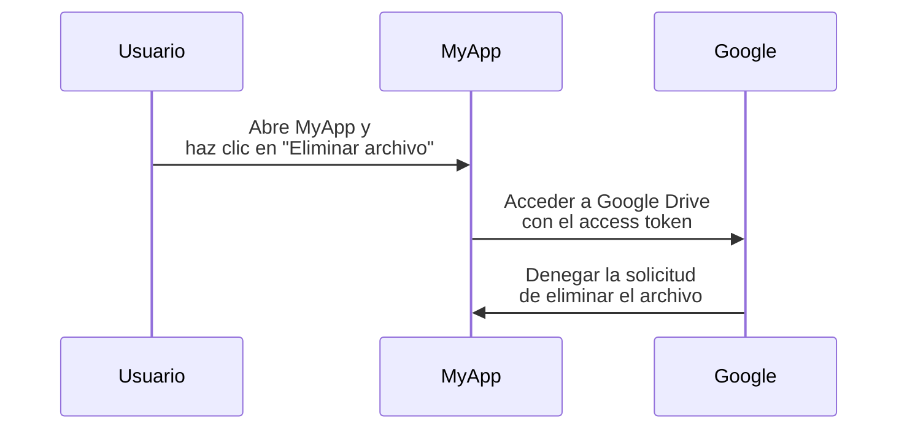

## ¿Qué es OAuth 2.0?

OAuth 2.0 es el estándar de facto para la autorización y es ampliamente utilizado en la web. Permite a una aplicación obtener de manera segura acceso limitado a recursos protegidos en otra aplicación, como el perfil o los datos de un usuario, sin exponer credenciales como contraseñas.

Veamos un ejemplo del mundo real para entenderlo mejor. Tienes una aplicación web MyApp que desea acceder al Google Drive del usuario. En lugar de pedir al usuario que comparta sus credenciales de Google Drive, MyApp puede usar OAuth 2.0 para solicitar acceso a Google Drive en nombre del usuario. Aquí hay un flujo simplificado:

En este flujo, MyApp nunca ve las credenciales del Google Drive del usuario. En cambio, recibe un <Ref slug="access-token" /> de Google que le permite acceder a Google Drive en nombre del usuario.

### Componentes clave de OAuth 2.0

Para el ejemplo anterior, MyApp es el <Ref slug="client" />, Google es tanto el <Ref slug="authorization-server" /> como el <Ref slug="resource-server" />, y el usuario es el <Ref slug="resource-owner" />. El flujo involucra todos los componentes clave de OAuth 2.0:

- **Cliente**: La aplicación que desea acceder a los recursos protegidos. "Cliente" y "aplicación" a menudo se usan indistintamente.
- **Propietario del recurso**: El usuario que posee los recursos protegidos. El propietario del recurso puede conceder (autorizar) o denegar el acceso al cliente.
- **Servidor de autorización**: El servidor que realiza la autorización (generalmente con autenticación) y emite access tokens al cliente.
- **Servidor de recursos**: El servidor que aloja los recursos protegidos. Verifica el access token y proporciona los recursos protegidos al cliente.

## Concesiones (flujos) de OAuth 2.0

La <Ref slug="oauth-2.0-grant">Concesión</Ref> construye la base de OAuth 2.0 y define cómo el cliente puede obtener un access token del servidor de autorización. La especificación básica de OAuth 2.0 define cuatro concesiones:

- <Ref slug="authorization-code-flow">Concesión de código de autorización</Ref>
- <Ref slug="implicit-flow">Concesión implícita</Ref>
- [Concesión de credenciales de usuario del propietario del recurso (ROPC)](https://datatracker.ietf.org/doc/html/rfc6749#section-4.3)
- <Ref slug="client-credentials-flow">Concesión de credenciales de cliente</Ref>

Sin entrar en los detalles de cada concesión, podemos esperar que estas concesiones se dividan en dos categorías:

- **Concesiones de autorización**: Se utilizan cuando el cliente necesita acceder a recursos en nombre de un usuario, es decir, se requiere la autorización del usuario.
- **Concesión de credenciales de cliente**: Se utiliza cuando el cliente necesita acceder a recursos en su propio nombre. Esta concesión es adecuada para la comunicación <Ref slug="machine-to-machine" />.

### Concesiones de autorización

Independientemente del tipo de concesión, las concesiones de autorización tienen los siguientes pasos comunes:

1. El cliente inicia una <Ref slug="authorization-request" /> al servidor de autorización.
2. El servidor de autorización autentica al usuario (propietario del recurso) y solicita permiso para acceder a los recursos.
3. El usuario concede permiso al cliente.
4. El servidor de autorización emite un access token al cliente.
5. El cliente utiliza el access token para acceder a los recursos protegidos en el <Ref slug="resource-server" />.

Tenga en cuenta que los pasos y parámetros exactos pueden variar según el tipo de concesión. Por ejemplo, la <Ref slug="authorization-code-flow">concesión de código de autorización</Ref> involucra más pasos como la generación e intercambio de código.

### Concesión de credenciales de cliente

La <Ref slug="client-credentials-flow">concesión de credenciales de cliente</Ref> es mucho más simple y no involucra la autorización del usuario. Aquí hay un flujo simplificado:

1. El cliente envía una <Ref slug="token-request" /> al servidor de autorización.
2. El servidor de autorización autentica al cliente y emite un access token.
3. El cliente utiliza el access token para acceder a los recursos protegidos en el <Ref slug="resource-server" />.

---

Para discusiones exhaustivas sobre las concesiones de OAuth 2.0, consulta <Ref slug="oauth-2.0-grant" /> y los artículos específicos sobre concesiones.

## Control de acceso (Access Control) con OAuth 2.0

OAuth 2.0 define el parámetro <Ref slug="scope" /> para especificar los permisos que solicita el cliente. El servidor de autorización puede ignorar parcial o completamente los alcances solicitados y otorgar acceso basado en sus propias políticas de control de acceso (access control).

Sin embargo, OAuth 2.0 deja al servidor de autorización a su propia discreción cómo hacer cumplir el <Ref slug="access-control" />. Esto significa que el servidor de autorización puede decidir qué recursos puede acceder el sujeto (usuario o cliente) y qué acciones pueden realizar sobre esos recursos.

Sigamos usando el ejemplo de Google Drive. MyApp puede iniciar una solicitud de autorización para acceder por error al Google Drive de otro usuario. En este caso, el servidor de autorización de Google debería denegar la solicitud porque el usuario no tiene los permisos necesarios para acceder al Google Drive de otro usuario.

Otro caso es cuando MyApp recibe un access token de Google que le permite leer archivos del Google Drive del usuario. Sin embargo, MyApp intenta eliminar un archivo en lugar de leerlo. El servidor de recursos (Google) debería denegar la solicitud.

Ambos casos demuestran por qué se requiere <Ref slug="access-control" /> al implementar OAuth 2.0. El <Ref slug="authorization-server" /> y el <Ref slug="resource-server" /> deben trabajar juntos para hacer cumplir las políticas de control de acceso y proteger los recursos.

### Modelos de control de acceso (Access Control)

Para manejar adecuadamente el control de acceso (access control), se recomienda utilizar los modelos estándar de control de acceso como <Ref slug="rbac" /> y <Ref slug="abac" />. Estos modelos han demostrado ser efectivos en la industria y ofrecen la escalabilidad necesaria para futuros requisitos.

## OAuth 2.1

<Ref slug="oauth-2.1" /> es una actualización propuesta para la especificación de OAuth 2.0 que tiene como objetivo mejorar la seguridad y la usabilidad de acuerdo con la experiencia de la industria a lo largo de los años. Aunque OAuth 2.1 aún no está finalizado, todavía podemos aprender sobre los cambios propuestos y entender cómo podrían afectar las implementaciones actuales de OAuth 2.0. OAuth 2.1 puede tratarse como una formalización de las mejores prácticas y recomendaciones de seguridad que han sido ampliamente adoptadas en la industria.

## OAuth 2.0 y OpenID Connect (OIDC)

OAuth 2.0 solo define el proceso de autorización y no cubre la autenticación del usuario o la identidad. Por esta razón, se introdujo <Ref slug="openid-connect" /> como una capa de identidad sobre OAuth 2.0. OIDC extiende OAuth 2.0 para proporcionar autenticación de usuario e información de identidad en forma de <Ref slug="id-token" />.

OpenID Connect amplía dos concesiones de OAuth 2.0 (código de autorización e implícita) para incluir ID tokens, e introduce una nueva concesión llamada <Ref slug="hybrid-flow">flujo híbrido</Ref> que combina ambos.

Es decir, todo tu conocimiento y prácticas de OAuth 2.0 pueden aplicarse directamente a OIDC; todas las extensiones de OAuth 2.0 como <Ref slug="pkce" /> y <Ref slug="resource-indicator" /> también pueden usarse en OIDC.

<SeeAlso slugs={["oauth-2.0-grant", "oauth-2.1", "openid-connect"]} />

<Resources
  urls={[
    "https://blog.logto.io/secure-cloud-apps-with-oauth-and-openid-connect",
    "https://blog.logto.io/oauth-2-1",
    "https://datatracker.ietf.org/doc/html/rfc6749",
    "https://datatracker.ietf.org/doc/draft-ietf-oauth-v2-1/",
  ]}
/>
