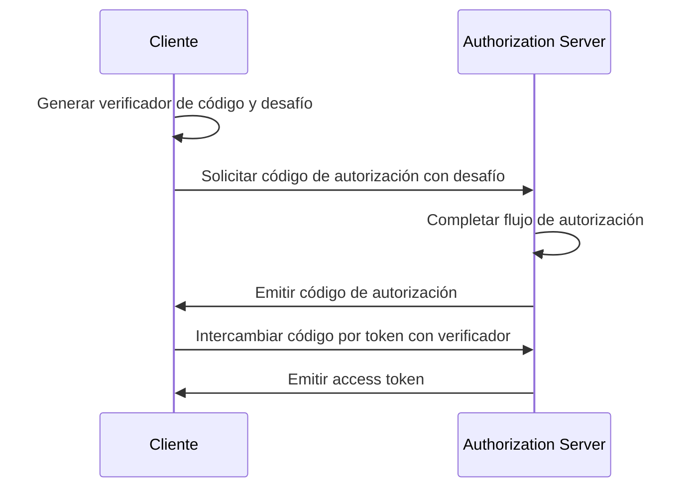

## ¿Qué es OAuth 2.1?

OAuth 2.1 es una actualización propuesta del marco de autorización de <Ref slug="oauth-2.0" />. Implica una serie de cambios y recomendaciones a la especificación actual de OAuth 2.0 que consolidan las mejores prácticas y mejoras de seguridad que se han adoptado ampliamente en la industria a lo largo de los años.

Las principales actualizaciones de OAuth 2.1 son:

1. Descontinuar <Ref slug="implicit-flow">concesión implícita</Ref> y [Concesión de Credenciales de Contraseña del Propietario del Recurso (ROPC)](https://datatracker.ietf.org/doc/html/rfc6749#section-4.3) debido a preocupaciones de seguridad.
2. Imponer el uso de <Ref slug="pkce" /> para todos los clientes, incluidos los <Ref slug="client" headingId="confidential-clients">clientes confidenciales (privados)</Ref>.
3. Coincidencia exacta de <Ref slug="redirect-uri">URIs de redireccionamiento</Ref>.
4. Definición clara de los tipos de <Ref slug="client">cliente</Ref> (clientes públicos y confidenciales).
5. Requisitos de seguridad para los <Ref slug="refresh-token">tokens de actualización</Ref>.

## Descontinuación de la concesión implícita

La concesión implícita fue diseñada para aplicaciones de una sola página (SPAs) y aplicaciones basadas en navegador que no pueden almacenar de manera segura los secretos del cliente. Sin embargo, sus riesgos de seguridad han llevado a su descontinuación: la concesión devuelve el access token en el canal frontal (fragmento de URL), que puede ser expuesto a atacantes a través del historial del navegador y encabezados referer.

OAuth 2.1 recomienda usar la <Ref slug="authorization-code-flow">concesión del código de autorización</Ref> con <Ref slug="pkce" /> para aplicaciones basadas en navegador.

## Descontinuación de la concesión de ROPC

La concesión de ROPC permite al cliente intercambiar directamente las credenciales del usuario por un access token. Fue diseñada para aplicaciones heredadas que no pueden soportar la concesión del código de autorización. Sin embargo, la concesión plantea riesgos de seguridad al:

- Exponer las credenciales del usuario al cliente.
- Evitar la pantalla de consentimiento del authorization server.
- Limitar la capacidad del authorization server para imponer otras medidas de seguridad, como <Ref slug="mfa" />.

OAuth 2.1 recomienda usar la <Ref slug="authorization-code-flow">concesión del código de autorización</Ref> con <Ref slug="pkce" /> para la autenticación y autorización del usuario.

## Imposición de PKCE para todos los clientes

<Ref slug="pkce" /> es una extensión de seguridad al authorization code flow que mitiga el riesgo de ataques de interceptación de códigos de autorización. Implica que el cliente genera un verificador de código y un desafío de código, y el authorization server verifica el desafío durante el intercambio de token.

Aquí hay un diagrama de secuencia simplificado del authorization code flow con PKCE:

Inicialmente se recomendaba que los <Ref slug="client" headingId="public-clients">clientes públicos</Ref> usaran PKCE, pero OAuth 2.1 extiende esta recomendación a un requisito obligatorio para todos los clientes, incluidos los <Ref slug="client" headingId="confidential-clients">clientes confidenciales (privados)</Ref>.

## Coincidencia exacta de URIs de redireccionamiento

Las <Ref slug="redirect-uri">URIs de redireccionamiento</Ref> son usadas por el cliente para recibir respuestas de autorización del authorization server. OAuth 2.1 introduce un nuevo requisito de que el URI de redireccionamiento utilizado en la authorization request debe coincidir exactamente con el URI de redireccionamiento registrado por el cliente con el <Ref slug="authorization-server" />, incluyendo el esquema, host y ruta.

En algunas implementaciones de OAuth 2.0, la coincidencia de URI de redireccionamiento era flexible, permitiendo coincidencias parciales o caracteres comodín. Sin embargo, esta flexibilidad puede introducir riesgos de seguridad, como vulnerabilidades de redirección abierta.

## Definición clara de los tipos de cliente

OAuth 2.0 no define explícitamente los tipos de cliente. Pueden verse diversas categorizaciones en la industria, como por nivel de acceso (público vs. confidencial) o por tipo de aplicación (aplicación web vs. aplicación móvil). Para el marco OAuth, no importa cómo esté implementado el cliente (ya que son más sobre los atributos comerciales del cliente), pero el nivel de acceso marca una diferencia en los requisitos de seguridad.

Por lo tanto, OAuth 2.1 introduce una definición clara de tipos de cliente:

- <Ref slug="client" headingId="public-clients" />: Clientes que NO PUEDEN mantener la confidencialidad de sus credenciales (por ejemplo, SPAs, aplicaciones móviles).
- <Ref slug="client" headingId="confidential-clients" />: Clientes que PUEDEN mantener la confidencialidad de sus credenciales (por ejemplo, aplicaciones web del lado del servidor, aplicaciones de escritorio nativas).

## Requisitos de seguridad para tokens de actualización

<Ref slug="refresh-token">Los tokens de actualización</Ref> son tokens de larga duración utilizados por el cliente para obtener nuevos access tokens sin interacción del usuario. Al mismo tiempo, también son objetivos de alto valor para los atacantes. Dado que los clientes públicos no pueden almacenar credenciales de manera segura, OAuth 2.1 especifica que el <Ref slug="authorization-server" /> debería utilizar uno de los siguientes métodos para asegurar los tokens de actualización:

- Emitir <Ref slug="refresh-token" headingId="sender-constrained-refresh-tokens">tokens de actualización restringidos al remitente</Ref>.
- Usar <Ref slug="refresh-token" headingId="refresh-token-rotation">rotación de tokens de actualización</Ref> para limitar la usabilidad y el tiempo de vida de los tokens de actualización.

## OAuth 2.1 y OpenID Connect (OIDC)

Dado que <Ref slug="openid-connect" /> se construye sobre OAuth 2.0, los cambios introducidos en OAuth 2.1 también se aplican a OIDC. Por ejemplo, todos los clientes de OIDC deben usar authorization code flow con PKCE para la autenticación y autorización del usuario.

<SeeAlso slugs={["oauth-2.0", "authorization-code-flow", "pkce", "implicit-flow", "openid-connect"]} />

<Resources
  urls={[
    "https://datatracker.ietf.org/doc/draft-ietf-oauth-v2-1/",
    "https://blog.logto.io/oauth-2-1",
  ]}
/>
