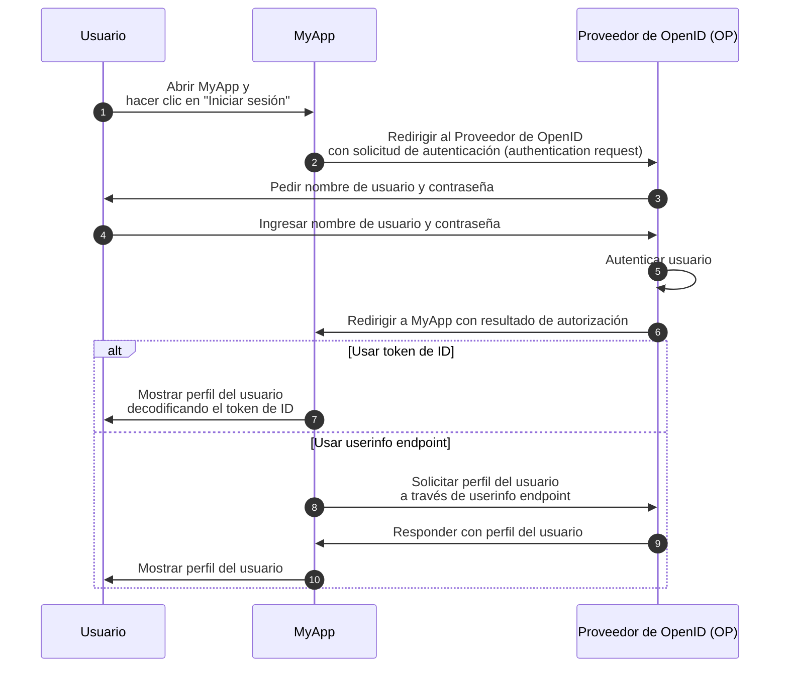
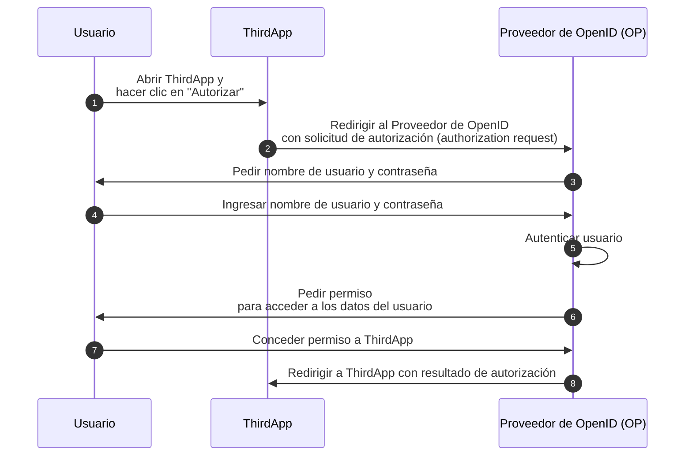

## ¿Qué es OpenID Connect (OIDC)?

OpenID Connect (OIDC) añade capacidades de autenticación (authentication) a <Ref slug="oauth-2.0" />, un marco de autorización (authorization), al introducir una capa de identidad sobre él. OIDC permite a los clientes autenticar usuarios y obtener información de identidad en forma de <Ref slug="id-token">tokens de identificación (ID tokens)</Ref> y respuestas del <Ref slug="userinfo-endpoint" />.

Veamos un ejemplo. Supongamos que tienes una aplicación web llamada MyApp y los usuarios pueden iniciar sesión usando nombre de usuario y contraseña; después de iniciar sesión, pueden acceder a su información de perfil. Aquí tienes un flujo simplificado:



Algunos términos pueden ser nuevos para ti, así que vamos a aclararlos:

### Proveedor de OpenID (OP) ||openid-provider-op||

Un Proveedor de OpenID (OP) es un <Ref slug="identity-provider">proveedor de identidad (identity provider)</Ref> que implementa la especificación OIDC y OAuth 2.0. Es decir, un OP también es un <Ref slug="authorization-server">servidor de autorización (authorization server)</Ref> de OAuth 2.0.

Los OPs son responsables de autenticar a los usuarios y emitir tokens de ID y tokens de acceso (access tokens) a los clientes.

### Tokens

- <Ref slug="id-token">Tokens de ID (ID tokens)</Ref> son <Ref slug="jwt">JSON Web Tokens</Ref> utilizados para representar información de identidad del usuario, como nombre, correo electrónico y foto de perfil.
- <Ref slug="access-token">Tokens de acceso (access tokens)</Ref> se usan para acceder a recursos protegidos en nombre del usuario (igual que en OAuth 2.0), por ejemplo, el userinfo endpoint.

### Solicitud de autenticación y resultado

- Una <Ref slug="authentication-request" /> es una solicitud realizada por el cliente al OP para autenticar al usuario. Incluye parámetros para especificar ciertos requisitos y afectará el proceso de autenticación.
- Dependiendo de la solicitud de autenticación, el resultado de la autenticación puede variar. Por ahora, solo necesitas saber que el resultado lleva la información necesaria para que el cliente identifique al usuario.

### Userinfo endpoint

El <Ref slug="userinfo-endpoint" /> es un endpoint específico de OIDC que permite a los clientes recuperar información de perfil del usuario. Es una alternativa al uso de tokens de ID, ya que el userinfo endpoint generalmente proporciona más información detallada del usuario que el token de ID.

OIDC deja al Proveedor de OpenID (OP) decidir qué información incluir en el token de ID y la respuesta de userinfo. Así que antes de analizar el token de ID o llamar al userinfo endpoint, deberías consultar la documentación del OP para entender qué información está disponible.

## Diferencias de términos entre OAuth 2.0 y OIDC

Dado que OIDC se construye sobre OAuth 2.0, muchos términos están compartidos entre las dos especificaciones. Sin embargo, mientras que OAuth 2.0 se centra en la autorización (authorization), OIDC introduce autenticación (authentication) e identidad, haciendo algunos términos inadecuados en el contexto de OIDC. Aquí hay algunas diferencias notables:

| OAuth 2.0             | OpenID Connect (OIDC)  |
|-----------------------|------------------------|
| Authorization server  | OpenID Provider (OP)   |
| Authorization request | Authentication request |
| Grant                 | Flow                   |

En esencia, los términos anteriores pueden apuntar al mismo tema, pero tienen diferentes significados en el contexto de OAuth 2.0 y OIDC:

- **OpenID Provider (OP)** es un <Ref slug="authorization-server">servidor de autorización (authorization server)</Ref> de OAuth 2.0 que tiene la capacidad de autenticar usuarios y emitir tokens de ID.
- **<Ref slug="authentication-request" />** es una <Ref slug="authorization-request">solicitud de autorización (authorization request)</Ref> de OAuth 2.0 que utiliza parámetros específicos de OIDC para solicitar autenticación del usuario final y obtener un token de ID.
- **Flow** es un término más general utilizado en OIDC para describir el proceso de autenticación y autorización del usuario, que puede involucrar múltiples pasos e interacciones en lugar de un ciclo de solicitud-respuesta único. Es esencialmente lo mismo que un <Ref slug="oauth-2.0-grant">grant de OAuth 2.0 (oauth 2.0 grant)</Ref>.

## Flujos de OIDC

Como muestra el ejemplo anterior, los flujos de OIDC son iniciados por el cliente (por ejemplo, MyApp) con una solicitud de autenticación (authentication request) al OP. La solicitud de autenticación especifica el flujo a utilizar, que puede ser uno de los siguientes:

- **<Ref slug="authorization-code-flow" />**: El flujo más seguro y recomendado para la autenticación (authentication) y autorización (authorization) del usuario. <Ref slug="pkce" /> es obligatorio para todos los clientes en <Ref slug="oauth-2.1" />.
- **<Ref slug="implicit-flow" />**: Un flujo simplificado que está obsoleto en OAuth 2.1 debido a problemas de seguridad.
- **<Ref slug="hybrid-flow" />**: Un flujo específico de OIDC que combina el flujo de autorización con el flujo implícito. Tampoco se recomienda para nuevas aplicaciones debido a problemas de seguridad.

El flujo de código de autorización (authorization code flow) y el flujo implícito (implicit flow) se extienden desde OAuth 2.0 para incluir tokens de ID, mientras que el flujo híbrido (hybrid flow) es un flujo específico de OIDC que combina ambos. Haz clic en los enlaces anteriores para obtener más información sobre cada flujo.

## Alcances (scopes) y reclamaciones (claims) de OIDC

Al igual que OAuth 2.0, OIDC utiliza valores de <Ref slug="scope">alcance (scope)</Ref> para especificar los permisos que solicita el cliente. Dado que los <Ref slug="id-token">tokens de ID</Ref> son <Ref slug="jwt">JSON Web Tokens</Ref>, pueden incluir <Ref slug="claim">reclamaciones (claims)</Ref> (pares de nombre-valor) que representan información de identidad del usuario según los alcances solicitados en la <Ref slug="authentication-request">solicitud de autenticación (authentication request)</Ref>. Dichas reclamaciones también se devuelven en la respuesta del <Ref slug="userinfo-endpoint" />.

OIDC define varios alcances estándar y las reclamaciones correspondientes que los clientes pueden solicitar en la solicitud de autenticación:

- **openid**: Indica que el cliente es un cliente OIDC y solicita un token de ID.
- **profile**: Solicita acceso a las reclamaciones de perfil predeterminadas del usuario, que son: `name`, `family_name`, `given_name`, `middle_name`, `nickname`, `preferred_username`, `profile`, `picture`, `website`, `gender`, `birthdate`, `zoneinfo`, `locale` y `updated_at`.
- **email**: Solicita acceso a las reclamaciones `email` y `email_verified` del usuario.
- **address**: Solicita acceso a la reclamación `address` del usuario.
- **phone**: Solicita acceso a las reclamaciones `phone_number` y `phone_number_verified` del usuario.
- **offline_access**: Solicita un token de actualización (refresh token) para permitir al cliente obtener nuevos tokens de acceso sin interacción del usuario.

Consulta [Reclamaciones Estándar](https://openid.net/specs/openid-connect-core-1_0.html#StandardClaims) y [Solicitar Reclamaciones usando Valores de Alcance](https://openid.net/specs/openid-connect-core-1_0.html#ScopeClaims) en la especificación de OIDC para obtener más información sobre alcances y reclamaciones. También revisa <Ref slug="offline-access" /> para una explicación detallada del alcance `offline_access`.

> [!Nota]
> Los Proveedores de OpenID (OPs) pueden admitir alcances y reclamaciones adicionales más allá de las estándar. Consulta la documentación del OP para más detalles.

## Autorización en OIDC

Si estás familiarizado con OAuth 2.0, puedes notar que el ejemplo anterior no involucra ningún proceso de <Ref slug="authorization">autorización (authorization)</Ref>. El ejemplo omite la parte de consentimiento del usuario porque asumimos que MyApp es una aplicación de primera parte que no involucra acceso a datos de usuario por terceros. La autorización aún es aplicada por el OP, pero no se muestra explícitamente en el flujo.

La parte de consentimiento del usuario es necesaria cuando un cliente de terceros (por ejemplo, una aplicación que no es propiedad del OP) solicita acceso a los datos del usuario. En tales casos, el OP pedirá al usuario que conceda permiso al cliente antes de emitir el token de ID o el token de acceso. Supongamos que hay una aplicación de terceros llamada ThirdApp que quiere acceder a los datos del usuario:



Una vez que el proceso de autorización está completo y ThirdApp recibe el resultado de autorización (generalmente un <Ref slug="access-token">token de acceso</Ref>), puede acceder a los datos del usuario desde el <Ref slug="resource-server">servidor de recursos (resource server)</Ref>.

Consulta <Ref slug="oauth-2.0" /> para obtener más información sobre OAuth 2.0 y los flujos de autorización.

### Alcances (Scopes)

Al igual que OAuth 2.0, OIDC utiliza valores de <Ref slug="scope">alcance (scope)</Ref> para especificar los permisos solicitados por el cliente. Hemos cubierto los alcances y reclamaciones estándar en [Alcances (scopes) y reclamaciones (claims) de OIDC](#oidc-scopes-and-claims). Es importante señalar que estos alcances y reclamaciones deben tratarse como valores reservados en OIDC, lo que significa que NO debes usarlos para propósitos específicos de negocio.

En la práctica, tu Proveedor de OpenID (OP) puede admitir alcances y reclamaciones personalizados para tus necesidades comerciales. Consulta la documentación del OP para obtener más información sobre alcances y reclamaciones personalizadas. Si no defines alcances y reclamaciones personalizados, el OP puede ignorarlos directamente o devolver una respuesta de error.

### Indicadores de recurso (Resource indicators)

Dado que el marco como OIDC y el OP pueden reservar ciertos alcances y reclamaciones para propósitos específicos, usualmente el OP recomienda usar un prefijo o espacio de nombres para evitar conflictos con valores reservados al definir alcances y reclamaciones personalizados. Por ejemplo, puedes prefijar tus alcances personalizados con `myapp:` para indicar que son específicos de tu aplicación.

```json
{
  "scope": "myapp:custom_scope"
}
```

Sin embargo, esto no puede garantizar que tus alcances y reclamaciones personalizados no entren en conflicto con futuros valores reservados, y puede aumentar el tamaño del token. Una extensión de OAuth 2.0 llamada <Ref slug="resource-indicator">indicadores de recurso (resource indicators)</Ref> proporciona una forma más flexible y escalable de lograr el mismo objetivo. Los indicadores de recurso son URIs que representan los recursos solicitados, y pueden ser los endpoints API reales para reflejar los recursos del mundo real. Por ejemplo, puedes usar `https://api.myapp.com` como un indicador de recurso para representar los recursos API a los que tu cliente quiere acceder.

De nuevo, dado que OIDC se construye sobre OAuth 2.0, puedes usar indicadores de recurso en solicitudes de autenticación (authentication requests) de OIDC cuando estén configurados adecuadamente. Aquí tienes un ejemplo no normativo de una solicitud de autenticación con un indicador de recurso:

```http
GET /authorize?response_type=code
  &client_id=YOUR_CLIENT_ID
  &redirect_uri=https%3A%2F%2Fclient.example.com%2Fcallback
  &scope=openid%20profile
  &resource=https%3A%2F%2Fapi.example.com HTTP/1.1
Host: your-openid-provider.com
```

Para usar indicadores de recurso, primero necesitas confirmar que tu OP admite esta extensión (RFC 8707). Si está soportado, deberías registrar un URI de indicador de recurso con el OP y usarlo en el parámetro `resource` de la solicitud de autenticación.

Consulta <Ref slug="resource-indicator" /> para obtener información detallada sobre los indicadores de recurso.

## Consideraciones de seguridad de OIDC

### Comunicación segura

Todas las comunicaciones entre el cliente, el OP y el servidor de recursos deberían estar aseguradas usando HTTPS para prevenir cualquier espionaje o manipulación de los datos.

### Elegir flujos seguros

Al implementar OIDC, se recomienda usar:

- <Ref slug="authorization-code-flow" /> con <Ref slug="pkce" /> para la autenticación y autorización del usuario (obligatorio en <Ref slug="oauth-2.1" />).
- <Ref slug="client-credentials-flow" /> para la comunicación máquina a máquina (machine to machine).

Los flujos implícito (implicit flow) e híbrido (hybrid flow) están obsoletos debido a problemas de seguridad, así que evita usarlos para nuevas aplicaciones y considera migrar aplicaciones existentes a flujos más seguros.

### Validación de tokens de ID

Al recibir un token de ID del OP, el cliente debe validar el token para asegurar su integridad y autenticidad. El proceso de validación debe INCLUIR AL MENOS las siguientes verificaciones:

- **Issuer (Issuer)**: La reclamación `iss` debería coincidir con la URL del emisor del OP.
- **Audiencia (Audience)**: La reclamación `aud` debería coincidir con el ID del cliente.
- **Expiración**: La reclamación `exp` debería estar en el futuro.
- **Firma**: El token debería estar firmado por la <Ref slug="signing-key">clave de firma (signing key)</Ref> del OP.

### Uso de tokens de acceso

Los tokens de acceso se usan para acceder a recursos protegidos en nombre del usuario. Los clientes deberían tratar los tokens de acceso como información sensible y seguir estas mejores prácticas:

- **Almacenamiento de tokens**: Almacenar los tokens de acceso de forma segura y evitar exponerlos a partes no autorizadas.
- **Expiración de tokens**: Los tokens de acceso deberían tener un tiempo de expiración corto (por ejemplo, 1 hora) para reducir el riesgo de acceso no autorizado si el token es comprometido.
- **Revocación de tokens**: Implementar mecanismos de revocación de tokens para invalidar los tokens de acceso cuando sea necesario.

### Consentimiento del usuario

Cuando un cliente de terceros solicita acceso a los datos del usuario, el OP debería asegurar que el usuario esté consciente de los permisos solicitados y otorgue su consentimiento. El proceso de consentimiento del usuario debería ser transparente y proporcionar información clara sobre los datos que se están accediendo y cómo se usarán.

<SeeAlso slugs={["oauth-2.0", "authorization-code-flow", "implicit-flow", "hybrid-flow", "pkce", "resource-indicator"]} />

<Resources
  urls={[
    "https://blog.logto.io/secure-cloud-apps-with-oauth-and-openid-connect",
    "https://openid.net/specs/openid-connect-core-1_0.html",
  ]}
/>
