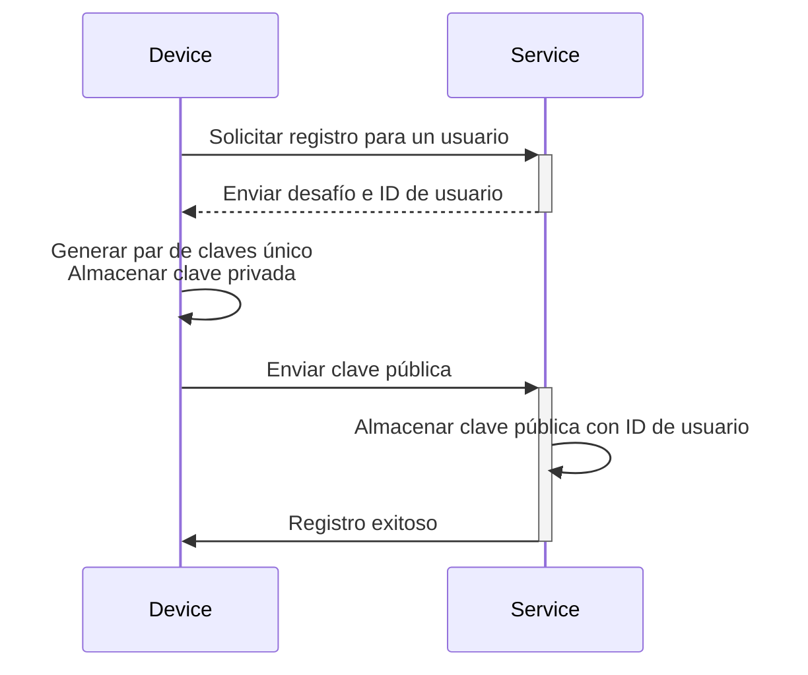
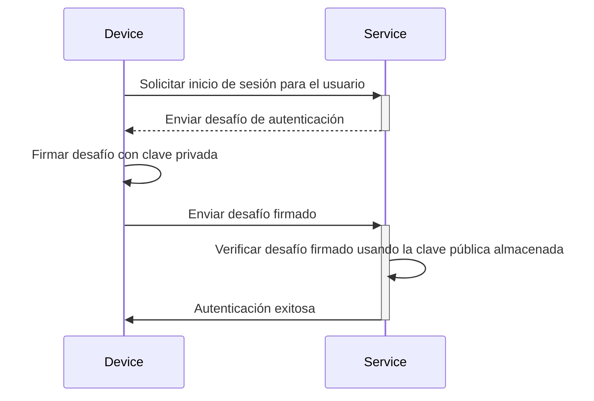

## ¿Qué es una clave de acceso (Passkey)?

**Clave de acceso (Passkey)** es una alternativa segura y conveniente basada en [FIDO](https://fidoalliance.org/) a las contraseñas tradicionales. Utilizan criptografía avanzada para proteger tus cuentas de ataques de [phishing](https://en.wikipedia.org/wiki/Phishing).

- **Única para cada servicio**: Cuando te registras en un servicio, tu dispositivo crea una clave de acceso única vinculada al dominio específico de ese servicio.
- **Vinculada al dispositivo:** Las claves de acceso generalmente están vinculadas a un dispositivo, como un teléfono, laptop, identificador biométrico o claves de seguridad de hardware.
- **Par de claves pública-privada:** El dispositivo guarda la clave privada, mientras que la clave pública se comparte con el servicio. Estos pares de claves criptográficas se llaman claves de acceso. (Citado de [FIDO](https://fidoalliance.org/how-fido-works/))
- **Múltiples métodos de autenticación:** Puedes usar un escaneo de huella digital, reconocimiento facial, PIN del dispositivo, escaneo de código QR o claves de seguridad para autenticarte con una clave de acceso.
- **Sincronización entre dispositivos**: Las claves de acceso pueden sincronizarse entre dispositivos utilizando almacenamiento en la nube seguro (por ejemplo, iCloud Keychain de Apple o Google Password Manager), lo que te permite iniciar sesión desde cualquier dispositivo compatible.

## ¿Cómo es el flujo de trabajo de la clave de acceso (Passkey)?

Aquí tienes un ejemplo del mundo real para ayudarte a entender mejor. Tienes un servicio web MyApp que quiere implementar el inicio de sesión con clave de acceso en lugar de un inicio de sesión basado en contraseña. Los usuarios seleccionan el dispositivo actual con escaneo de huellas digitales como método de autenticación de clave de acceso.

Las **claves de acceso (Passkeys)** funcionan utilizando criptografía de clave pública para proporcionar credenciales seguras.

- **Registro de clave de acceso**
    - Cuando te registras en un servicio, tu dispositivo genera un par de claves criptográficas único vinculado a ese servicio.
    - La **clave privada** permanece en tu dispositivo, mientras que la **clave pública** se comparte con el servicio.

- **Autenticación de clave de acceso**
    - Cuando intentas iniciar sesión, el servicio envía un **desafío** a tu dispositivo.
    - Tu dispositivo utiliza la **clave privada** para generar una **firma** criptográfica basada en el desafío.
    - La **firma** se envía de vuelta al servicio, que la verifica utilizando la **clave pública**.
    - Si la firma es válida, la autenticación es exitosa.

Lee <Ref slug="webauthn" />, una API para implementar claves de acceso, para conocer los detalles.

## ¿Cómo es el flujo de usuario final de la clave de acceso (Passkey)?

Las claves de acceso ofrecen flexibilidad con dos tipos de autenticadores para uso local y en la nube, y los usuarios pueden habilitar uno o ambos para el servicio.

- **Autenticador de plataforma (Autenticador interno):** Vinculado a un sistema operativo de dispositivo específico (por ejemplo, teléfono, laptop), utilizando biometría o código de acceso del dispositivo para autorizar. Es rápido y conveniente.
    - Ejemplos: iCloud Keychain en dispositivos Apple (verificación mediante Touch ID, Face ID o código de acceso del dispositivo), Windows Hello, Google Password Manager en Android.
- **Autenticador itinerante (Autenticador externo):** Dispositivos portátiles o software, por ejemplo, claves de seguridad, teléfonos inteligentes. Puede usarse en múltiples dispositivos, pero puede requerir pasos adicionales como escaneo de código QR o emparejamiento NFC/Bluetooth.
    - Ejemplos: YubiKey y cuentas basadas en la nube en teléfonos inteligentes. Los autenticadores móviles a menudo requieren escaneo de código QR para vincularse con dispositivos de escritorio, y la autenticación entre dispositivos necesita conectarse a través de Bluetooth, NFC o USB para asegurar que el autenticador esté cerca.

## ¿Cuándo usar una clave de acceso (Passkey)?

Las claves de acceso son un factor de autenticación moderno que puede usarse como primer o segundo factor.

- **Inicio de sesión con clave de acceso:** Las claves de acceso ofrecen un método de autenticación sin contraseña más rápido y seguro en comparación con la contraseña tradicional.
    - Las aplicaciones modernas generalmente presentan un botón de “Iniciar sesión con clave de acceso” en la página de inicio de sesión, invitando a los usuarios a seleccionar esta opción de manera proactiva.
    - Además, la página de inicio de sesión puede mostrar automáticamente un aviso de inicio de sesión con clave de acceso si reconoce que el usuario está accediendo al mismo dispositivo y navegador donde está registrada su clave de acceso.
- **MFA con clave de acceso:** Las claves de acceso también pueden servir como un segundo factor para MFA.
    - Cuando un usuario intenta iniciar sesión, primero ingresa su correo electrónico y contraseña (u otros primeros factores), después de lo cual el servicio les solicita completar la verificación en dos pasos usando una clave de acceso.
    - Si hay sesiones existentes en el navegador, el servicio puede solicitar directamente a los usuarios que inicien sesión con su clave de acceso sin requerir que ingresen su contraseña nuevamente. Este proceso, conocido como completar MFA, se debe a que la clave de acceso es un nivel de seguridad alto al vincularse al dispositivo actual y verificar a los usuarios a través de biometría, PINs u otros métodos de hardware.
- **Verificación de seguridad**: En entornos de alta seguridad, las claves de acceso a menudo se utilizan para verificar la identidad del usuario. Por ejemplo, al acceder a información financiera sensible o realizar operaciones críticas (banca, gobierno, sistema corporativo).

### ¿Por qué son las claves de acceso el método de autenticación más seguro?

Las claves de acceso son una de las formas más seguras para que los clientes comunes inicien sesión porque utilizan **criptografía de clave pública**. A diferencia de las contraseñas o códigos de un solo uso (TOTPs), tu clave privada nunca sale de tu dispositivo. Incluso si un atacante roba la clave pública, que está libremente disponible, no puede falsificar un intento de inicio de sesión válido.

Aquí tienes una comparación para ilustrar por qué las claves de acceso son significativamente más seguras:

| Ataques | Claves de acceso | TOTP de software (Autenticador) |
| --- | --- | --- |
| **Ataques de phishing** | Altamente resistente al phishing, ya que la clave privada nunca sale del dispositivo ni se ingresa manualmente en ningún lugar, lo que dificulta su robo. | Vulnerable al phishing, ya que el TOTP de software se muestra en tu pantalla, por lo que los atacantes pueden engañarte para que lo reveles en un sitio web falso. |
| **Ataques de intermediario (MitM)** | Fuerte protección contra MitM, ya que los protocolos criptográficos robustos hacen que las claves privadas solo permanezcan en tu dispositivo. | Vulnerable a MitM, ya que los TOTPs pueden ser interceptados por un atacante MitM que luego podría usarlos para iniciar sesión como tú. |
| **Ataques de repetición** | Fuerte protección contra ataques de repetición, ya que cada solicitud de clave de acceso es única, lo que hace inútil para un atacante capturarla y repetirla más tarde. | Posible ataque de repetición, ya que el TOTP cambia periódicamente, pero si se intercepta antes de expirar, podrían reutilizarse para acceso no autorizado. |

<SeeAlso slugs={["webauthn", "authentication", "authorization"]} />

<Resources
  urls={[
    "https://fidoalliance.org/passkeys/",
    "https://webauthn.io/"
  ]}
/>