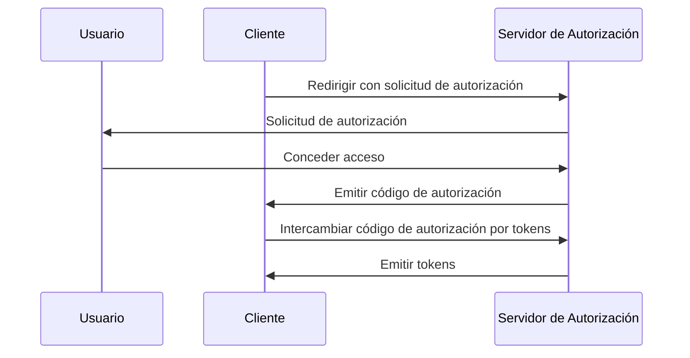

## ¿Qué es Proof Key for Code Exchange (PKCE)?

Proof Key for Code Exchange (PKCE) sirve como una extensión de seguridad para <Ref slug="authorization-code-flow" /> en <Ref slug="oauth-2.0" />. Está diseñado para proteger los códigos de autorización de la interceptación y el mal uso, especialmente en clientes públicos donde el secreto del cliente no es seguro.

Desde <Ref slug="oauth-2.1" />, PKCE se aplica a todos los tipos de clientes, incluidos <Ref slug="client" headingId="public-clients" /> y <Ref slug="client" headingId="confidential-clients">confidential (privados)</Ref>.

## ¿Cómo funciona PKCE?

PKCE introduce algunos pasos adicionales en el flujo de código de autorización para garantizar que el <Ref slug="client" /> que intercambia el código de autorización sea el mismo cliente que inició el flujo.

> [!Note]
> PKCE también es aplicable a los flujos de <Ref slug="openid-connect" /> que se basan en el flujo de código de autorización. Para simplificar, nos centraremos en la implementación de OAuth 2.0.

Repasemos rápidamente el flujo estándar de código de autorización antes de profundizar en PKCE:



Ahora, veamos cómo PKCE mejora el flujo de código de autorización.

### 1. Preparando la solicitud de autorización

#### 1.1. Cliente genera un verificador de código

Antes de iniciar la <Ref slug="authorization-request" />, el cliente debe generar una cadena aleatoria llamada **verificador de código**. La cadena debe ser una cadena criptográfica aleatoria de alta entropía segura para URL con una longitud mínima de 43 caracteres y una máxima de 128 caracteres.

Aquí tienes un ejemplo de cómo generar un verificador de código en JavaScript:

```javascript
// `js-base64` es una biblioteca universal que se puede usar tanto en Node.js como en navegadores
import { fromUint8Array } from 'js-base64';

// El segundo argumento `true` indica que la salida debe ser segura para URL
const codeVerifier = fromUint8Array(crypto.getRandomValues(new Uint8Array(64)), true);
```

#### 1.2. Cliente crea un desafío de código

El cliente debe hash el **verificador de código** utilizando una función hash criptográfica, como SHA-256, y codificar el hash en una cadena Base64 segura para URL. La cadena resultante se llama **desafío de código**.

Aquí tienes un ejemplo de cómo crear un desafío de código en JavaScript:

```javascript
// `js-base64` es una biblioteca universal que se puede usar tanto en Node.js como en navegadores
import { fromUint8Array } from 'js-base64';

const encodedCodeVerifier = new TextEncoder().encode(codeVerifier);
const codeChallenge = new Uint8Array(await crypto.subtle.digest('SHA-256', encodedCodeVerifier));

// El segundo argumento `true` indica que la salida debe ser segura para URL
return fromUint8Array(codeChallenge, true);
```

#### 1.3. Cliente incluye el desafío de código en la solicitud de autorización

Cuando el cliente inicia la solicitud de autorización, incluye los parámetros `code_challenge` y `code_challenge_method` en la solicitud. El parámetro `code_challenge` contiene el **desafío de código** generado en el paso anterior, y el parámetro `code_challenge_method` especifica el algoritmo de hashing utilizado para crear el **desafío de código** (por ejemplo, `S256` para SHA-256).

Los valores admitidos para `code_challenge_method` son `plain` y `S256`, donde `plain` indica que el **desafío de código** se envía tal cual, sin hashing. Generalmente, se recomienda `S256` para una mejor seguridad.

Aquí tienes un ejemplo no normativo de una solicitud de autorización con PKCE:

```http
GET /authorize?response_type=code
  &client_id=YOUR_CLIENT_ID
  &redirect_uri=https%3A%2F%2Fclient.example.com%2Fcallback
  &scope=openid%20profile
  &code_challenge=YOUR_CODE_CHALLENGE
  &code_challenge_method=S256
  &state=abc123
  &nonce=123456 HTTP/1.1
```

### 2. Intercambiando el código de autorización por tokens

El cliente debe guardar el **verificador de código** para su uso posterior y proseguir con el flujo de autorización como de costumbre. Una vez que el cliente recibe el código de autorización, debe enviar la <Ref slug="token-request" /> con el **verificador de código** al servidor de autorización.

Aquí tienes un ejemplo no normativo de una solicitud de token con PKCE:

```http
POST /token HTTP/1.1
Host: your-authorization-server.com
Content-Type: application/x-www-form-urlencoded

grant_type=authorization_code
  &code=YOUR_AUTHORIZATION_CODE
  &redirect_uri=https%3A%2F%2Fclient.example.com%2Fcallback
  &client_id=YOUR_CLIENT_ID
  &code_verifier=YOUR_CODE_VERIFIER
```

El servidor de autorización verificará el **desafío de código** contra el **verificador de código** para asegurar que el cliente es la misma entidad que inició el flujo. Si la verificación falla, el servidor de autorización rechazará la solicitud de token.

## Cómo PKCE mejora la seguridad

El principal beneficio de seguridad de PKCE es que previene los ataques de interceptación de códigos de autorización, que pueden ocurrir en clientes públicos. Por ejemplo, si un atacante intercepta el código de autorización, no puede intercambiarlo por tokens sin el **verificador de código**. PKCE asegura que solo el cliente que inició el flujo puede completar el intercambio de tokens.

<SeeAlso slugs={['oauth-2.1', 'authorization-code-flow']} />

<Resources
  urls={[
    "https://blog.logto.io/how-pkce-protects-the-authorization-code-flow-for-native-apps",
    "https://datatracker.ietf.org/doc/html/rfc7636",
  ]}
/>
