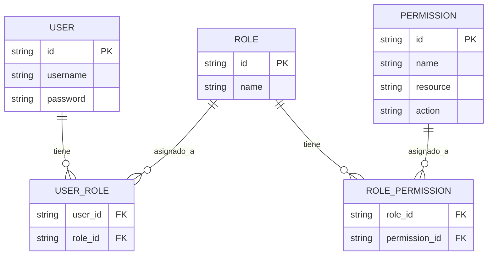
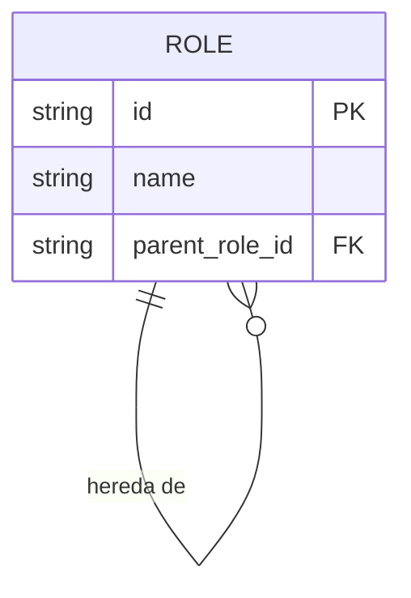
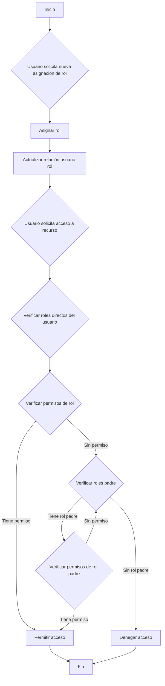
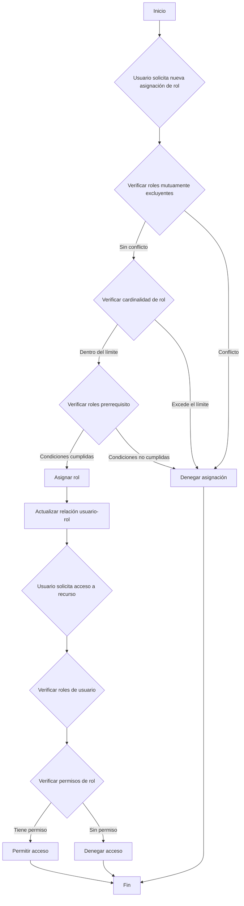

## ¿Qué es el control de acceso basado en roles (RBAC)?

El control de acceso basado en roles (RBAC) es un modelo de control de acceso ampliamente adoptado que introduce el concepto de "roles" para desacoplar a los usuarios de los permisos, resultando en un sistema de gestión de permisos flexible y eficiente.

La idea central detrás de RBAC es simple pero poderosa: en lugar de asignar permisos directamente a los usuarios, los permisos se asignan a roles, que luego se asignan a los usuarios. Este método indirecto de asignación de permisos simplifica enormemente el proceso de gestión de derechos de acceso.

## ¿Cuáles son los conceptos clave en RBAC?

El modelo RBAC gira en torno a cuatro elementos principales:

1. Usuarios: Individuos dentro del sistema, típicamente personas reales.
2. Roles: Representaciones de funciones laborales o responsabilidades dentro de una organización.
3. Permisos: Autorizaciones para realizar operaciones específicas en recursos particulares.
4. Sesiones: Entornos dinámicos donde los usuarios activan ciertos roles.

El flujo de trabajo básico de RBAC se puede resumir de la siguiente manera:
1. Definir roles basados en la estructura organizativa o requisitos empresariales.
2. Asignar permisos apropiados a cada rol.
3. Asignar uno o más roles a los usuarios según sus responsabilidades.
4. Cuando un usuario intenta acceder a un recurso, el sistema verifica si sus roles asignados tienen los permisos necesarios.

## ¿Cómo se utiliza comúnmente RBAC en aplicaciones del mundo real?

Al usar RBAC en una aplicación empresarial típica, puedes comenzar respondiendo las siguientes tres preguntas básicas:

1. ¿Qué recursos necesitan ser protegidos en el sistema?
2. ¿Qué operaciones necesitan ser controladas en esos recursos?
3. En escenarios del mundo real, ¿qué roles son responsables de ejecutar estos recursos y operaciones?

Tomemos como ejemplo un sistema de comercio electrónico.

Primero puedes identificar los recursos que necesitan ser protegidos:

- Producto
- Pedido

Luego, puedes determinar qué operaciones necesitan ser controladas en estos recursos, es decir, definir los permisos para estos recursos:

- Producto
  - `read:product`
  - `create:product`
  - `delete:product`
- Pedido
  - `read:order`
  - `create:order`
  - `delete:order`

Con los permisos anteriores, ahora puedes definir el siguiente modelo de gestión de permisos basado en los roles en escenarios del mundo real:

- Administrador de productos
  - Producto
    - `read:product`
    - `create:product`
    - `delete:product`
- Administrador de pedidos
  - Pedido
    - `read:order`
    - `create:order`
    - `delete:order`

Finalmente, asigna los roles a los usuarios según sus responsabilidades:

- Alice: Administradora de productos
- Bob: Administrador de pedidos

Cuando un usuario accede a un recurso, el sistema verificará si los roles asignados al usuario tienen los permisos necesarios.

Por ejemplo, cuando Alice intenta leer información de productos, el sistema primero recupera su información de rol y descubre que tiene el rol de administradora de productos.

Luego, el sistema consulta los permisos asociados con ese rol, que incluyen `read:product`, `create:product` y `delete:product`.

El sistema luego verifica si el permiso requerido `read:product` existe en su lista de permisos.

Dado que este permiso existe, el sistema permite a Alice acceder a la lista de productos. Si el permiso requerido no está en la lista, el sistema niega la solicitud de acceso.

## Por qué no deberías usar roles directamente para el control de acceso

Un error común en la implementación de RBAC es usar roles directamente para el control de acceso:

```typescript
// ❌ Enfoque problemático
if (user.hasRole('product_admin')) {
  await deleteProduct(productId);
}
```

Aunque este enfoque parece simple, crea problemas a medida que tu sistema crece. Por ejemplo:
- Cuando el equipo de marketing necesita actualizar descripciones de productos, tendrás que modificar el código para verificar roles de marketing.
- Cuando deseas que ciertos gerentes de producto solo publiquen pero no eliminen productos, necesitarás crear nuevas verificaciones de roles para operaciones relacionadas.
- Cuando un nuevo equipo de contenido necesita acceso parcial a productos, nuevamente tendrás que actualizar tu código.

En su lugar, siempre debes verificar permisos específicos:

```typescript
// ✅ Enfoque recomendado
if (user.hasPermission('delete:product')) {
  await deleteProduct(productId);
}
```

Este enfoque basado en permisos ofrece varias ventajas:

1. Control de permisos detallado: los permisos pueden mapearse precisamente a operaciones específicas de recursos:

- Crear producto: `create:product`
- Actualizar producto: `update:product`
- Eliminar producto: `delete:product`
- Publicar producto: `publish:product`

2. Configuración flexible de roles: los permisos pueden combinarse libremente en roles sin cambios en el código:

```typescript
const roles = {
  product_admin: ['create:product', 'update:product', 'delete:product', 'publish:product'],
  content_editor: ['update:product'],
  publisher: ['publish:product']  // Nuevos roles pueden añadirse fácilmente
};
```

Este diseño hace que tu sistema sea adaptable al crecimiento empresarial:
- Añadir nuevos roles solo requiere configuración de permisos
- Ajustar permisos de roles se realiza a través de configuración
- Nuevas características solo necesitan nuevas entradas de permisos

Recuerda: los roles solo deben ser contenedores de permisos, no la base para decisiones de control de acceso. Este diseño permite que RBAC proporcione el máximo valor.

## Modelos RBAC y su evolución

### RBAC0: La base

RBAC0 es el modelo básico que define los conceptos centrales de usuarios, roles, permisos y sesiones. Sirve como la base para todos los demás modelos RBAC.

Características clave:
- Asociación usuario-rol: Relación de muchos a muchos
- Asociación rol-permiso: Relación de muchos a muchos



Este diagrama ilustra la estructura básica de RBAC0, mostrando las relaciones entre usuarios, roles y permisos.

Operaciones clave:
1. Asignación de roles a usuarios
2. Asignación de permisos a roles
3. Verificación de si un usuario tiene un permiso específico

Aunque RBAC0 proporciona un punto de partida sólido, tiene algunas limitaciones:
1. Explosión de roles: A medida que la complejidad del sistema aumenta, el número de roles puede crecer rápidamente.
2. Redundancia de permisos: Diferentes roles pueden requerir conjuntos similares de permisos, lo que lleva a duplicaciones.
3. Falta de jerarquía: No puede representar relaciones de herencia entre roles.

### RBAC1: Introducción de jerarquías de roles

RBAC1 se basa en RBAC0 añadiendo el concepto de herencia de roles.

```plaintext
RBAC1 = RBAC0 + Herencia de Roles
```

Características clave:
- Jerarquía de roles: Los roles pueden tener roles padre
- Herencia de permisos: Los roles hijos heredan todos los permisos de sus roles padre



Este diagrama muestra cómo los roles pueden heredar de otros roles en RBAC1.

Operaciones clave:



Este diagrama de flujo ilustra el proceso de asignación de roles y verificación de permisos en RBAC1, incluyendo el aspecto de herencia de roles.

RBAC1 ofrece varias ventajas:
1. Reducción del número de roles: Se pueden crear menos roles base a través de la herencia
2. Gestión simplificada de permisos: Más fácil reflejar jerarquías organizativas

Sin embargo, RBAC1 todavía tiene algunas limitaciones:
1. Falta de mecanismos de restricción: Incapaz de restringir a los usuarios de tener simultáneamente roles potencialmente conflictivos
2. Consideraciones de rendimiento: Las verificaciones de permisos pueden requerir recorrer toda la jerarquía de roles

### RBAC2: Implementación de restricciones

RBAC2 también se basa en RBAC0 pero introduce el concepto de restricciones.

```plaintext
RBAC2 = RBAC0 + Restricciones
```

Características clave:
1. Roles mutuamente excluyentes: Los usuarios no pueden ser asignados a estos roles simultáneamente
2. Cardinalidad de roles: Limita el número de usuarios que pueden ser asignados a un rol particular
3. Roles prerrequisito: Los usuarios deben tener un rol específico antes de ser asignados a otro



Este diagrama de flujo demuestra el proceso de asignación de roles y control de acceso en RBAC2, incorporando las diversas restricciones.

RBAC2 mejora la seguridad al prevenir la concentración excesiva de permisos y permite un control de acceso más preciso. Sin embargo, aumenta la complejidad del sistema y puede impactar el rendimiento debido a la necesidad de verificar múltiples condiciones de restricción para cada asignación de rol.

### RBAC3: El modelo integral

RBAC3 combina las características de RBAC1 y RBAC2, ofreciendo tanto herencia de roles como mecanismos de restricción:

```plaintext
RBAC3 = RBAC0 + Herencia de Roles + Restricciones
```

Este modelo integral proporciona máxima flexibilidad pero también presenta desafíos en la implementación y optimización del rendimiento.

## ¿Cuáles son las ventajas de RBAC (control de acceso basado en roles)?

1. Gestión simplificada de permisos: La autorización masiva a través de roles reduce la complejidad de gestionar permisos individuales de usuarios.
2. Seguridad mejorada: Un control más preciso sobre los permisos de usuario reduce los riesgos de seguridad.
3. Costos administrativos reducidos: Modificar permisos de roles afecta automáticamente a todos los usuarios asociados.
4. Alineación con la lógica empresarial: Los roles a menudo corresponden a estructuras organizativas o procesos empresariales, lo que los hace más fáciles de entender y gestionar.
5. Soporte para la separación de deberes: Las responsabilidades críticas pueden separarse a través de restricciones como roles mutuamente excluyentes.

## ¿Cuáles son las consideraciones prácticas de implementación?

Al implementar RBAC en escenarios del mundo real, los desarrolladores deben considerar estos aspectos clave:

1. Diseño de base de datos: Utilizar bases de datos relacionales para almacenar y consultar eficazmente las estructuras RBAC.
2. Optimización del rendimiento: Implementar estrategias de caché y optimizar las verificaciones de permisos, especialmente para modelos RBAC3 complejos.
3. Integración de API y frontend: Diseñar APIs claras para gestionar usuarios, roles y permisos, y considerar cómo usar RBAC en aplicaciones frontend.
4. Seguridad y auditoría: Asegurar la seguridad del propio sistema RBAC e implementar funciones detalladas de registro y auditoría.
5. Escalabilidad: Diseñar con futuras expansiones en mente, como soportar reglas de permisos más complejas o integrarse con otros sistemas.
6. Experiencia de usuario: Diseñar interfaces intuitivas para que los administradores del sistema configuren y mantengan fácilmente la estructura RBAC.

<SeeAlso slugs={['abac', 'access-control']} />

<Resources
  urls={[
    "https://blog.logto.io/rbac-and-abac",
    "https://blog.logto.io/mastering-rbac",
    "https://blog.logto.io/organization-and-role-based-access-control",
    "https://docs.logto.io/docs/recipes/rbac/",
    "https://en.wikipedia.org/wiki/Role-based_access_control"
  ]}
/>