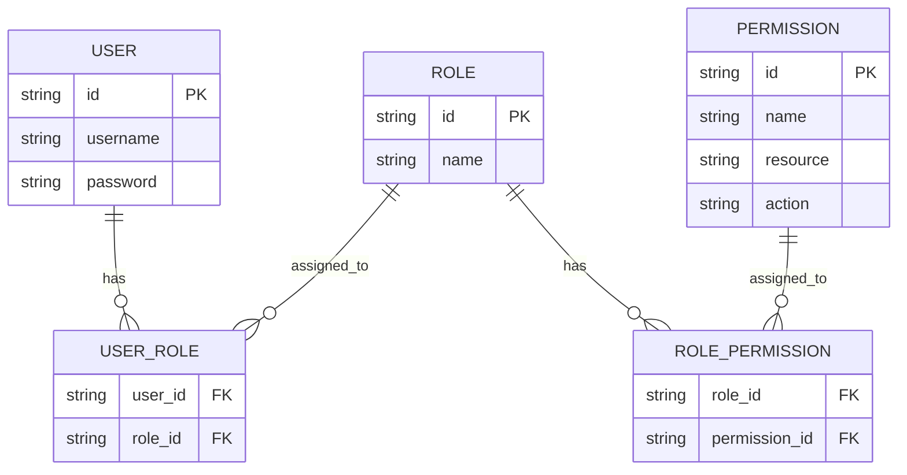
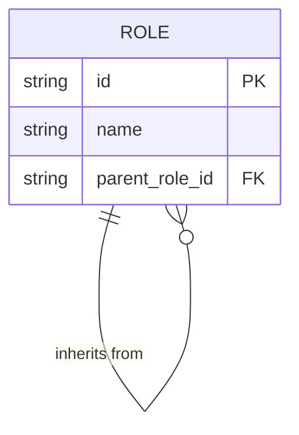
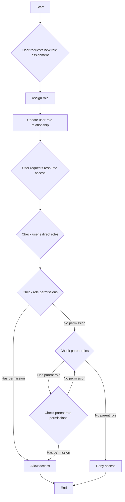
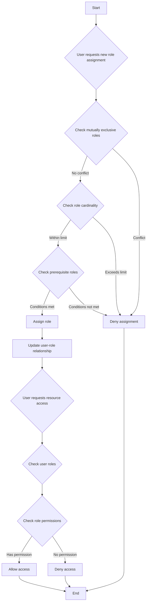

## ¿Qué es el control de acceso basado en roles (RBAC)?

El control de acceso basado en roles (RBAC) es un modelo de control de acceso adoptado ampliamente que introduce el concepto de "roles" para desacoplar usuarios de permisos, resultando en un sistema de gestión de permisos flexible y eficiente.

La idea central detrás de RBAC es simple pero poderosa: en lugar de asignar permisos directamente a los usuarios, los permisos se asignan a roles, que luego se asignan a los usuarios. Este método indirecto de asignación de permisos simplifica en gran medida el proceso de gestión de derechos de acceso.

### Conceptos clave en RBAC

El modelo RBAC gira en torno a cuatro elementos principales:

1. Usuarios: Individuos dentro del sistema, típicamente personas reales.
2. Roles: Representaciones de funciones laborales o responsabilidades dentro de una organización.
3. Permisos: Autorizaciones para realizar operaciones específicas en recursos particulares.
4. Sesiones: Entornos dinámicos donde los usuarios activan ciertos roles.

El flujo de trabajo básico de RBAC se puede resumir de la siguiente manera:
1. Definir roles basados en la estructura organizacional o los requisitos comerciales.
2. Asignar permisos apropiados a cada rol.
3. Asignar uno o más roles a los usuarios según sus responsabilidades.
4. Cuando un usuario intenta acceder a un recurso, el sistema verifica si los roles asignados tienen los permisos necesarios.

### Tipos de RBAC

#### RBAC0: La fundación

RBAC0 es el modelo básico que define los conceptos centrales de usuarios, roles, permisos y sesiones. Sirve como la base para todos los demás modelos RBAC.

Características clave:
- Asociación usuario-rol: Relación de muchos a muchos
- Asociación rol-permiso: Relación de muchos a muchos



Este diagrama ilustra la estructura básica de RBAC0, mostrando las relaciones entre usuarios, roles y permisos.

Operaciones clave:
1. Asignación de roles a usuarios
2. Asignación de permisos a roles
3. Comprobación de si un usuario tiene un permiso específico

Aunque RBAC0 proporciona un punto de partida sólido, tiene algunas limitaciones:
1. Explosión de roles: A medida que aumenta la complejidad del sistema, el número de roles puede crecer rápidamente.
2. Redundancia de permisos: Diferentes roles pueden requerir conjuntos similares de permisos, llevando a la duplicación.
3. Falta de jerarquía: No puede representar relaciones de herencia entre roles.

#### RBAC1: Introduciendo jerarquías de roles

RBAC1 se construye sobre RBAC0 al agregar el concepto de herencia de roles.

```plaintext
RBAC1 = RBAC0 + Herencia de Roles
```

Características clave:
- Jerarquía de roles: Los roles pueden tener roles padres
- Herencia de permisos: Los roles hijos heredan todos los permisos de sus roles padres



Este diagrama muestra cómo los roles pueden heredar de otros roles en RBAC1.

Operaciones clave:



Este diagrama de flujo ilustra el proceso de asignación de roles y verificación de permisos en RBAC1, incluyendo el aspecto de herencia de roles.

RBAC1 ofrece varias ventajas:
1. Número reducido de roles: Se pueden crear menos roles base a través de la herencia.
2. Gestión simplificada de permisos: Más fácil reflejar jerarquías organizacionales.

Sin embargo, RBAC1 aún tiene algunas limitaciones:
1. Falta de mecanismos de restricción: Incapaz de restringir a los usuarios de tener simultáneamente roles potencialmente conflictivos.
2. Consideraciones de rendimiento: Las verificaciones de permisos pueden requerir recorrer toda la jerarquía de roles.

#### RBAC2: Implementación de restricciones

RBAC2 también se basa en RBAC0, pero introduce el concepto de restricciones.

```plaintext
RBAC2 = RBAC0 + Restricciones
```

Características clave:
1. Roles mutuamente exclusivos: Los usuarios no pueden ser asignados a estos roles simultáneamente.
2. Cardinalidad de roles: Limita el número de usuarios que pueden ser asignados a un rol particular.
3. Roles prerrequisito: Los usuarios deben tener un rol específico antes de ser asignados a otro.



Este diagrama de flujo demuestra el proceso de asignación de roles y control de acceso en RBAC2, incorporando las varias restricciones.

RBAC2 mejora la seguridad al prevenir la concentración excesiva de permisos y permite un control de acceso más preciso. Sin embargo, aumenta la complejidad del sistema y puede impactar el rendimiento debido a la necesidad de verificar múltiples condiciones de restricción para cada asignación de rol.

### RBAC3: El modelo integral

RBAC3 combina las características de RBAC1 y RBAC2, ofreciendo tanto herencia de roles como mecanismos de restricción：

```plaintext
RBAC3 = RBAC0 + Herencia de Roles + Restricciones
```

Este modelo integral proporciona máxima flexibilidad pero también presenta desafíos en la implementación y optimización del rendimiento.

## ¿Cuáles son las ventajas de RBAC (control de acceso basado en roles)?

1. Gestión simplificada de permisos: La autorización masiva a través de roles reduce la complejidad de gestionar los permisos de usuarios individuales.
2. Seguridad mejorada: Un control más preciso sobre los permisos de los usuarios reduce los riesgos de seguridad.
3. Costos administrativos reducidos: Modificar los permisos de roles afecta automáticamente a todos los usuarios asociados.
4. Alineación con la lógica empresarial: Los roles a menudo corresponden a estructuras organizacionales o procesos de negocios, lo que los hace más fáciles de entender y gestionar.
5. Soporte para separación de deberes: Las responsabilidades críticas pueden ser separadas a través de restricciones como roles mutuamente exclusivos.

## ¿Cuáles son las consideraciones prácticas de implementación?

Al implementar RBAC en escenarios del mundo real, los desarrolladores deberían considerar estos aspectos clave:

1. Diseño de bases de datos: Utilizar bases de datos relacionales para almacenar y consultar efectivamente las estructuras de RBAC.
2. Optimización del rendimiento: Implementar estrategias de almacenamiento en caché y optimizar las verificaciones de permisos, especialmente para modelos complejos de RBAC3.
3. Integración de API y frontend: Diseñar API claras para gestionar usuarios, roles y permisos, y considerar cómo usar RBAC en aplicaciones frontend.
4. Seguridad y auditoría: Asegurar la seguridad del sistema RBAC en sí mismo e implementar funciones detalladas de registro y auditoría.
5. Escalabilidad: Diseñar pensando en futuras expansiones, como soportar reglas de permiso más complejas o integrarse con otros sistemas.
6. Experiencia del usuario: Diseñar interfaces intuitivas para que los administradores del sistema puedan configurar y mantener fácilmente la estructura RBAC.

<SeeAlso slugs={['abac', 'access-control']} />

<Resources
  urls={[
    "https://blog.logto.io/rbac-and-abac",
    "https://blog.logto.io/mastering-rbac",
    "https://blog.logto.io/organization-and-role-based-access-control",
    "https://docs.logto.io/docs/recipes/rbac/",
    "https://en.wikipedia.org/wiki/Role-based_access_control"
  ]}
/>
