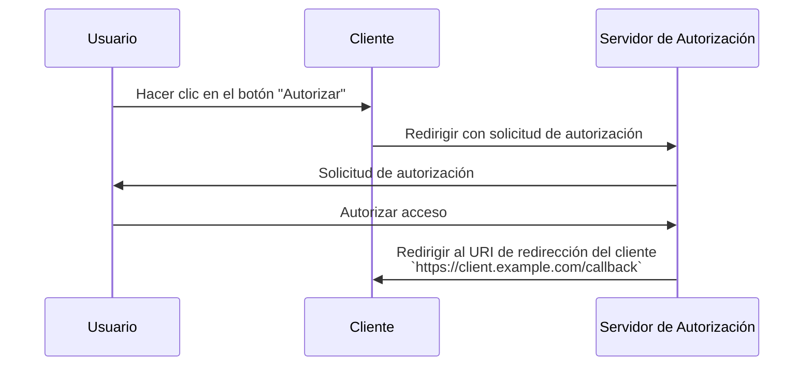

## ¿Qué es un URI de redirección?

Un URI de redirección, también conocido como URL de retorno o URL de redirección, es una URI para indicar a dónde el <Ref slug="authorization-server" /> debe redirigir al agente de usuario una vez que se complete la <Ref slug="authorization-request" />.

> El Identificador Universal de Recursos (URI) a menudo se confunde con la URL (Localizador Uniforme de Recursos). Para más información, consulta [Descubriendo URI, URL y URN](https://blog.logto.io/unveiling-uri-url-and-urn).

Veamos un ejemplo de una solicitud de autorización que incluye un URI de redirección:

```http
GET /authorize?response_type=code
  &client_id=YOUR_CLIENT_ID
  &redirect_uri=https%3A%2F%2Fclient.example.com%2Fcallback
  &scope=openid%20profile%20email
  &state=abc123
  &nonce=123456 HTTP/1.1
```

En este ejemplo, el valor en bruto del parámetro `redirect_uri` es `https%3A%2F%2Fclient.example.com%2Fcallback`, que está codificado en URL. El valor real es `https://client.example.com/callback`.

## ¿Cómo funciona un URI de redirección?

> En el contexto de <Ref slug="openid-connect" />, el flujo de trabajo para la <Ref slug="authorization-request" /> de OAuth 2.0 y el <Ref slug="authorization-server" /> se aplica de manera similar. El URI de redirección funciona de la misma manera que lo hace en OAuth 2.0, tanto para la <Ref slug="authentication-request" /> como para <Ref slug="openid-connect" headingId="openid-provider-op" />.

Supongamos que el <Ref slug="client" /> inicia la solicitud de autorización desde la URL `https://client.example.com`. Después de que el usuario complete el proceso de autorización, el servidor de autorización redirigirá al agente de usuario (navegador) de vuelta a `https://client.example.com/callback`.



Es evidente que el URI de redirección es esencial para que el servidor de autorización redirija al agente de usuario de regreso cuando se complete el proceso de autorización. Además, el URI de redirección también se utiliza para recibir el código de autorización o los tokens, dependiendo del flujo.

Aquí tienes un ejemplo no normativo de cómo podría verse la redirección real en un <Ref slug="authorization-code-flow" />:

```http
HTTP/1.1 302 Found
Location: https://client.example.com/callback?code=AUTHORIZATION_CODE&state=abc123
```

Ten en cuenta que los parámetros de URL `code` y `state` que son añadidos por el servidor de autorización se incluyen en el URI de redirección. El cliente necesita extraer los parámetros `code` y `state` de la URL para continuar con el proceso de autorización.

## ¿Por qué necesitamos un URI de redirección?

Como podemos ver en el ejemplo anterior, el servidor de autorización necesita saber a dónde redirigir después de una solicitud de autorización exitosa. Es especialmente útil cuando hay múltiples clientes (es decir, <Ref slug="single-sign-on" />), y cada cliente tiene un URI de redirección diferente.

Con el <Ref slug="authorization-code-flow" />, el URI de redirección también se usa para pasar el código de autorización de vuelta al cliente, en lugar de usar el canal frontal (navegador) para evitar exponer los tokens a posibles ataques.

Era posible usar el [Permiso de Credenciales de Contraseña del Propietario del Recurso (ROPC)](https://datatracker.ietf.org/doc/html/rfc6749#section-4.3) para obtener tokens para el usuario sin un URI de redirección. Sin embargo, está obsoleto en <Ref slug="oauth-2.1" /> debido a preocupaciones de seguridad.

## Consideraciones de seguridad

El URI de redirección es un parámetro crítico y es un objetivo común para los atacantes. Aquí hay algunas consideraciones de seguridad a tener en cuenta:

- **Lista blanca de URIs de redirección**: El cliente solo debe aceptar URIs de redirección que estén registradas con el servidor de autorización. Esto previene que los atacantes redirijan a los usuarios a sitios maliciosos.
- **Usar HTTPS**: Siempre usa HTTPS para el URI de redirección para asegurar la comunicación entre el cliente y el servidor de autorización.
- **Coincidencia exacta**: El URI de redirección debe coincidir exactamente con el URI registrado. Los servidores de autorización pueden aplicar reglas estrictas de coincidencia que desautorizan patrones de coincidencia amplios.
- **Parámetro de estado**: Usa el parámetro `state` para prevenir ataques de <Ref slug="csrf" />. El cliente debe validar el parámetro `state` para asegurar que coincida con el valor enviado en la solicitud de autorización.

<SeeAlso slugs={["csrf", "oauth-2.1", "authorization-code-flow"]} />

<Resources
  urls={[
    "https://blog.logto.io/oauth-2-1",
    "https://blog.logto.io/csrf",
    "https://blog.logto.io/redirect-uri-in-authorization-code-flow",
  ]}
/>
