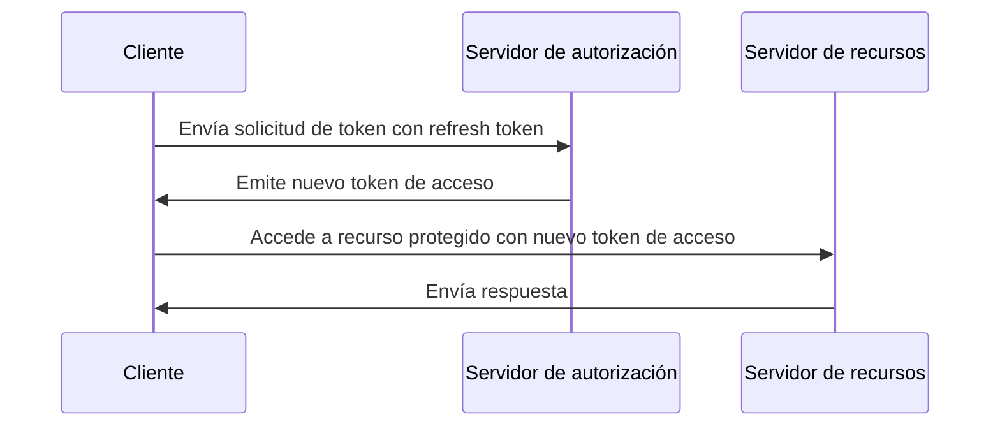

## ¿Qué es un refresh token?

Un refresh token es una credencial de larga duración, típicamente una cadena aleatoria, que se utiliza para obtener nuevos <Ref slug="access-token">tokens de acceso (access tokens)</Ref> sin requerir que el usuario vuelva a autenticarse. En el contexto de OAuth 2.0 y OpenID Connect (OIDC), los <Ref slug="authorization-server">servidores de autorización (authorization servers)</Ref> pueden emitir refresh tokens a los <Ref slug="client">clientes (clients)</Ref> (aplicaciones) cuando el cliente solicita <Ref slug="offline-access" />.

Mientras que el [RFC de OAuth 2.0](https://datatracker.ietf.org/doc/html/rfc6749#section-1.5) define el ciclo de vida de alto nivel de un refresh token, los detalles de implementación pueden variar entre los servidores de autorización y los clientes. Los exploraremos en las secciones siguientes.

## ¿Cómo funciona un refresh token?

Un refresh token se emite típicamente junto con un token de acceso (access token) cuando el cliente solicita <Ref slug="offline-access" />. La norma de la industria para solicitar acceso fuera de línea es incluir el scope `offline_access` en el <Ref slug="authorization-request">solicitud de autorización (authorization request)</Ref>, mientras que <Ref slug="openid-connect" /> define oficialmente el scope `offline_access` para este propósito (disponible en el <Ref slug="authentication-request">solicitud de autenticación (authentication request)</Ref>).

Aquí hay un ejemplo no normativo de una solicitud de autorización que incluye el scope `offline_access`:

```http
GET /authorize?response_type=code
  &client_id=YOUR_CLIENT_ID
  &redirect_uri=https%3A%2F%2Fclient.example.com%2Fcallback
  &scope=openid%20profile%20email%20offline_access
  &state=abc123
  &nonce=123456 HTTP/1.1
```

Una vez que el cliente recibe el refresh token, puede usarlo para solicitar nuevos tokens de acceso cuando el token de acceso actual expire. Aquí hay un ejemplo simplificado usando un refresh token:



Como ilustra el diagrama de secuencia, el uso de un refresh token necesita ser soportado tanto por el cliente como por el servidor de autorización:

- El cliente debe almacenar el refresh token de manera segura y usarlo en la <Ref slug="token-request">solicitud de token (token request)</Ref> para obtener un nuevo token de acceso.
- El servidor de autorización debe validar el refresh token y emitir un nuevo token de acceso cuando el cliente presenta un refresh token válido.

El refresh token no está destinado a ser compartido con el <Ref slug="resource-server">servidor de recursos (resource server)</Ref>. Los tokens de acceso son los únicos tokens que el servidor de recursos debe verificar para la autorización.

Aquí hay un ejemplo no normativo de una solicitud de token usando un refresh token:

```http
POST /token HTTP/1.1
Host: your-authorization-server.com
Content-Type: application/x-www-form-urlencoded

grant_type=refresh_token
  &refresh_token=YOUR_REFRESH_TOKEN
  &client_id=YOUR_CLIENT_ID
  &client_secret=YOUR_CLIENT_SECRET
  &scope=openid%20profile%20email
```

## Consideraciones de seguridad ||security-considerations||

Dado que los refresh tokens son de larga duración (por ejemplo, días, semanas) y se pueden usar para obtener nuevos tokens de acceso sin interacción del usuario, representan un mayor riesgo de seguridad que los tokens de acceso (por ejemplo, minutos, horas). El uso de refresh tokens debe considerarse e implementarse cuidadosamente para mitigar posibles amenazas de seguridad. Aquí hay algunas prácticas recomendadas a considerar:

### Almacenamiento seguro

Almacenar los refresh tokens de manera segura en el lado del cliente para prevenir accesos no autorizados. Tales mecanismos de almacenamiento incluyen:

- **Cookies HTTP-only**: Almacenar tokens en cookies HTTP-only para evitar que el JavaScript del lado del cliente acceda a ellos.
- **Almacenamiento cifrado**: Usar almacenes seguros como Keychain (iOS) o KeyStore (Android) en dispositivos móviles, o bases de datos cifradas en aplicaciones web.

### Rotación de refresh tokens ||refresh-token-rotation||

Si bien los refresh tokens pueden ser de larga duración, rotarlos periódicamente o basados en ciertas condiciones (por ejemplo, después de un intercambio de token exitoso) puede reducir significativamente el riesgo de acceso no autorizado. La estrategia de rotación exacta puede variar según los requisitos de seguridad de la aplicación y las capacidades del servidor de autorización.

Aquí hay dos estrategias comunes de rotación de tokens:

- **Rotación basada en tiempo**: Rotar refresh tokens después de un cierto período (por ejemplo, cada 7 días).
- **Rotación basada en eventos**: Rotar refresh tokens después de eventos específicos (por ejemplo, intercambio de token exitoso, cambio de contraseña).

Cuando se rota un refresh token, el refresh token anterior debe invalidarse para prevenir su reutilización. Estas estrategias a menudo se combinan con el TTL (tiempo de vida) de la sesión para asegurar que después de un cierto período de tiempo, independientemente de la validez del refresh token, el usuario debe volver a autenticarse.

### Refresh tokens restringidos al remitente ||sender-constrained-refresh-tokens||

Los refresh tokens restringidos al remitente son un mecanismo de seguridad para vincular el refresh token al cliente que lo solicitó, en caso de que el cliente no sea un <Ref slug="client" headingId="confidential-clients">cliente confidencial (confidential client)</Ref>. Métodos comunes son [DPoP](https://datatracker.ietf.org/doc/html/rfc9449) y [mTLS](https://datatracker.ietf.org/doc/html/rfc8705).

### Tipo de cliente

Es una buena práctica limitar el uso de refresh tokens a <Ref slug="client" headingId="confidential-clients">clientes confidenciales (confidential clients)</Ref>.

- Los clientes públicos (por ejemplo, aplicaciones de una sola página) exponen el código fuente al lado del cliente, lo que facilita a los atacantes extraer y abusar de los refresh tokens. Usualmente, se utilizan mecanismos más seguros como <Ref slug="pkce" /> y rotación de refresh token para clientes públicos si es necesario usar refresh tokens.
- Por otro lado, los clientes confidenciales se ejecutan en un entorno de servidor seguro donde el código fuente y el entorno no están expuestos al lado del cliente. Los refresh tokens se pueden usar de manera más segura en tales entornos.

### Revocación de tokens

Dado que los refresh tokens suelen ser <Ref slug="opaque-token">tokens opacos (opaque tokens)</Ref> (es decir, no tienen significado para el cliente) y deben ser validados por el servidor de autorización, el servidor de autorización puede implementar fácilmente mecanismos de revocación de tokens para invalidar los refresh tokens cuando sea necesario. Esto puede ser útil en escenarios como cierre de sesión del usuario, compromiso de cuenta o uso indebido de tokens.

<SeeAlso slugs={["access-token", "id-token", "jwt", "opaque-token"]} />

<Resources urls={[
  "https://blog.logto.io/understanding-refresh-token-rotation",
  "https://blog.logto.io/understanding-tokens-in-oidc",
  {
    url: "https://openid.net/specs/openid-connect-core-1_0.html#OfflineAccess",
    result: {
      ogTitle: "Offline Access in OpenID Connect Core 1.0",
    }
  },
  {
    url: "https://datatracker.ietf.org/doc/html/rfc6749#section-1.5",
    result: {
      ogTitle: "Refresh Token in OAuth 2.0",
      ogDescription: "Refresh tokens are credentials used to obtain access tokens."
    },
  },
]} />
