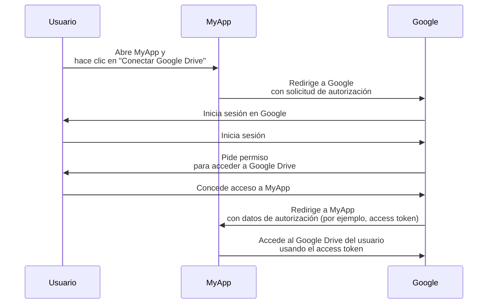

## ¿Qué es un propietario del recurso?

En el contexto de <Ref slug="oauth-2.0" />, un propietario del recurso es una identidad (típicamente un usuario) que tiene la capacidad de conceder acceso a un recurso protegido (por ejemplo, datos, archivos o servicios).

Por ejemplo, tienes una aplicación web MyApp que quiere acceder al Google Drive del usuario. Aquí hay un flujo típico de OAuth 2.0:

En este flujo, el **usuario** es el **propietario del recurso** que concede acceso a su Google Drive a MyApp, mientras que **MyApp** es el <Ref slug="client" /> que quiere acceder a los recursos protegidos y **Google** es tanto el <Ref slug="authorization-server" /> como el <Ref slug="resource-server" />.

Como sugiere el nombre, el propietario del recurso posee algunos recursos en un <Ref slug="resource-server" /> y puede autorizar a los clientes para que accedan a ellos en su nombre en el contexto de <Ref slug="oauth-2.0" />.

## ¿Por qué es importante el propietario del recurso?

Durante un proceso de <Ref slug="authorization" />, el propietario del recurso es ineludible porque son ellos quienes explícitamente conceden o niegan el acceso a sus recursos. El consentimiento del propietario del recurso es obligatorio por razones tanto técnicas como de cumplimiento:

- **Técnicas**: El consentimiento del propietario del recurso asegura que el cliente tenga los permisos necesarios para acceder a los recursos. En lugar de un acceso total o nulo, el propietario del recurso puede conceder acceso parcial según la solicitud del cliente. Por otro lado, el propietario del recurso también puede revocar el acceso explícitamente en cualquier momento. Este enfoque proporciona una forma clara y auditable de <Ref slug="access-control" />.
- **Cumplimiento**: El consentimiento del propietario del recurso es un requisito legal en muchas jurisdicciones, especialmente cuando se trata de datos sensibles. Por ejemplo, el Reglamento General de Protección de Datos (GDPR) establece que el sujeto de datos (propietario del recurso) debe proporcionar un consentimiento explícito para las actividades de procesamiento de datos.

## Propietario del recurso vs. servidor de recursos

<Ref slug="resource-server">Los servidores de recursos</Ref> son responsables de alojar y servir los **recursos protegidos**. Son los guardianes que verifican los access tokens y sirven los recursos a los clientes.

El propietario del recurso, por otro lado, puede tener control total o parcial sobre los recursos protegidos en el servidor de recursos según las políticas de <Ref slug="access-control" />.

<SeeAlso slugs={["resource-server", "oauth-2.0", "resource-indicator", "access-control"]} />

<Resources
  urls={[
    "https://tools.ietf.org/html/rfc6749",
  ]}
/>