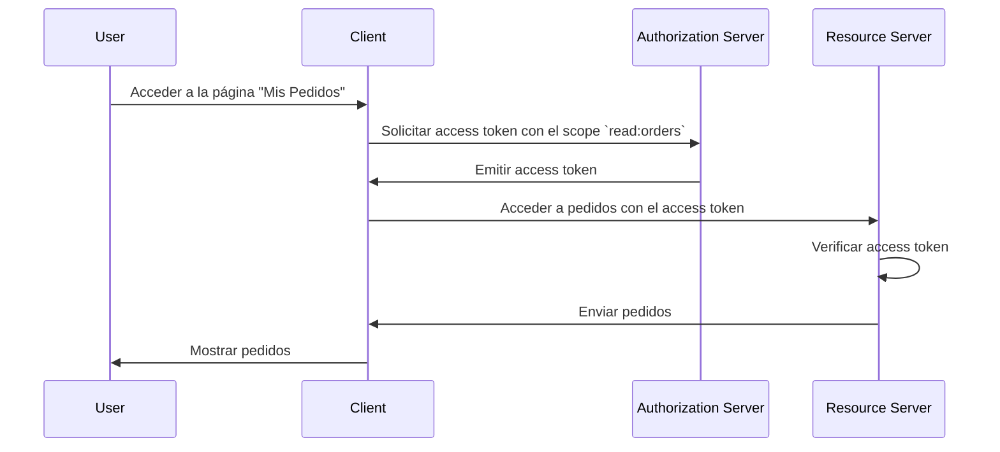

## ¿Qué es un servidor de recursos?

En el contexto de <Ref slug="oauth-2.0" />, un **servidor de recursos (resource server)** es un servidor que aloja los **recursos protegidos** que el <Ref slug="client" /> desea acceder. El servidor de recursos también es responsable de verificar el <Ref slug="access-token" /> y de servir los recursos protegidos al cliente de acuerdo con las políticas de <Ref slug="access-control" />.

Por ejemplo, consideremos una aplicación web llamada MyApp que desea acceder al Google Drive de un usuario. En este escenario:

- **MyApp** es el cliente que quiere acceder a los recursos protegidos.
- **Google** es el servidor de recursos que aloja el Google Drive del usuario.
- **Google** también es el <Ref slug="authorization-server" /> que emite el access token a MyApp.

Consideremos otro ejemplo en el que un sitio web de comercio electrónico desea acceder al historial de pedidos de un usuario desde un servicio de pedidos interno. En este caso:

- **Sitio web de comercio electrónico** es el cliente que quiere acceder a los recursos protegidos.
- **Servicio de pedidos** es el servidor de recursos que aloja el historial de pedidos del usuario.
- Si el sitio web de comercio electrónico se integra con un servicio OAuth 2.0 o un proveedor OpenID, ese servicio actúa como el authorization server.

## ¿Cómo funciona un servidor de recursos?

OAuth 2.0 define los roles del servidor de recursos y del authorization server por separado para proporcionar una clara separación de responsabilidades. Sin embargo, no define una representación específica del servidor de recursos en el marco, refiriéndose a él como un concepto virtual que aloja los recursos protegidos; el <Ref slug="client" /> necesita especificar <Ref slug="scope">scopes</Ref> para los recursos protegidos que desea acceder.

Supongamos que el cliente quiere acceder al historial de pedidos del usuario desde el servicio de pedidos. Un ejemplo no normativo de enviar una <Ref slug="token-request" /> para acceder a los pedidos podría verse así:



En el diagrama de secuencia anterior, el cliente solicita un access token con el scope `read:orders` al authorization server. Suponemos que todas las partes han alineado el significado del scope `read:orders`: este especifica que el cliente quiere realizar acciones de `lectura` en los `pedidos` servidos por el servidor de recursos. Luego el cliente utiliza el access token para acceder a los pedidos del servidor de recursos.

> [!Note]
> El significado y la estructura de los scopes no están definidos por OAuth 2.0 y deben ser acordados por el cliente, el authorization server y el servidor de recursos.

El servidor de recursos es responsable de verificar el access token y determinar si el cliente tiene los permisos necesarios para acceder a los recursos solicitados según las políticas de <Ref slug="access-control" />. Dependiendo de la implementación, el access token puede ser un <Ref slug="opaque-token" /> o un <Ref slug="jwt" />.

## Convenciones de nomenclatura

Es flexible nombrar al servidor de recursos de acuerdo con el contexto de la aplicación. Dado que OAuth 2.0 no define una representación específica del servidor de recursos en el parámetro de <Ref slug="scope" />, puedes ver múltiples convenciones en la industria:

- Omitir el nombre del servidor de recursos y usar solo la acción: Por ejemplo, `read` y `write`.
- `[verbo]:[recurso]`: Una convención común es usar la combinación `verbo` y `recurso` para especificar las acciones que el cliente puede realizar en el recurso. Por ejemplo, `read:orders` y `write:profile`. A veces se invierten como `orders:read` y `profile:write`.
- `[uri]:[acción]`: Otra convención es usar el URI del recurso y la acción que el cliente puede realizar. Por ejemplo, `https://api.example.com/orders:read` y `https://api.example.com/profile:write`.

## Indicadores de recursos

Veamos un ejemplo del parámetro scope en una <Ref slug="authentication-request" /> (decodificada):

```plaintext
openid profile email https://api.example.com/orders:read
```

En este ejemplo, el parámetro `scope` incluye los scopes `openid`, `profile` y `email`, que son scopes estándar de <Ref slug="openid-connect" />, junto con el scope `https://api.example.com/orders:read` que especifica la ubicación del servidor de recursos y el permiso para leer los recursos.

Parece estar bien en este caso específico, pero a medida que aumenta el número de recursos y scopes, puede volverse desafiante gestionar y entender los scopes. Para abordar este problema, OAuth 2.0 introdujo una extensión llamada <Ref slug="resource-indicator">indicadores de recursos</Ref> (RFC 8707) que permite a los clientes usar URIs para especificar los recursos que quieren acceder, haciendo que los servidores de recursos sean más explícitos en el proceso.

Después de agregar un parámetro de indicador de recursos a la autenticación request (`resource=https://api.example.com/orders`), el parámetro scope puede simplificarse a:

```plaintext
openid profile email read
```

Lo cual se ve más limpio y es más fácil de gestionar.

> [!Note]
> No todos los authorization servers (proveedores OpenID) soportan la extensión de indicadores de recursos. Por favor, verifica la documentación del authorization server antes de usarla.

<SeeAlso slugs={["access-control", "resource-indicator", "resource-owner", "client"]} />

<Resources
  urls={[
    "https://datatracker.ietf.org/doc/html/rfc8707",
  ]}
/>
