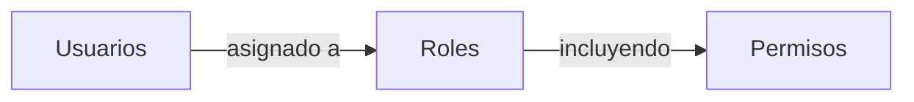

## Rol

Un rol es uno de los componentes centrales en <Ref slug="rbac" />. Sirve como un contenedor para permisos que pueden ser asignados a usuarios, actuando como un intermediario entre los usuarios y sus derechos de acceso.



Una estructura típica de rol contiene un nombre y un conjunto de permisos:

```typescript
const role = {
  name: 'order_admin',
  permissions: [
    'read:orders',   // Ver detalles de pedidos
    'write:orders',  // Editar pedidos
    'read:products'  // Ver productos
  ]
}
```

> [!Note]
> Los roles se utilizan principalmente para la gestión de permisos. Para la implementación de control de acceso (access control), se recomienda verificar los permisos directamente en lugar de los roles. Consulta <Ref slug="rbac" /> para más información.

<SeeAlso slugs={["rbac", "authorization", "access-control"]} />