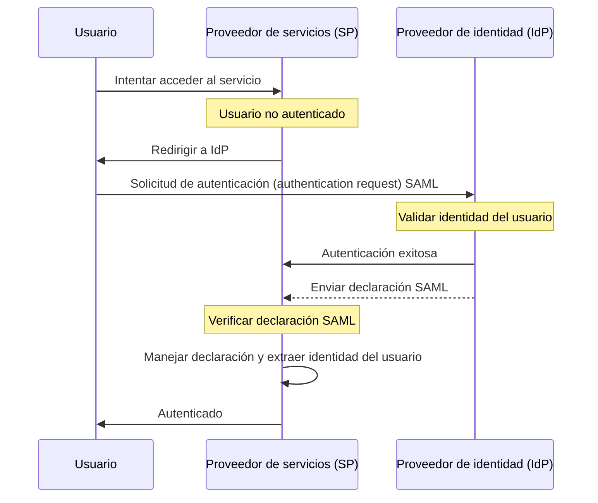

## ¿Qué es SAML?

SAML (generalmente conocido como SAML 2.0) es un estándar basado en XML para intercambiar datos de autenticación (authentication) y autorización (authorization) entre dos partes: el <Ref slug="identity-provider" /> y el <Ref slug="service-provider" />. Es ampliamente utilizado para federación de identidades y soluciones de <Ref slug="enterprise-sso" />.

Como sugiere el nombre, SAML transmite declaraciones sobre la identidad y los atributos del usuario. Estas declaraciones están firmadas digitalmente y, opcionalmente, encriptadas para garantizar su integridad y confidencialidad.

## ¿Cómo funciona SAML?

Antes de profundizar en el flujo de autenticación (authentication) de SAML, necesitamos entender cómo los proveedores de identidad y los proveedores de servicios pueden reconocerse y confiar entre sí. Esta confianza se establece a través del intercambio de metadatos, donde ambas partes comparten información sobre:

- **ID de entidad**: Un identificador único para el proveedor de identidad o proveedor de servicios.
- **Clave pública**: Utilizada para verificar las firmas digitales en las declaraciones de SAML.
- **Puntos finales**: URLs para diferentes operaciones SAML, como solicitudes y respuestas de autenticación (authentication requests).

Una vez establecida la confianza, puede proceder el flujo de autenticación de SAML:

### RelayState

En el flujo de SAML, el parámetro `RelayState` se utiliza para mantener el estado del usuario a lo largo del proceso de autenticación. Actúa como una referencia a la solicitud original hecha por el usuario antes de ser redirigido al proveedor de identidad. El proveedor de servicios puede utilizar este parámetro para redirigir al usuario de regreso a la página o recurso original después de una autenticación exitosa.

RelayState también se utiliza para prevenir ataques de <Ref slug="csrf" />, asegurando que el usuario sea redirigido de vuelta a la página correcta después de la autenticación.

### Declaraciones SAML

Las declaraciones SAML son el componente central del protocolo SAML. Contienen información sobre la identidad del usuario, los atributos y el estado de autenticación (authentication). Hay tres tipos de declaraciones SAML:

- **Declaración de autenticación (authentication assertion)**: Indica que el usuario ha sido autenticado por el proveedor de identidad.
- **Declaración de atributos**: Contiene información adicional sobre el usuario, como roles, permisos y datos de perfil.
- **Declaración de decisión de autorización (authorization decision assertion)**: Especifica los derechos de acceso del usuario a recursos específicos.

## Consideraciones para adoptar SAML

SAML ha sido ampliamente adoptado en entornos empresariales desde su inicio a principios de los años 2000. Aquí hay algunas consideraciones clave al adoptar SAML para tus aplicaciones:

- Complejidad: Las implementaciones de SAML pueden ser complejas al integrarse con tus aplicaciones, especialmente en comparación con marcos modernos como <Ref slug="oauth-2.0" /> y <Ref slug="openid-connect" />.
- Eficiencia de transporte: Los mensajes SAML pueden ser grandes debido al formato XML, lo que puede afectar el rendimiento de la red.
- Seguridad: Las declaraciones SAML deben protegerse contra manipulaciones e interceptaciones. Asegúrate de que tu implementación de SAML siga las mejores prácticas para cifrado y firmas digitales.

A pesar de estas consideraciones, SAML sigue siendo un estándar robusto y ampliamente utilizado para federación de identidades segura y soluciones de inicio de sesión único (single sign-on) en entornos empresariales. Sin embargo, para nuevas aplicaciones o servicios, podrías considerar alternativas modernas como OAuth 2.0 y OpenID Connect para un enfoque más ligero y amigable para desarrolladores en autenticación (authentication) y autorización (authorization).

<SeeAlso slugs={["enterprise-sso", "oauth-2.0", "openid-connect"]} />

<Resources
  urls={[
    "https://blog.logto.io/saml-security-cheat-sheet",
    "https://blog.logto.io/picking-your-sso-method",
    "https://blog.logto.io/differences-between-saml-and-oidc",
  ]}
/>
