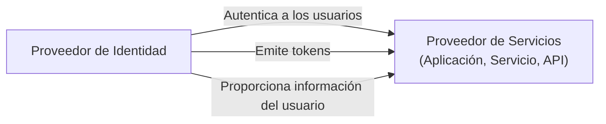

## ¿Qué es un proveedor de servicios (SP)?

En el ámbito de <Ref slug="iam" />, un proveedor de servicios (SP) (o una **parte que confía** en el contexto de <Ref slug="openid-connect" />) es una aplicación o servicio que depende de un <Ref slug="identity-provider" /> para la autenticación (authentication) y autorización (authorization). Es responsable de proporcionar servicios a los usuarios y aplicar las políticas de <Ref slug="access-control" /> basadas en los tokens emitidos por el proveedor de identidad.

## Estándares del proveedor de servicios

No hay un estándar estricto para los proveedores de servicios, ya que pueden ser cualquier tipo de aplicación o servicio que requiera gestión de identidad. Sin embargo, los proveedores de servicios a menudo siguen los estándares establecidos por el proveedor de identidad en el que confían. Por ejemplo, si el proveedor de identidad soporta <Ref slug="openid-connect" />, el proveedor de servicios usará típicamente OIDC para la autenticación (authentication) y autorización (authorization).

## Arquitectura del proveedor de servicios

El término "proveedor de servicios" no especifica una arquitectura o implementación particular. Usualmente, los proveedores de servicios necesitan ser registrados con el proveedor de identidad para establecer confianza y habilitar la comunicación segura. El proceso de registro generalmente involucra el intercambio de metadatos y credenciales del cliente.

Por ejemplo, en el contexto de OpenID Connect, los metadatos del proveedor de servicios típicamente incluyen:

- **ID del Cliente**: Un identificador único para el proveedor de servicios.
- **Secreto del Cliente**: Un secreto compartido usado para autenticar el proveedor de servicios.
- **<Ref slug="redirect-uri">URIs de Redirección</Ref>**: Las URIs donde el proveedor de identidad redirigirá a los usuarios después de la autenticación (authentication) y autorización (authorization).

Una vez registrado, el proveedor de servicios puede iniciar el proceso de <Ref slug="authentication" /> redirigiendo a los usuarios al endpoint especificado del proveedor de identidad.

Cuando los proveedores de servicios están diseñados para casos de uso sin interacción, a menudo se les refiere como <Ref slug="client">clientes</Ref> que requieren comunicación <Ref slug="machine-to-machine" />.

<SeeAlso slugs={["identity-provider", "openid-connect", "oauth-2.0"]} />

<Resources
  urls={[
    "https://blog.logto.io/secure-cloud-apps-with-oauth-and-openid-connect",
    "https://blog.logto.io/incorporate-identity-solution",
    "https://blog.logto.io/centralized-identity-system"
  ]}
/>
