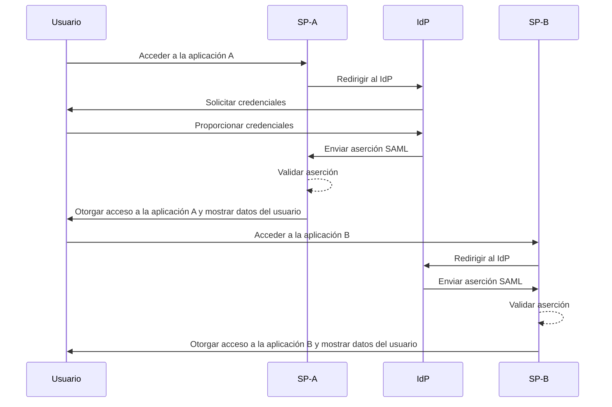
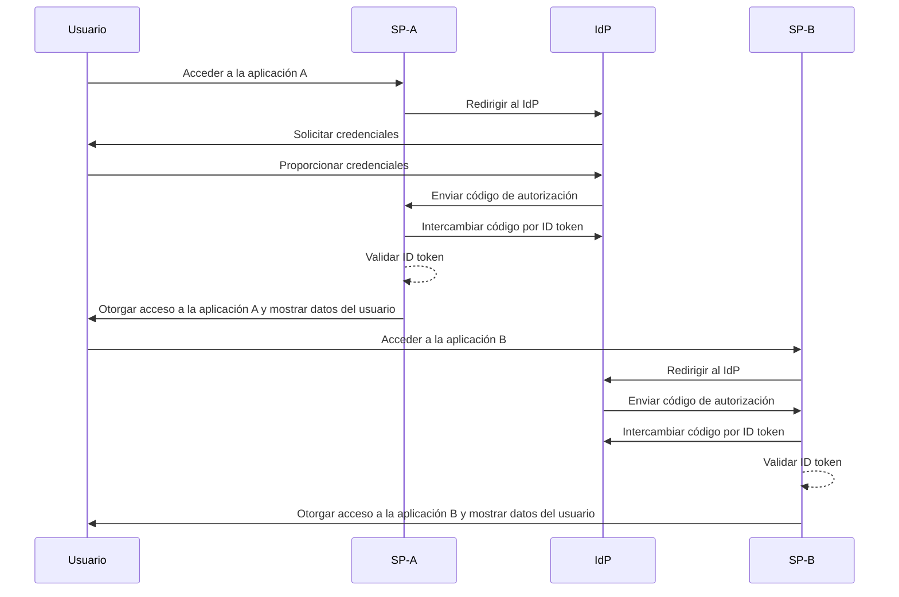

## ¿Qué es el inicio de sesión único (SSO)?

El inicio de sesión único (SSO) es un método de autenticación (authentication) que permite a los usuarios acceder a múltiples aplicaciones o servicios con un solo conjunto de credenciales. En lugar de gestionar inicios de sesión separados para cada sistema, los usuarios se autentican una vez y son automáticamente conectados a todas las plataformas vinculadas.

El SSO se utiliza comúnmente tanto en entornos personales como empresariales, especialmente en ambientes empresariales donde los empleados o trabajadores remotos dependen de varias aplicaciones SaaS para realizar su trabajo. Al implementar SSO, las organizaciones pueden mejorar la seguridad, simplificar la gestión de acceso (access control) y aumentar la productividad del usuario.

Un ejemplo conocido de SSO es el conjunto de servicios de Google, como Gmail, Google Drive y Google Calendar. Después de iniciar sesión en su cuenta de Google, los usuarios pueden acceder fácilmente a todos estos servicios sin volver a ingresar sus credenciales.

## ¿Cómo funciona el inicio de sesión único?

El SSO opera sobre una relación de confianza entre una aplicación o servicio, conocido como el <Ref slug="service-provider" /> y un <Ref slug="identity-provider" />. El IdP maneja la autenticación (authentication) del usuario y comparte de manera segura la información necesaria con el SP para otorgar acceso. Esta confianza se establece a través de un proceso llamado federación, donde tanto el SP como el IdP acuerdan estándares y protocolos específicos para intercambiar datos de autenticación de manera segura.

Cuando un usuario intenta acceder a una aplicación habilitada para SSO, el SP los redirige al IdP para la autenticación (authentication). El IdP solicita al usuario sus credenciales, verifica su identidad y genera un token de seguridad o aserción que contiene la información del usuario. Este token se envía de vuelta al SP, que luego lo utiliza para otorgar acceso.

Si el usuario intenta acceder a otra aplicación habilitada para SSO, el proceso se repite automáticamente sin necesidad de que inicie sesión nuevamente. El IdP envía los datos de autenticación (authentication) necesarios directamente al SP, permitiendo al usuario acceder sin problemas a la nueva aplicación.

SAML (Security Assertion Markup Language) y OIDC (OpenID Connect) son dos protocolos ampliamente utilizados para implementar SSO. Estos estándares definen cómo se intercambian los datos de autenticación (authentication) entre el IsP y el SP, asegurando una comunicación segura y confiable.

### SSO basado en SAML

En el SSO basado en SAML, una vez que el usuario es autenticado (authentication) por el IdP, se genera una aserción SAML basada en XML, que es firmada y enviada de manera segura al SP. El SP luego valida la aserción y otorga acceso según la identidad del usuario.

### SSO basado en OIDC

OIDC, en contraste, se construye sobre OAuth 2.0 y ofrece un enfoque más moderno para SSO. Utiliza JSON Web Tokens (JWT) para intercambiar información de identidad entre el IdP y el SP, proporcionando seguridad mejorada y mayor flexibilidad.

## Beneficios del inicio de sesión único

1. **Seguridad mejorada**: El SSO reduce el riesgo de violaciones de seguridad relacionadas con contraseñas al minimizar la cantidad de credenciales que los usuarios deben recordar. También permite a las organizaciones implementar métodos de autenticación (authentication) más fuertes, como la autenticación multifactor (MFA), para proteger las cuentas de usuario.

2. **Mejora de la experiencia del usuario**: Los usuarios pueden acceder a múltiples aplicaciones sin necesidad de iniciar sesión repetidamente, mejorando la productividad y reduciendo la frustración. El SSO simplifica el proceso de inicio de sesión y proporciona una experiencia de usuario consistente en diferentes plataformas.

3. **Gestión centralizada del acceso**: Las organizaciones pueden gestionar centralmente el acceso de usuarios y permisos a través del IdP, garantizando políticas de seguridad consistentes y controles de acceso (access control) en todas las aplicaciones conectadas. Esto simplifica los procesos de aprovisionamiento, desaprovisionamiento y auditoría de usuarios.

## Cuándo usar el inicio de sesión único

1. **Entornos empresariales y organizativos**: El SSO es particularmente beneficioso para empresas que dependen de múltiples aplicaciones y servicios para optimizar los flujos de trabajo. Simplifica el acceso del usuario y reduce la carga sobre los equipos de TI para administrar cuentas de usuario individuales. Por ejemplo, empresas que utilizan múltiples aplicaciones SaaS, como herramientas CRM, RRHH y de colaboración.
2. **Aplicaciones orientadas al cliente**: El SSO también puede mejorar la experiencia del usuario para los clientes que acceden a servicios en línea o plataformas de comercio electrónico. Por ejemplo, permitir que los usuarios inicien sesión con sus cuentas de redes sociales o direcciones de correo electrónico en lugar de crear nuevas cuentas para cada servicio.
3. **Servicios multiproducto**: Las empresas que ofrecen un conjunto de productos o servicios interconectados pueden aprovechar el SSO para proporcionar una experiencia de usuario fluida en todas sus ofertas. Los usuarios pueden navegar entre diferentes aplicaciones sin la molestia de inicios de sesión repetidos. Por ejemplo, G Suite de Google. Los usuarios pueden iniciar sesión una vez en su navegador Chrome y acceder a múltiples servicios de Google sin volver a ingresar sus credenciales.

El uso del SSO no se limita a estos escenarios y puede adaptarse a diversos casos de uso según las necesidades específicas de una organización o aplicación. Se considera ampliamente como una mejor práctica para mejorar la seguridad, la experiencia del usuario y la eficiencia operativa en entornos digitales modernos.

<SeeAlso slugs={['enterprise-sso']} />
