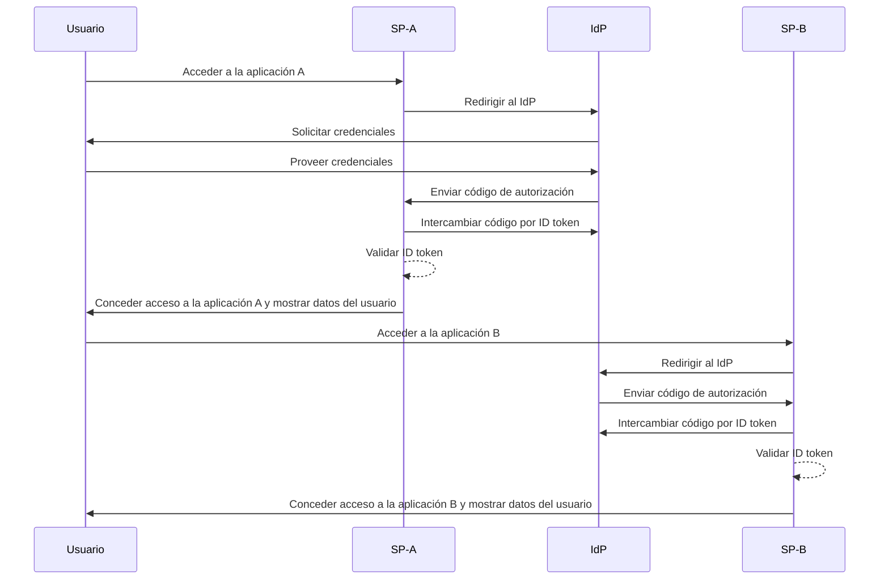

## ¿Qué es el inicio de sesión único (Single Sign-On, SSO)?

El inicio de sesión único (Single Sign-On, SSO) es un método de <Ref slug="authentication" /> que permite a los usuarios acceder a múltiples aplicaciones o servicios con un único conjunto de credenciales. En lugar de gestionar inicios de sesión separados para cada sistema, los usuarios se autentican una vez y se inician automáticamente en todas las plataformas conectadas.

El SSO se utiliza comúnmente tanto en entornos personales como empresariales, especialmente en entornos empresariales donde los empleados o trabajadores remotos dependen de varias aplicaciones SaaS para realizar sus trabajos. Al implementar el SSO, las organizaciones pueden mejorar la seguridad, simplificar la gestión del acceso y aumentar la productividad de los usuarios.

Un ejemplo bien conocido de SSO es la suite de servicios de Google, como Gmail, Google Drive y Google Calendar. Después de iniciar sesión en su cuenta de Google, los usuarios pueden acceder fácilmente a todos estos servicios sin volver a ingresar sus credenciales.

## ¿Cómo funciona el inicio de sesión único?

El SSO opera sobre una relación de confianza entre una aplicación o servicio, conocido como <Ref slug="service-provider" /> y un <Ref slug="identity-provider" />. El IdP maneja la autenticación del usuario y comparte de forma segura la información necesaria con el SP para conceder acceso. Esta confianza se establece mediante un proceso llamado federación, donde tanto el SP como el IdP acuerdan estándares y protocolos específicos para intercambiar datos de autenticación de forma segura.

Cuando un usuario intenta acceder a una aplicación habilitada para SSO, el SP lo redirige al IdP para la autenticación. El IdP solicita al usuario sus credenciales, verifica su identidad y genera un token de seguridad o aserción que contiene la información del usuario. Este token se envía de vuelta al SP, que lo utiliza para conceder acceso.

Si el usuario intenta acceder a otra aplicación habilitada para SSO, el proceso se repite automáticamente sin requerir que inicie sesión nuevamente. El IdP envía los datos de autenticación necesarios directamente al SP, permitiendo al usuario acceder sin problemas a la nueva aplicación.

<Ref slug="saml" /> y <Ref slug="openid-connect" /> son dos protocolos ampliamente utilizados para implementar el SSO. Estos estándares definen cómo se intercambian los datos de autenticación entre el IsP y el SP, asegurando una comunicación segura y confiable.

### SSO basado en SAML

En el SSO basado en SAML, una vez que el usuario es autenticado por el IdP, se genera una aserción SAML basada en XML, se firma y se envía de manera segura al SP. El SP luego valida la aserción y concede acceso basado en la identidad del usuario.

### SSO basado en OIDC

OIDC, en contraste, está construido sobre <Ref slug="oauth-2.0" /> y ofrece un enfoque más moderno para el SSO. Utiliza <Ref slug="jwt" /> para intercambiar información de identidad entre el IdP y el SP, proporcionando mayor seguridad y flexibilidad.

## Beneficios del inicio de sesión único

1. **Seguridad mejorada**: El SSO reduce el riesgo de brechas de seguridad relacionadas con contraseñas al minimizar el número de credenciales que los usuarios deben recordar. También permite a las organizaciones implementar métodos de autenticación más robustos, como <Ref slug="mfa" />, para proteger las cuentas de usuario.

2. **Mejora de la experiencia del usuario**: Los usuarios pueden acceder a múltiples aplicaciones de manera fluida sin tener que iniciar sesión repetidamente, mejorando la productividad y reduciendo la frustración. El SSO simplifica el proceso de inicio de sesión y proporciona una experiencia de usuario coherente en diferentes plataformas.

3. **Gestión centralizada del acceso**: Las organizaciones pueden gestionar centralmente el acceso y los permisos de los usuarios a través del IdP, asegurando políticas de seguridad y controles de acceso consistentes en todas las aplicaciones conectadas. Esto simplifica los procesos de aprovisionamiento, desaprovisionamiento y auditoría de usuarios.

## Cuándo utilizar el inicio de sesión único

1. **Entornos empresariales y organizacionales**: El SSO es particularmente beneficioso para las empresas que dependen de múltiples aplicaciones y servicios para optimizar los flujos de trabajo. Simplifica el acceso de los usuarios y reduce la carga sobre los equipos de TI para gestionar cuentas de usuario individuales. Por ejemplo, empresas que utilizan múltiples aplicaciones SaaS, como CRM, RRHH y herramientas de colaboración.
2. **Aplicaciones orientadas al cliente**: El SSO también puede mejorar la experiencia del usuario para clientes que acceden a servicios en línea o plataformas de comercio electrónico. Por ejemplo, permitiendo que los usuarios inicien sesión con sus cuentas de redes sociales o direcciones de correo electrónico en lugar de crear nuevas cuentas para cada servicio.
3. **Servicios multi-producto**: Las empresas que ofrecen una suite de productos o servicios interconectados pueden aprovechar el SSO para proporcionar una experiencia de usuario sin fisuras a través de sus ofertas. Los usuarios pueden navegar entre diferentes aplicaciones sin la molestia de inicios de sesión repetidos. Por ejemplo, G Suite de Google. Los usuarios pueden iniciar sesión una vez en su navegador Chrome y acceder a múltiples servicios de Google sin volver a ingresar sus credenciales.

El uso del SSO no se limita a estos escenarios y puede adaptarse a diversos casos de uso según las necesidades específicas de una organización o aplicación. Se considera ampliamente como una práctica recomendada para mejorar la seguridad, la experiencia del usuario y la eficiencia operativa en los entornos digitales modernos.

<SeeAlso slugs={["enterprise-sso"]} />