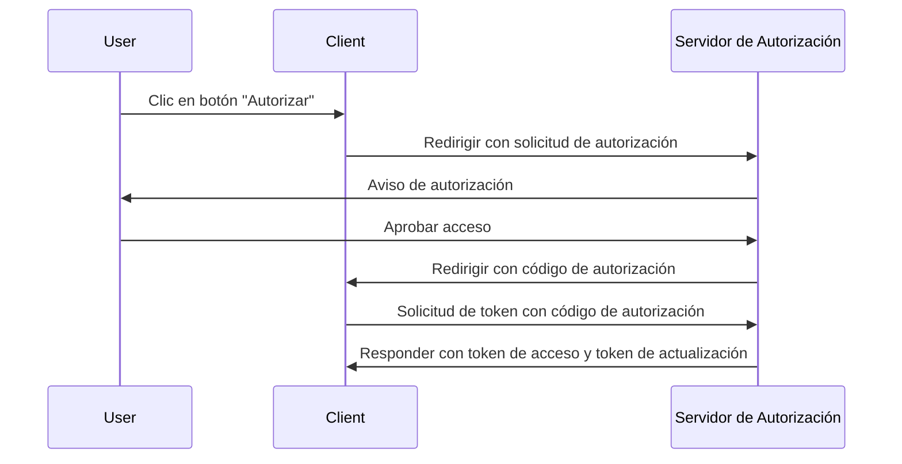
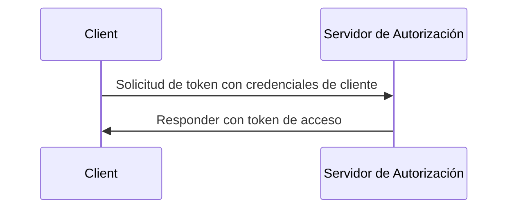

## ¿Qué es una solicitud de token (token request)?

En <Ref slug="oauth-2.0" /> y <Ref slug="openid-connect" />, una solicitud de token (token request) es una solicitud al <Ref slug="authorization-server" /> (o <Ref slug="openid-connect" headingId="openid-provider-op" /> en OIDC) para intercambiar credenciales (por ejemplo, código de autorización, token de actualización (refresh token)) por un conjunto de tokens. El conjunto de tokens generalmente incluye uno o más de los siguientes:

- <Ref slug="access-token" />: Un token que otorga acceso a recursos protegidos.
- <Ref slug="id-token" />: Un token que contiene información del usuario (específico de OIDC).
- <Ref slug="refresh-token" />: Un token que se puede usar para obtener un nuevo token de acceso sin interacción del usuario.

Según el <Ref slug="oauth-2.0-grant">tipo de concesión (grant type)</Ref> utilizado, la solicitud puede incluir diferentes parámetros y devolver diferentes tokens.

Por ejemplo, en el <Ref slug="client-credentials-flow" />, el <Ref slug="client" /> solicita directamente un <Ref slug="access-token" /> con las credenciales del cliente. Aquí hay un ejemplo no normativo de la solicitud de token:

```http
POST /token HTTP/1.1
Host: authorization-server.example.com
Content-Type: application/x-www-form-urlencoded

grant_type=client_credentials
  &client_id=client-id
  &client_secret=client-secret
  &scope=read
```

Si la solicitud tiene éxito, el servidor de autorización responde con un token de acceso:

```http
HTTP/1.1 200 OK
Content-Type: application/json

{
  "access_token": "eyJhbGci...zHg",
  "token_type": "Bearer",
  "expires_in": 3600,
  "scope": "read"
}
```

## ¿Cómo funciona una solicitud de token (token request)?

Como muestra el ejemplo anterior, la solicitud de token (token request) en sí es sencilla. El cliente envía una solicitud HTTP al endpoint de token del servidor de autorización con los parámetros necesarios. El servidor de autorización valida la solicitud, la procesa y devuelve los tokens en la respuesta.

Sin embargo, según el tipo de concesión (flujo) específico utilizado, la solicitud de token puede necesitar más preparación.

### Flujo de código de autorización (Authorization code flow)

En el <Ref slug="authorization-code-flow" />, el cliente primero obtiene un código de autorización iniciando una <Ref slug="authorization-request" /> (o <Ref slug="authentication-request" /> en OIDC) con el servidor de autorización. Una vez que el usuario otorga permiso, el cliente intercambia el código de autorización por un token de acceso y, opcionalmente, un token de actualización (refresh token) a través de la solicitud de token.

Aquí hay un diagrama de secuencia simplificado del flujo de código de autorización:



### Flujo de credenciales del cliente (Client credentials flow)

Como muestra el ejemplo en la primera sección, el <Ref slug="client-credentials-flow" /> es mucho más simple. El cliente solicita directamente un token de acceso con sus credenciales de cliente. El servidor de autorización valida las credenciales del cliente y emite un token de acceso si tiene éxito.

Aquí hay un diagrama de secuencia no normativo del flujo de credenciales del cliente:



### Token de actualización (Refresh token)

En algunos tipos de concesión, el cliente también puede solicitar <Ref slug="offline-access" /> incluyendo el alcance (scope) `offline_access` en la solicitud de autorización. Si se concede, el servidor de autorización emite un token de actualización junto con el token de acceso. El cliente puede usar el token de actualización para obtener un nuevo token de acceso a través de la solicitud de token sin interacción del usuario.

Aquí hay un ejemplo no normativo de uso de un token de actualización para obtener un nuevo token de acceso:

```http
POST /token HTTP/1.1
Host: authorization-server.example.com
Content-Type: application/x-www-form-urlencoded

grant_type=refresh_token
  &refresh_token=refresh-token
  &client_id=client-id
  &client_secret=client-secret
```

---

Otros <Ref slug="oauth-2.0-grant">tipos de concesión (grant types)</Ref> también pueden involucrar solicitudes de token, pero la idea básica sigue siendo la misma.

## Parámetros clave en una solicitud de token

Aquí hay algunos parámetros clave que se utilizan comúnmente en una solicitud de token:

- **`grant_type`**: El tipo de concesión que se solicita. Los valores comunes incluyen `authorization_code`, `client_credentials`, `refresh_token`, etc.
- **`client_id`**: El identificador del cliente emitido por el servidor de autorización.
- **`client_secret`**: El secreto del cliente emitido por el servidor de autorización (para clientes confidenciales).
- **`code`**: El código de autorización obtenido del servidor de autorización (para el flujo de código de autorización).
- **`refresh_token`**: El token de actualización obtenido del servidor de autorización (para actualizar los tokens de acceso).
- **`scope`**: Los <Ref slug="scope">alcances</Ref> (permisos) solicitados para el token de acceso.
- **`redirect_uri`**: La URI donde el servidor de autorización envía la respuesta (para el flujo de código de autorización).
- **`code_verifier`**: El verificador de código utilizado en la extensión <Ref slug="pkce" /> (para el flujo de código de autorización).

Los parámetros reales y sus valores dependen del tipo de concesión y de los requisitos específicos de la aplicación. Antes de hacer una solicitud de token, debes consultar la lista completa de parámetros para el tipo de concesión específico que estás utilizando.

<SeeAlso slugs={["oauth-2.0", "openid-connect", "authorization-request", "authentication-request"]} />