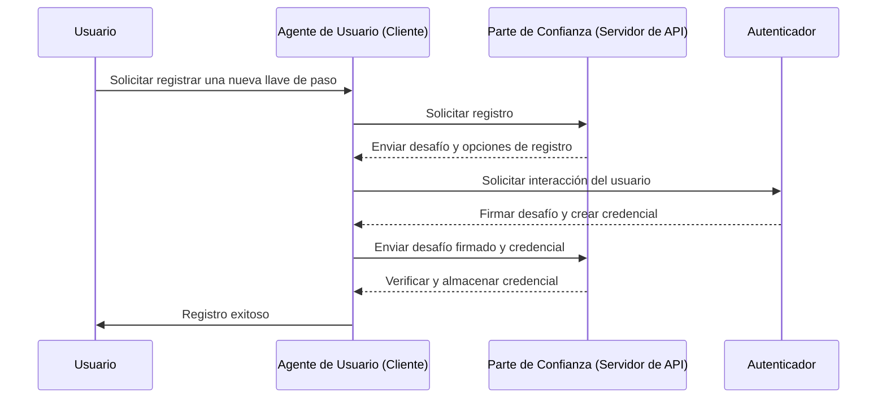
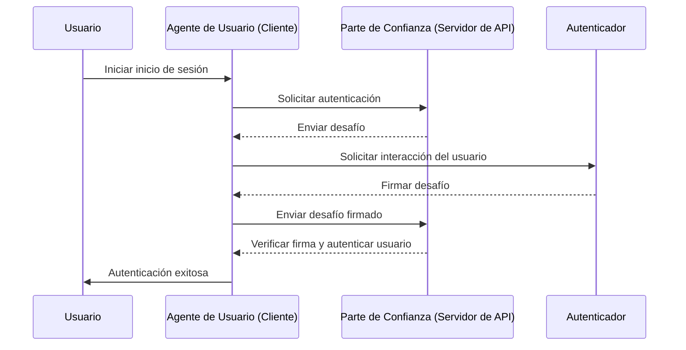

## ¿Qué es WebAuthn?

WebAuthn (API de Autenticación Web), desarrollada por la [W3C](https://www.w3.org/) y la [FIDO Alliance](https://fidoalliance.org/), es una especificación para la autenticación web segura utilizando los estándares FIDO2. WebAuthn proporciona una API para permitir que los sitios web implementen <Ref slug="passkey" />, que son credenciales resistentes al phishing aseguradas por criptografía de clave pública. Las llaves de paso (passkeys) pueden reemplazar contraseñas para inicios de sesión sin contraseña y autenticación de múltiples factores (MFA).

## ¿Cómo es el flujo de trabajo de WebAuthn?

Para proporcionar una explicación más detallada, podemos dividir el proceso en dos fases: registro y autenticación. Primero, es esencial comprender las cuatro entidades clave involucradas en el flujo de WebAuthn.

### 4 entidades clave

1. **Usuario:** El individuo que intenta acceder a una aplicación web.
2. **Agente de usuario:** El navegador web que maneja las llamadas a la API de WebAuthn y gestiona el proceso de autenticación entre el usuario, la parte de confianza y el autenticador.
3. **Parte de confianza:** El servicio, aplicación o servidor de API al que el usuario busca acceder.
4. **Autenticador:** El componente de hardware o software utilizado para verificar la identidad del usuario. Puede adoptar varias formas según la plataforma o capacidad del navegador, como claves de seguridad (como Yubikeys), teléfonos o tabletas (conectados por Bluetooth, NFC o USB), biometría o PINs basados en el dispositivo, etc.

### Registro de WebAuthn

La criptografía asimétrica de clave pública es el proceso central.

1. **Generación de par de claves:**
   El agente de usuario genera un par de claves pública-privada.
   - **Clave pública:** Se comparte con la parte de confianza.
   - **Clave privada:** Permanece almacenada de manera segura en el autenticador del usuario.
2. **Desafío de registro:**
   Cuando el usuario intenta inscribir una llave de paso, la parte de confianza envía un desafío de registro al agente de usuario.
3. **Verificación del usuario:**
   El agente de usuario envía el desafío al autenticador, que solicita al usuario la verificación (por ejemplo, autenticación biométrica o una clave de seguridad de hardware).
4. **Firma criptográfica:** 
   El autenticador utiliza su clave privada para firmar el desafío, creando una firma criptográfica.
5. **Verificación y acceso:**
   El agente de usuario envía el desafío firmado de regreso a la parte de confianza, que verifica la firma utilizando la clave pública y completa el proceso de registro.



### Autenticación de WebAuthn

1. **Desafío de autenticación:**
   Cuando el usuario intenta iniciar sesión, la parte de confianza envía un desafío de autenticación al agente de usuario.
2. **Verificación del usuario:**
   El agente de usuario envía el desafío al autenticador, que solicita al usuario la verificación (por ejemplo, autenticación biométrica o una clave de seguridad de hardware).
3. **Firma criptográfica:**
   El autenticador utiliza su clave privada para firmar el desafío, creando una firma criptográfica.
4. **Verificación y acceso:**
   El agente de usuario verifica la firma utilizando la clave pública e informa a la parte de confianza de una autenticación exitosa. Se concede el acceso si la verificación tiene éxito.



## ¿Cómo usar WebAuthn?

La API de WebAuthn puede utilizarse para implementar inicio de sesión con llave de paso (passkey) o verificación en dos pasos. Consulta la experiencia de llaves de paso para obtener más detalles.

Para usar la API de Autenticación Web (WebAuthn) para autenticación segura, debes gestionar dos procesos principales: registro y autenticación. Aquí tienes ejemplos de código simples de cómo podrías implementar estos procesos usando JavaScript.

**Registro**

La parte de confianza (tu aplicación web) inicia el proceso de registro llamando al método `navigator.credentials.create()`.

```jsx
// Registro
navigator.credentials.create({
  publicKey: {
    rp: {
      name: "Tu Nombre de Parte de Confianza",
      id: "tu-id-de-parte-de-confianza"
    },
    user: {
      id: "id-de-usuario",
      displayName: "Nombre de Usuario",
      name: "Nombre de Usuario"
    },
    challenge: "tu-valor-de-desafío",
    timeout: 60000 // 60 segundos
  }
}).then(credential => {
  // Almacenar el id de la credencial para autenticación futura
  localStorage.setItem("credentialId", credential.id);
}).catch(error => {
  console.error("Error de registro:", error);
});
```

La parte de confianza inicia el proceso de autenticación llamando al método `navigator.credentials.get()`.

```jsx
// Autenticación
navigator.credentials.get({
  publicKey: {
    rp: {
      name: "Tu Nombre de Parte de Confianza",
      id: "tu-id-de-parte-de-confianza"
    },
    challenge: "tu-valor-de-desafío",
    timeout: 60000 // 60 segundos
  }
}).then(credential => {
  // Verificar las propiedades y el id de la credencial
  if (credential.id === localStorage.getItem("credentialId")) {
    // Autenticación exitosa
    console.log("Usuario autenticado exitosamente");
  } else {
    console.error("Credencial no válida");
  }
}).catch(error => {
  console.error("Error de autenticación:", error);
});
```

Para conocer los detalles, lee las especificaciones: https://fidoalliance.org/specifications/download/.

Nota: En las acciones de WebAuthn, ya sea para registro o autenticación, el "ID de parte de confianza" (rp ID) es un campo obligatorio. Representa el nombre de dominio de la página web actual. Si no coincide con el dominio actual, el navegador rechazará la solicitud. Esto significa que las llaves de paso (passkeys) están vinculadas a un dominio específico, y actualmente no hay forma de migrar llaves de paso existentes a un dominio diferente. Además, las llaves de paso no se pueden usar en dominios diferentes.

## ¿Cuál es la diferencia entre WebAuthn y CTAP2?

**WebAuthn** y **CTAP2** son componentes esenciales del estándar FIDO2, pero sirven a propósitos distintos:

- **CTAP2 (Protocolo Cliente-a-Autenticador 2):** Este protocolo define cómo un dispositivo, como una clave de seguridad o un teléfono inteligente, se comunica con una aplicación web. Establece un canal seguro entre el **autenticador** y el **dispositivo del usuario**, asegurando que los datos de autenticación sensibles estén protegidos.
- **WebAuthn (API de Autenticación Web):** Esta API proporciona una manera estandarizada para que las aplicaciones web interactúen con autenticadores compatibles con CTAP2. Maneja el proceso de autenticación, incluyendo el intercambio de datos de autenticación entre el **dispositivo del usuario** y la **parte de confianza**.

## Términos que debes conocer

- <Ref slug="passkey" />
- FIDO
- FIDO2
- CTAP2
- MFA
- Autenticador

<Resources
  urls={[
    "https://fidoalliance.org/specs/fido-v2.0-id-20180227/fido-client-to-authenticator-protocol-v2.0-id-20180227.html",
    "https://blog.logto.io/webauthn-nextjs",
    "https://blog.logto.io/webauthn-base-knowledge"
  ]}
/>