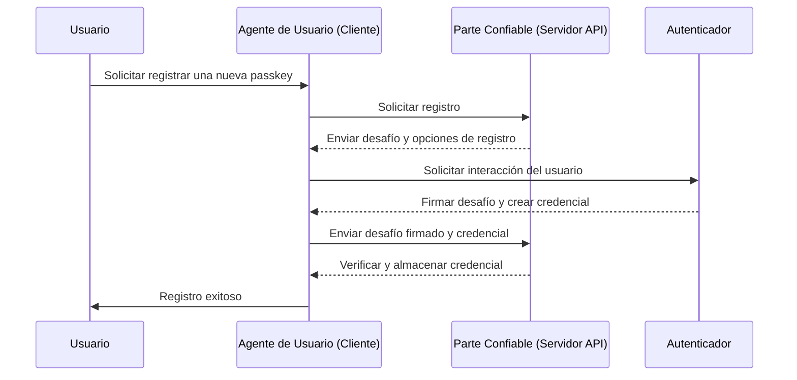
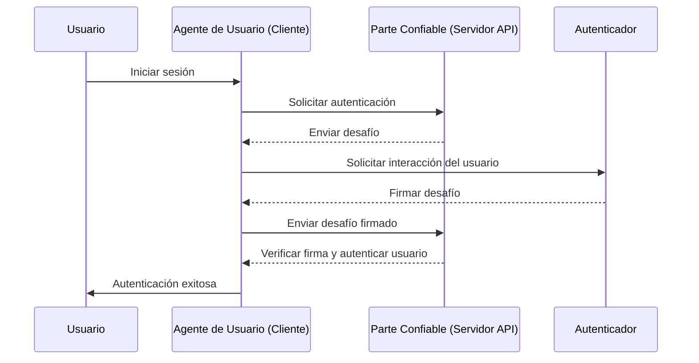

## ¿Qué es WebAuthn?

WebAuthn (Web Authentication API), desarrollado por el [W3C](https://www.w3.org/) y la [FIDO Alliance](https://fidoalliance.org/), es una especificación para la autenticación web segura utilizando estándares FIDO2. WebAuthn proporciona una API para permitir que los sitios web implementen <Ref slug="passkey" />, que son credenciales resistentes al phishing aseguradas por criptografía de clave pública. Las passkeys pueden reemplazar las contraseñas tanto para inicios de sesión sin contraseña como para <Ref slug="mfa" />.

## ¿Cómo es el flujo de trabajo de WebAuthn?

Aquí hay un ejemplo del mundo real para entenderlo mejor. Tienes una aplicación web MyApp que quiere integrar la API de WebAuthn para implementar Passkey para la autenticación multifactor.

**Fase de registro:** Después de registrarse con una verificación de correo electrónico y establecer una nueva contraseña, se le pide al usuario que cree una Passkey. Eligen vincular su dispositivo usando una huella digital. Esto establece la Passkey de manera segura en su dispositivo.

**Fase de autenticación:** Durante el próximo inicio de sesión, se le pide al usuario que verifique su Passkey después de ingresar su contraseña. Con solo un rápido escaneo de huella digital, pueden completar fácilmente el proceso de autenticación.


Para proporcionar una explicación más detallada, podemos dividir el proceso en dos fases: registro y autenticación. Primero, es esencial entender las cuatro entidades clave involucradas en el flujo de WebAuthn.

### 4 entidades clave

1. **Usuario:** El individuo que intenta acceder a una aplicación web.
2. **Agente de usuario:** El navegador web que maneja las llamadas a la API de WebAuthn y gestiona el proceso de autenticación entre el usuario, la parte confiable y el autenticador.
3. **Parte confiable:** El servicio, aplicación o servidor API al que el usuario busca acceder.
4. **Autenticador:** El componente de hardware o software utilizado para verificar la identidad del usuario. Puede tomar varias formas según la capacidad de la plataforma o el navegador, como claves de seguridad (como Yubikeys), teléfonos o tabletas (conectados por Bluetooth, NFC o USB), biometría basada en dispositivos o PIN, etc.

### Registro en WebAuthn

La criptografía de clave pública asimétrica es el proceso central.

1. **Generación de par de claves**: 
El agente de usuario genera un par de claves pública-privada.
   - **Clave pública**: Compartida con la parte confiable.
   - **Clave privada**: Se almacena de forma segura en el autenticador del usuario.
2. **Desafío de registro**: 
Cuando el usuario intenta registrar una passkey, la parte confiable envía un desafío de registro al agente de usuario.
3. **Verificación del usuario**: 
El agente de usuario reenvía el desafío al autenticador, que solicita al usuario una verificación (por ejemplo, autenticación biométrica o una clave de seguridad de hardware).
4. **Firma criptográfica:** 
El autenticador utiliza su clave privada para firmar el desafío, creando una firma criptográfica.
5. **Verificación y acceso:** 
El agente de usuario envía el desafío firmado de vuelta a la parte confiable, que verifica la firma utilizando la clave pública y completa el proceso de registro.



### Autenticación en WebAuthn

1. **Desafío de autenticación:**
Cuando el usuario intenta iniciar sesión, la parte confiable envía un desafío de autenticación al agente de usuario.
2. **Verificación del usuario:**
El agente de usuario envía el desafío al autenticador, que solicita al usuario una verificación (por ejemplo, autenticación biométrica o una clave de seguridad de hardware).
3. **Firma criptográfica:**
El autenticador utiliza su clave privada para firmar el desafío, creando una firma criptográfica.
4. **Verificación y acceso:**
El agente de usuario verifica la firma utilizando la clave pública e informa a la parte confiable de una autenticación exitosa. Se concede acceso si la verificación es exitosa.



## ¿Cómo usar WebAuthn?

La API de WebAuthn se puede usar para implementar inicio de sesión con passkey o verificación en dos pasos. Consulta la experiencia de Passkey para obtener más detalles.

Para usar la API de Autenticación Web (WebAuthn) para una autenticación segura, necesitas manejar dos procesos principales: registro y autenticación. Aquí hay ejemplos de código simples de cómo podrías implementar estos procesos usando JavaScript.

**Registro**

La parte confiable (tu aplicación web) inicia el proceso de registro llamando al método `navigator.credentials.create()`.

```jsx
// Registro
navigator.credentials.create({
  publicKey: {
    rp: {
      name: "Tu Nombre de Parte Confiable",
      id: "tu-id-de-parte-confiable"
    },
    user: {
      id: "id-de-usuario",
      displayName: "Nombre de Usuario",
      name: "Nombre de Usuario"
    },
    challenge: "tu-valor-de-desafío",
    timeout: 60000 // 60 segundos
  }
}).then(credential => {
  // Almacenar el id de la credencial para futura autenticación
  localStorage.setItem("credentialId", credential.id);
}).catch(error => {
  console.error("Error de registro:", error);
});
```

La parte confiable inicia el proceso de autenticación llamando al método `navigator.credentials.get()`.

```jsx
// Autenticación
navigator.credentials.get({
  publicKey: {
    rp: {
      name: "Tu Nombre de Parte Confiable",
      id: "tu-id-de-parte-confiable"
    },
    challenge: "tu-valor-de-desafío",
    timeout: 60000 // 60 segundos
  }
}).then(credential => {
  // Verificar el id de la credencial y otras propiedades
  if (credential.id === localStorage.getItem("credentialId")) {
    // Autenticación exitosa
    console.log("Usuario autenticado con éxito");
  } else {
    console.error("Credencial inválida");
  }
}).catch(error => {
  console.error("Error de autenticación:", error);
});
```

Para conocer los detalles, lee las especificaciones: https://fidoalliance.org/specifications/download/.

Nota: En las acciones de WebAuthn, ya sea para registro o autenticación, el "ID de rp" (ID de parte confiable) es un campo obligatorio. Representa el nombre de dominio de la página web actual. Si no coincide con el dominio actual, el navegador rechazará la solicitud. Esto significa que las passkeys están vinculadas a un dominio específico, y actualmente no hay forma de migrar passkeys existentes a un dominio diferente. Además, las passkeys no se pueden usar en diferentes dominios.

## WebAuthn y OpenID Connect (OIDC)

Al combinar la fuerte seguridad de WebAuthn con el protocolo de identidad estandarizado de OIDC, podemos crear una experiencia de autenticación más segura y amigable para el usuario.

Aprende cómo funciona:

- **Fase de registro**: Los usuarios completan un proceso de registro estándar de <Ref slug="openid-connect" /> (por ejemplo, verificación de correo electrónico y creación de contraseña). WebAuthn genera un par de claves pública-privada, almacenando la clave pública con el <Ref slug="identity-provider" /> de OIDC y manteniendo la clave privada en el dispositivo del usuario.
- **Fase de autenticación**: Los usuarios acceden a un recurso protegido por OIDC y son redirigidos a la página de inicio de sesión. Después de proporcionar credenciales básicas (por ejemplo, correo electrónico y contraseña), el sistema invoca WebAuthn para la autenticación con passkey. Una vez verificada la Passkey, OIDC emite un Access Token o ID Token para el acceso del usuario.

## ¿Cuál es la diferencia entre WebAuthn y CTAP2?

**WebAuthn** y **CTAP2** son componentes esenciales del estándar FIDO2, pero sirven para propósitos distintos:

- **CTAP2 (Client to Authenticator Protocol 2):** Este protocolo define cómo un dispositivo, como una clave de seguridad o un teléfono inteligente, se comunica con una aplicación web. Establece un canal seguro entre el **autenticador** y el **dispositivo del usuario**, asegurando que los datos de autenticación sensibles estén protegidos.
- **WebAuthn (Web Authentication API):** Esta API proporciona una forma estandarizada para que las aplicaciones web interactúen con autenticadores compatibles con CTAP2. Maneja el proceso de autenticación, incluyendo el intercambio de datos de autenticación entre el **dispositivo del usuario** y la **parte confiable**.

<SeeAlso slugs={["passkey", "mfa", "openid-connect"]} />

<Resources
  urls={[
    "https://fidoalliance.org/specs/fido-v2.0-id-20180227/fido-client-to-authenticator-protocol-v2.0-id-20180227.html",
    "https://blog.logto.io/webauthn-nextjs",
    "https://blog.logto.io/webauthn-base-knowledge"
  ]}
/>