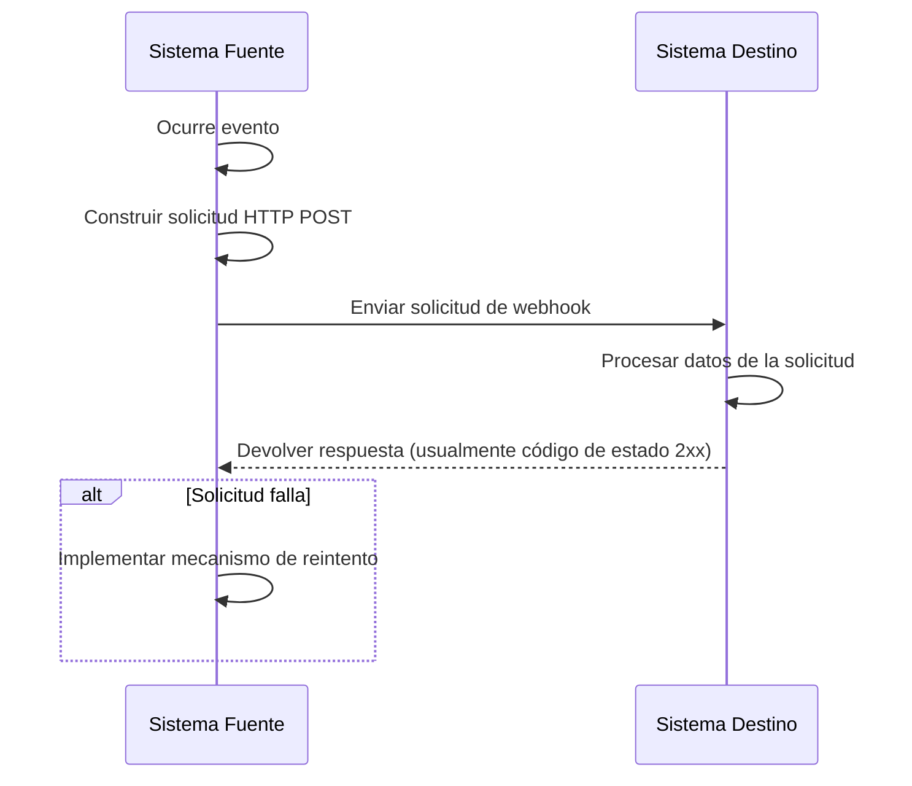
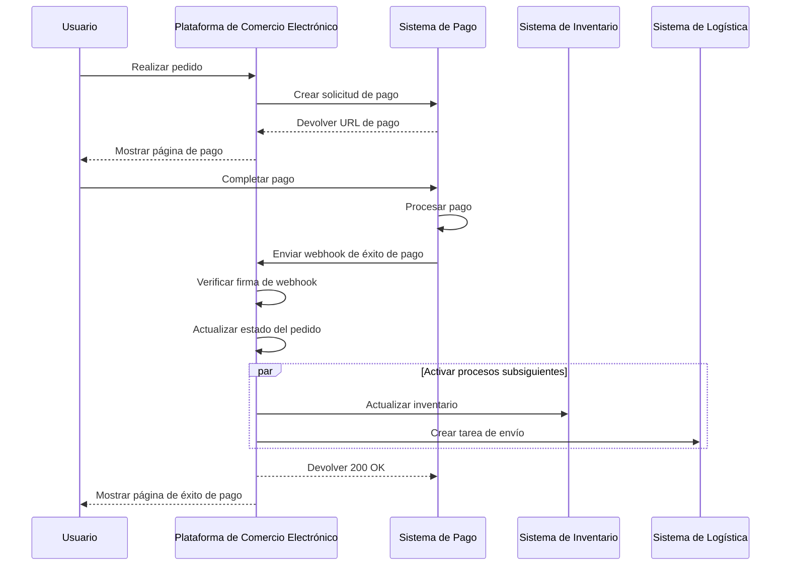

## ¿Qué es un webhook?

Un webhook es un mecanismo de devolución de llamadas HTTP que permite a las aplicaciones enviar notificaciones en tiempo real a URLs predefinidas cuando ocurren eventos específicos. Este mecanismo habilita el intercambio automatizado de datos y la comunicación en tiempo real entre sistemas.

## ¿Cómo funcionan los webhooks?



1. Ocurre un evento específico en el sistema fuente.
2. El sistema fuente construye una solicitud HTTP POST que contiene datos del evento.
3. El sistema fuente envía la solicitud a la URL del sistema destino preconfigurada.
4. El sistema destino recibe la solicitud y procesa los datos.
5. El sistema destino devuelve una respuesta al sistema fuente.
6. Si la solicitud falla, el sistema fuente puede implementar un mecanismo de reintento.

## ¿Cuáles son los casos de uso comunes para los webhooks?

1. Sistemas de pago: Notificar cambios en el estado de pedidos.
2. Sistemas de control de versiones: Notificar commits de código, solicitudes de fusión y otros eventos.
3. Sistemas CRM: Notificaciones de actualizaciones de información del cliente.
4. Dispositivos IoT: Notificaciones de cambios de estado del dispositivo.
5. Plataformas de redes sociales: Notificaciones de nuevos mensajes y comentarios.

## ¿Cómo funcionan los webhooks en un escenario del mundo real?

Examinemos un escenario que involucra una plataforma de comercio electrónico que se integra con un sistema de pago de terceros:

### Escenario

Una plataforma de comercio electrónico utiliza un sistema de pago de terceros para procesar pagos de pedidos. Cuando un usuario completa un pago, el sistema de pago necesita notificar a la plataforma de comercio electrónico en tiempo real sobre el estado del pago a través de un webhook, permitiendo que la plataforma actualice el estado del pedido y active procesos subsiguientes.

### Flujo de implementación de Webhook



1. Creación de pedido y solicitud de pago:
   - El usuario realiza un pedido en la plataforma de comercio electrónico.
   - La plataforma envía una solicitud de pago al sistema de pago.
   - El sistema de pago devuelve una URL de pago, que la plataforma muestra al usuario.

2. Pago del usuario:
   - El usuario completa el pago en el sistema de pago.

3. Activación del webhook:
   - El sistema de pago detecta el evento "pago exitoso".
   - Construye una carga útil del webhook que contiene los detalles del pago.

4. Envío del webhook:
   - El sistema de pago envía una solicitud POST a la URL preconfigurada de la plataforma de comercio electrónico.

5. Procesamiento del receptor:
   - La plataforma de comercio electrónico recibe el webhook y primero verifica la firma de la solicitud para garantizar la seguridad.
   - Después de la verificación, la plataforma actualiza el estado del pedido correspondiente a "pagado".
   - La plataforma activa procesos subsiguientes, como actualizar inventario y crear tareas de envío.

6. Manejo de respuesta:
   - La plataforma de comercio electrónico devuelve inmediatamente una respuesta 200 OK al recibir el webhook.
   - Si ocurren errores durante el procesamiento, la plataforma reintentará en segundo plano o involucrará la intervención manual.

7. Experiencia del usuario:
   - La plataforma de comercio electrónico muestra una página de éxito de pago al usuario.

Este ejemplo demuestra cómo los webhooks permiten la comunicación en tiempo real entre un sistema de pago de terceros y una plataforma de comercio electrónico. A través de los webhooks, el sistema de pago puede notificar a la plataforma de comercio electrónico instantáneamente cuando se completa un pago, permitiendo actualizaciones inmediatas del estado del pedido y la activación rápida de procesos comerciales subsiguientes. Esto mejora la capacidad de respuesta y eficiencia general del sistema, proporcionando una mejor experiencia de compra para los usuarios.

## ¿Cuáles son las mejores prácticas para implementar webhooks?

Cuando eres el emisor (productor) de webhooks, considera los siguientes aspectos:

### Diseño del Webhook

Diseña estructuras de webhook claras y consistentes:

- Define tipos de eventos claros: Por ejemplo, `order.created`, `user.updated`, etc.
- Usa el formato estándar JSON: Asegúrate de que la estructura de datos sea clara y fácil de analizar.
- Control de versiones: Incluye información de la versión en los encabezados de la solicitud o carga útil. Por ejemplo:

  ```javascript
  // En los encabezados de la solicitud
  headers: {
    'Content-Type': 'application/json',
    'X-Webhook-Version': '1.0'
  }
  
  // O en la carga útil
  {
    "version": "1.0",
    "event_type": "order.created",
    "data": {
      // Detalles del evento
    }
  }
  ```

- Proporciona suficiente contexto: Incluye marcas de tiempo de cuando ocurrieron los eventos, identificadores únicos para recursos relacionados, etc.
- Mantén la consistencia: Usa convenciones de nombres y estructuras de datos consistentes en todos los tipos de eventos.

### Mecanismo de envío

Implementa un mecanismo confiable para el envío de webhooks:

- Usa colas de tareas asincrónicas: Evita bloquear el programa principal y mejora la capacidad de respuesta del sistema.
- Implementa mecanismos de reintento: Maneja fallas de red o la indisponibilidad temporal del receptor.

### Estrategia de reintento

Diseña una estrategia de reintento adecuada:

- Implementa retroceso exponencial: Evita reintentos frecuentes que puedan estresar el sistema y el receptor.
- Establece un máximo de reintentos: Previene reintentos infinitos que consuman recursos del sistema.
- Proporciona mecanismos de reintento manual: Ofrece una interfaz para reintentos manuales para webhooks que finalmente fallan.

### Implementación de seguridad

Implementa un mecanismo de firma para permitir a los receptores verificar la autenticidad de las solicitudes:

```javascript
const crypto = require('crypto');

function generateSignature(payload, secret) {
  return crypto.createHmac('sha256', secret)
    .update(JSON.stringify(payload))
    .digest('hex');
}

function sendWebhookWithSignature(url, payload, secret) {
  const signature = generateSignature(payload, secret);
  return axios.post(url, payload, {
    headers: { 'X-Webhook-Signature': signature }
  });
}
```

### Optimización del rendimiento

Optimiza el rendimiento de envío de webhooks:

- Usa pools de conexiones: Reduce la sobrecarga de establecer conexiones y mejora el rendimiento.
- Implementa procesamiento en lotes: Envía webhooks en lotes cuando sea apropiado para reducir el número de interacciones de red.

### Documentación y herramientas de prueba

Proporciona soporte para los usuarios de webhooks:

- Documentación detallada del API: Incluye todos los posibles tipos de eventos, formatos de solicitud y descripciones de campos.
- Proporciona herramientas de prueba: Implementa endpoints de prueba de webhook para permitir a los usuarios simular la recepción de notificaciones de webhook.
- Código de ejemplo: Proporciona ejemplos de integración en varios lenguajes de programación.

## ¿Cuáles son las mejores prácticas para usar webhooks?

Cuando usas webhooks como receptor (consumidor), considera los siguientes aspectos:

### Seguridad

Dado que los endpoints para recibir webhooks son generalmente accesibles públicamente, la seguridad es una preocupación principal. Presta atención a los siguientes puntos:

- Verifica la autenticidad de las solicitudes: Implementa un mecanismo de verificación de firmas para asegurar que las solicitudes provengan de los emisores esperados.
  
  ```javascript
  const crypto = require('crypto');

  function verifySignature(payload, signature, secret) {
    const expectedSignature = crypto
      .createHmac('sha256', secret)
      .update(JSON.stringify(payload))
      .digest('hex');
    
    return crypto.timingSafeEqual(
      Buffer.from(signature),
      Buffer.from(expectedSignature)
    );
  }
  ```

- Usa HTTPS: Asegúrate de que tu endpoint de recepción de webhooks use HTTPS para prevenir que los datos sean interceptados o alterados durante la transmisión.
- Implementa lista blanca de IP: Solo acepta solicitudes de webhook de direcciones IP confiables para reducir el riesgo de ataques.

### Confiabilidad

Para asegurar un manejo confiable de los webhooks recibidos:

- Implementa procesamiento idempotente: Diseña tu sistema para manejar correctamente notificaciones de webhook duplicadas, ya que los emisores pueden reintentar solicitudes fallidas.
- Responde rápidamente: Devuelve una respuesta (usualmente un código de estado 2xx) inmediatamente después de recibir una solicitud de webhook para evitar que el emisor considere la solicitud fallida y active un reintento.

### Rendimiento

Mantén una operación eficiente del sistema:

- Procesamiento asincrónico: Después de recibir un webhook, realiza el procesamiento de datos real en segundo plano sin bloquear la respuesta.
- Establece límites de tiempo: Establece periodos de tiempo de espera razonables para el procesamiento de webhooks para prevenir que tareas de larga duración afecten el rendimiento del sistema.

### Manejo de errores

Maneja adecuadamente las situaciones de error potenciales:

- Registro: Mantén registros detallados de las solicitudes de webhook recibidas y procedimientos de procesamiento para facilitar la investigación de problemas.
- Degradación elegante: Ten mecanismos de manejo de errores adecuados cuando no pueda procesar webhooks para asegurar que otras partes del sistema no se vean afectadas.

### Compatibilidad de versiones

Dado que los formatos de webhook pueden cambiar con el tiempo:

- Maneja información de versiones: Prepárate para manejar diferentes versiones de formatos de webhook. La información de la versión generalmente se proporciona en la URL o los encabezados de la solicitud.
- Compatibilidad hacia atrás: Al actualizar tu lógica de manejo de webhooks, asegura soporte continuo para versiones de formatos más antiguas.

### Monitoreo

Monitorea continuamente la recepción y el procesamiento de webhooks:

- Configura alertas: Implementa monitoreo en tiempo real y alertas para situaciones anormales (como altas tasas de falla o tráfico inusual).
- Métricas de rendimiento: Seguimiento de métricas de rendimiento para el procesamiento de webhooks, como el tiempo de respuesta y la tasa de éxito.

<Resources
  urls={[
    "https://docs.logto.io/docs/recipes/webhooks/",
    "https://docs.logto.io/docs/recipes/webhooks/securing-your-webhooks/",
    "https://en.wikipedia.org/wiki/Webhook"
  ]}
/>