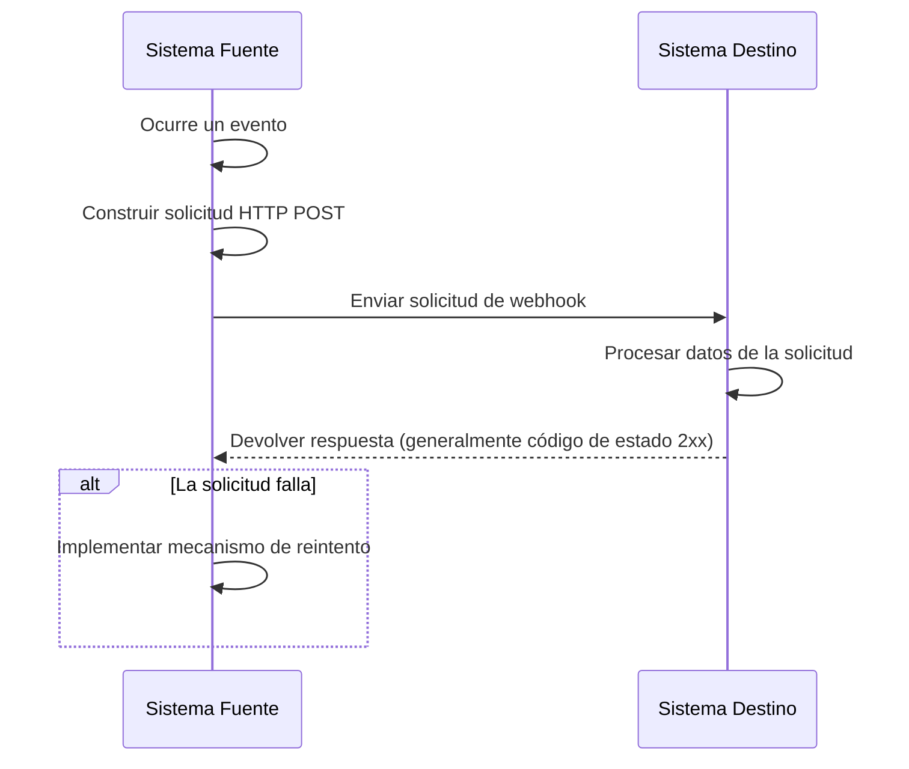
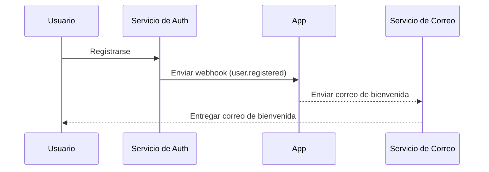

## ¿Qué es un webhook?

Un webhook es un mecanismo de callback HTTP que permite a las aplicaciones enviar notificaciones en tiempo real a URLs predefinidas cuando ocurren eventos específicos. Este mecanismo habilita el intercambio automatizado de datos y la comunicación en tiempo real entre sistemas.

## ¿Cómo funcionan los webhooks?



1. Ocurre un evento específico en el sistema fuente
2. El sistema fuente construye una solicitud HTTP POST que contiene los datos del evento
3. El sistema fuente envía la solicitud a la URL del sistema destino preconfigurada
4. El sistema destino recibe la solicitud y procesa los datos
5. El sistema destino devuelve una respuesta al sistema fuente
6. Si la solicitud falla, el sistema fuente puede implementar un mecanismo de reintento

## ¿Cómo funcionan los webhooks en un escenario del mundo real?

Tomemos como ejemplo una aplicación integrada con un servicio de auth (autenticación). Cuando un nuevo usuario se registra, la aplicación enviará un correo electrónico de bienvenida al usuario.

Típicamente, el servicio de auth proporciona un evento de webhook `user.registered` que se activa cuando un nuevo usuario completa el registro.

La carga útil del evento de webhook contiene la información del usuario, como el correo electrónico y el nombre de usuario, que se puede usar para enviar el correo electrónico de bienvenida:

```json
// Nota: la estructura real de la carga útil depende del servicio de auth.
{
  "event": "user.registered",
  "timestamp": "2024-03-21T08:00:00Z",
  "data": {
    "user_id": "u_1234567890",
    "email": "john@example.com",    // Dirección de correo electrónico para enviar el correo de bienvenida
    "username": "johndoe",          // Nombre de usuario para personalizar el correo
    "registered_at": "2024-03-21T08:00:00Z"
  }
}
```

Así es como funciona el flujo del webhook:



## ¿Cuáles son las mejores prácticas para implementar webhooks?

Cuando eres el emisor (productor) de webhooks, considera los siguientes aspectos:

### Diseño de webhook

Diseña estructuras de webhook claras y consistentes:

- Define tipos de eventos claros: Por ejemplo, `order.created`, `user.updated`, etc.
- Usa formato JSON estándar: Asegúrate de que la estructura de datos sea clara y fácil de analizar.
- Control de versiones: Incluye información de versión en los encabezados de la solicitud o en la carga útil. Por ejemplo:

  ```javascript
  // En encabezados de solicitud
  headers: {
    'Content-Type': 'application/json',
    'X-Webhook-Version': '1.0'
  }
  
  // O en la carga útil
  {
    "version": "1.0",
    "event_type": "order.created",
    "data": {
      // Detalles del evento
    }
  }
  ```

- Proporciona contexto suficiente: Incluye marcas de tiempo de cuándo ocurrieron los eventos, identificadores únicos para recursos relacionados, etc.
- Mantén la consistencia: Usa convenciones de nomenclatura y estructuras de datos consistentes en todos los tipos de eventos.

### Mecanismo de envío

Implementa un mecanismo de envío de webhooks confiable:

- Usa colas de tareas asíncronas: Evita bloquear el programa principal y mejora la capacidad de respuesta del sistema.
- Implementa mecanismos de reintento: Maneja fallos de red o indisponibilidad temporal del receptor.

### Estrategia de reintento

Diseña una estrategia de reintento adecuada:

- Implementa retroceso exponencial: Evita reintentos frecuentes que podrían estresar el sistema y el receptor.
- Establece un conteo máximo de reintentos: Previene reintentos infinitos que consuman recursos del sistema.
- Proporciona mecanismos de reintento manual: Ofrece una interfaz para reintentos manuales para webhooks que finalmente fallan.

### Implementación de seguridad

Implementa un mecanismo de firma para permitir que los receptores verifiquen la autenticidad de las solicitudes:

```javascript
const crypto = require('crypto');

function generateSignature(payload, secret) {
  return crypto.createHmac('sha256', secret)
    .update(JSON.stringify(payload))
    .digest('hex');
}

function sendWebhookWithSignature(url, payload, secret) {
  const signature = generateSignature(payload, secret);
  return axios.post(url, payload, {
    headers: { 'X-Webhook-Signature': signature }
  });
}
```

### Optimización del rendimiento

Optimiza el rendimiento del envío de webhooks:

- Usa grupos de conexiones: Reduce la sobrecarga de establecer conexiones y mejora el rendimiento.
- Implementa procesamiento por lotes: Envía webhooks en lotes cuando sea apropiado para reducir el número de interacciones de red.

### Documentación y herramientas de prueba

Proporciona soporte para los usuarios de webhooks:

- Documentación detallada de la API: Incluye todos los posibles tipos de eventos, formatos de solicitud y descripciones de campos.
- Proporciona herramientas de prueba: Implementa endpoints de prueba de webhooks para permitir que los usuarios simulen la recepción de notificaciones de webhooks.
- Código de ejemplo: Proporciona ejemplos de integración en varios lenguajes de programación.

## ¿Cuáles son las mejores prácticas para usar webhooks?

Cuando usas webhooks como receptor (consumidor), considera los siguientes aspectos:

### Seguridad

Dado que los endpoints para recibir webhooks generalmente son accesibles públicamente, la seguridad es una preocupación principal. Presta atención a los siguientes puntos:

- Verifica la autenticidad de la solicitud: Implementa un mecanismo de verificación de firmas para asegurar que las solicitudes provengan de emisores esperados.
  
  ```javascript
  const crypto = require('crypto');

  function verifySignature(payload, signature, secret) {
    const expectedSignature = crypto
      .createHmac('sha256', secret)
      .update(JSON.stringify(payload))
      .digest('hex');
    
    return crypto.timingSafeEqual(
      Buffer.from(signature),
      Buffer.from(expectedSignature)
    );
  }
  ```

- Usa HTTPS: Asegúrate de que tu endpoint de recepción de webhooks use HTTPS para evitar que los datos sean interceptados o manipulados durante la transmisión.
- Implementa listas blancas de IP: Solo acepta solicitudes de webhooks de direcciones IP confiables para reducir el riesgo de ataques.

### Confiabilidad

Para asegurar el manejo confiable de los webhooks recibidos:

- Implementa procesamiento idempotente: Diseña tu sistema para manejar correctamente notificaciones duplicadas de webhooks, ya que los emisores pueden reintentar solicitudes fallidas.
- Responde rápidamente: Devuelve una respuesta (generalmente un código de estado 2xx) inmediatamente después de recibir una solicitud de webhook para evitar que el emisor considere que la solicitud falló y active un reintento.

### Rendimiento

Mantén una operación eficiente del sistema:

- Procesamiento asíncrono: Después de recibir un webhook, realiza el procesamiento real de datos en segundo plano sin bloquear la respuesta.
- Establece límites de tiempo de espera: Establece períodos de tiempo de espera razonables para el procesamiento de webhooks para evitar que tareas de larga duración afecten el rendimiento del sistema.

### Manejo de errores

Maneja adecuadamente las situaciones de error potenciales:

- Registro: Mantén registros detallados de las solicitudes de webhooks recibidas y los procedimientos de procesamiento para facilitar la investigación de problemas.
- Degradación elegante: Ten mecanismos de manejo de errores apropiados cuando no puedas procesar webhooks para asegurar que otras partes del sistema no se vean afectadas.

### Compatibilidad de versiones

Dado que los formatos de webhooks pueden cambiar con el tiempo:

- Maneja la información de versión: Prepárate para manejar diferentes versiones de formatos de webhooks. La información de versión generalmente se proporciona en la URL o en los encabezados de la solicitud.
- Compatibilidad hacia atrás: Al actualizar tu lógica de manejo de webhooks, asegúrate de seguir soportando versiones de formatos más antiguos.

### Monitoreo

Monitorea continuamente la recepción y procesamiento de webhooks:

- Configura alertas: Implementa monitoreo en tiempo real y alertas para situaciones anormales (como altas tasas de fallos o tráfico inusual).
- Métricas de rendimiento: Rastrea métricas de rendimiento para el procesamiento de webhooks, como el tiempo de respuesta y la tasa de éxito.

<Resources
  urls={[
    "https://docs.logto.io/docs/recipes/webhooks/",
    "https://docs.logto.io/docs/recipes/webhooks/securing-your-webhooks/",
    "https://en.wikipedia.org/wiki/Webhook"
  ]}
/>