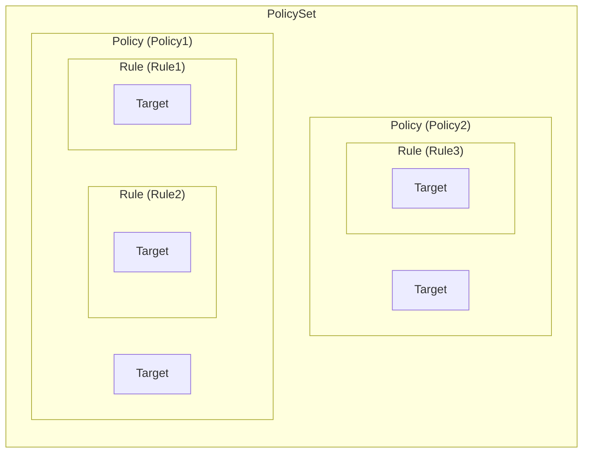
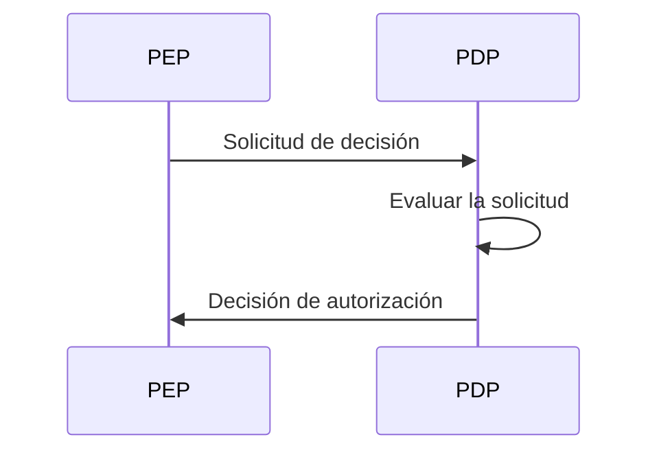
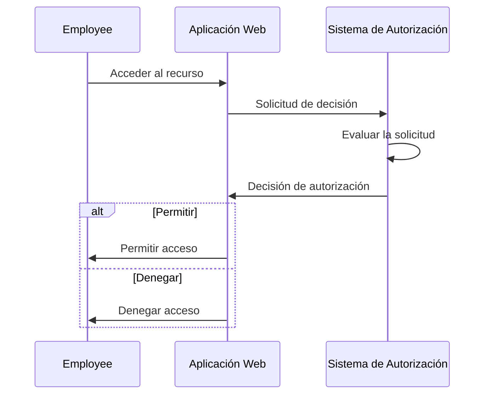
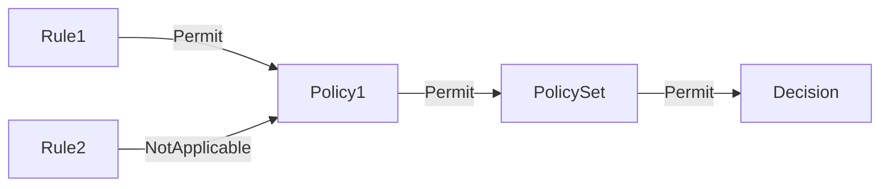
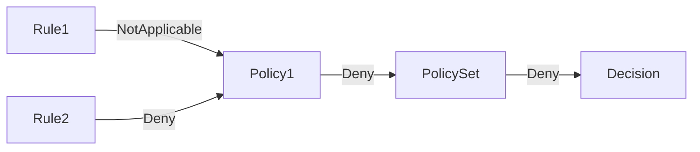

## ¿Qué es XACML?

Como su nombre indica, el Lenguaje de Marcado Extensible para el Control de Acceso (XACML) es un lenguaje basado en XML que se utiliza principalmente para el control de acceso. Es un estándar definido por la Organización para el Avance de Estándares de Información Estructurada (OASIS).

[XACML 3.0](https://docs.oasis-open.org/xacml/3.0/xacml-3.0-core-spec-os-en.html) es la última versión del estándar, que fue lanzada en 2013. Aunque no especifica un modelo particular de control de acceso, XACML se utiliza a menudo para implementar políticas de <Ref slug="abac" />. Veamos un ejemplo simple de cómo se puede usar XACML para representar políticas de ABAC:

```xml
<PolicySet PolicySetId="ABAC_Policies" PolicyCombiningAlgId="urn:oasis:names:tc:xacml:3.0:policy-combining-algorithm:deny-overrides">
  <Description>Políticas de ABAC</Description>
  <Policy PolicyId="Policy1" RuleCombiningAlgId="urn:oasis:names:tc:xacml:3.0:rule-combining-algorithm:deny-overrides">
    <Description>Los empleados pueden leer datos</Description>
    <Target>
      <AnyOf>
        <AllOf>
          <Match MatchId="urn:oasis:names:tc:xacml:1.0:function:string-equal">
            <AttributeValue DataType="http://www.w3.org/2001/XMLSchema#string">read</AttributeValue>
            <AttributeDesignator
              AttributeId="urn:oasis:names:tc:xacml:1.0:action:action-id"
              Category="urn:oasis:names:tc:xacml:3.0:attribute-category:action"
              DataType="http://www.w3.org/2001/XMLSchema#string"
              MustBePresent="true"
            />
          </Match>
        </AllOf>
      </AnyOf>
    </Target>
    <Rule RuleId="Rule1" Effect="Permit">
      <Target>
        <AnyOf>
          <AllOf>
            <Match MatchId="urn:oasis:names:tc:xacml:1.0:function:string-equal">
              <AttributeValue DataType="http://www.w3.org/2001/XMLSchema#string">employee</AttributeValue>
              <AttributeDesignator
                AttributeId="urn:oasis:names:tc:xacml:1.0:subject:subject-id"
                Category="urn:oasis:names:tc:xacml:1.0:subject-category:access-subject"
                DataType="http://www.w3.org/2001/XMLSchema#string"
                MustBePresent="true"
              />
            </Match>
          </AllOf>
        </AnyOf>
      </Target>
    </Rule>
    <Rule RuleId="Rule2" Effect="Deny">
      <Target>
        <AnyOf>
          <AllOf>
            <Match MatchId="urn:oasis:names:tc:xacml:1.0:function:string-equal">
              <AttributeValue DataType="http://www.w3.org/2001/XMLSchema#string">user</AttributeValue>
              <AttributeDesignator
                AttributeId="urn:oasis:names:tc:xacml:1.0:subject:subject-id"
                Category="urn:oasis:names:tc:xacml:1.0:subject-category:access-subject"
                DataType="http://www.w3.org/2001/XMLSchema#string"
                MustBePresent="true"
              />
            </Match>
          </AllOf>
        </AnyOf>
      </Target>
    </Rule>
  </Policy>
  <!-- ...other policies... -->
</PolicySet>
```

XACML utiliza convenciones de nomenclatura autoexplicativas. El lenguaje está diseñado para ser legible por humanos y fácil de entender.

En resumen, esta política establece que a los empleados se les permite leer datos, y a los usuarios se les niega la lectura de datos. Vamos a desglosar la política analizando los componentes clave:

- `<PolicySet>`: El elemento raíz del conjunto de políticas. Un `PolicySet` puede contener múltiples elementos `Policy` y `PolicySet`, formando una jerarquía de políticas.
- `<Policy>`: Una política que contiene una o más reglas. Cada política puede tener:
  - Un elemento `Target` que especifica las condiciones bajo las cuales la política se aplica.
  - Múltiples elementos `Rule` que definen las reglas de control de acceso.
  - Un atributo `RuleCombiningAlgId` que especifica cómo se combinan las reglas para tomar una decisión.
- `<Rule>`: Una regla que define las condiciones bajo las cuales se concede o se niega el acceso. Cada regla tiene:
  - Un elemento `Target` que especifica las condiciones bajo las cuales se aplica la regla.
  - Un atributo `Effect` que especifica si la regla permite o niega el acceso.

> [!Note]
> Los componentes y atributos disponibles en XACML no se limitan a los que acabamos de mencionar. Consulta la [especificación XACML 3.0](https://docs.oasis-open.org/xacml/3.0/xacml-3.0-core-spec-os-en.html) para obtener una lista completa de elementos y atributos.

A continuación se muestra una representación gráfica de la relación entre los diferentes componentes clave:



Se proporcionará una explicación detallada de otros elementos y atributos del ejemplo en las próximas secciones.

## Cómo funciona XACML

Para simplificar, supongamos que solo hay una política definida en el conjunto de políticas anterior. Para activar el proceso de evaluación de la política, se debe enviar una **solicitud de decisión** desde un **punto de aplicación de políticas (PEP)** a un **punto de decisión de políticas (PDP)**. El PDP evalúa la solicitud en función de la política y devuelve una **decisión de autorización** al PEP.



- PEP: El componente que envía la solicitud de decisión al PDP y aplica la decisión de autorización (es decir, realiza <Ref slug="access-control" />).
- PDP: El componente que evalúa la solicitud de decisión en función de la política y devuelve la decisión de autorización.

Utilicemos un ejemplo del mundo real para reemplazar el lenguaje shakespeariano. Supongamos que hay una aplicación web que permite a los empleados acceder a ciertos recursos, y la aplicación está integrada con un sistema de autorización basado en XACML.

Cuando un empleado intenta acceder a un recurso, la aplicación web (**PEP**) envía una **solicitud de decisión** al sistema de autorización (**PDP**). Una vez que el sistema de autorización evalúa la solicitud contra la política XACML, devuelve una **decisión de autorización** a la aplicación web.



## Solicitud de decisión

Una solicitud de decisión en XACML consiste en los siguientes componentes clave:

- **Subject (Sujeto)**: La entidad que solicita acceso a un recurso. Puede ser un usuario, dispositivo o cualquier otra entidad.
- **Resource (Recurso)**: El recurso al que se accede. Puede ser un archivo, base de datos, endpoint de API, o cualquier otro recurso.
- **Action (Acción)**: La acción que se realiza sobre el recurso. Puede ser leer, escribir, eliminar, o cualquier otra acción.
- **Environment (Entorno)**: El contexto en el que se realiza la solicitud de acceso. Puede incluir información como la hora del día, ubicación, o cualquier otra información contextual.

Aquí hay un ejemplo de una solicitud de decisión en XACML:

```xml
<Request>
  <Attributes Category="urn:oasis:names:tc:xacml:3.0:attribute-category:resource">
    <Attribute AttributeId="urn:oasis:names:tc:xacml:1.0:resource:resource-id" DataType="http://www.w3.org/2001/XMLSchema#string">
      <AttributeValue>http://example.com/data</AttributeValue>
    </Attribute>
  </Attributes>
  <Attributes Category="urn:oasis:names:tc:xacml:3.0:attribute-category:action">
    <Attribute AttributeId="urn:oasis:names:tc:xacml:1.0:action:action-id" DataType="http://www.w3.org/2001/XMLSchema#string">
      <AttributeValue>read</AttributeValue>
    </Attribute>
  </Attributes>
  <Attributes Category="urn:oasis:names:tc:xacml:3.0:attribute-category:subject">
    <Attribute AttributeId="urn:oasis:names:tc:xacml:1.0:subject:subject-id" DataType="http://www.w3.org/2001/XMLSchema#string">
      <AttributeValue>employee</AttributeValue>
    </Attribute>
  </Attributes>
</Request>
```

## Proceso de evaluación

Una vez que el PDP recupera el conjunto de políticas, evalúa la solicitud de decisión de la siguiente manera:

1. **Coincidencia de destino**: Para cada política, el PDP verifica si la solicitud coincide con el objetivo de la política. Si la solicitud coincide con el objetivo, el PDP procede a evaluar las reglas.
2. **Evaluación de reglas**: El PDP evalúa cada regla en la política. Si el objetivo de una regla coincide con la solicitud, el PDP evalúa la condición de la regla. Si la condición se evalúa como `true`, el PDP devuelve el efecto de la regla (permitir o denegar). Si la condición se evalúa como `false`, el PDP continúa evaluando la siguiente regla.
3. **Combinación de reglas**: El PDP combina los efectos de todas las reglas en la política según el atributo `RuleCombiningAlgId` de la política. El efecto combinado se devuelve luego como la decisión de la política.
4. **Combinación de políticas**: Si el conjunto de políticas contiene múltiples políticas, el PDP combina las decisiones de todas las políticas según el atributo `PolicyCombiningAlgId` del conjunto de políticas. La decisión combinada se devuelve luego como la decisión final de autorización.

### Ejemplo 1

Por ejemplo, en el conjunto de políticas de ejemplo, supongamos que la solicitud de decisión es como la anterior. El PDP evaluaría la solicitud contra la política `Policy1` de la siguiente manera:

#### Coincidencia de destino

El `Target` de la política especifica que cualquier sujeto que tenga un ID de acción de `read` debe ser evaluado por la política. Dado que la acción de la solicitud es `read`, la solicitud coincide con el objetivo de la política.

#### Evaluación de reglas

La política contiene dos reglas:

1. `Rule1`: Dado que el ID de sujeto de la solicitud es `employee`, la condición de la regla se evalúa como `true`, y el efecto de la regla es `Permit`.
2. `Rule2`: Dado que el ID de sujeto de la solicitud no es `user`, la condición de la regla se evalúa como `false`, y el efecto de la regla es `NotApplicable`.

#### Combinación de reglas y políticas

- Dado que `Policy1` utiliza el algoritmo de combinación `deny-overrides`, la decisión de la política es `Permit` porque `Rule1` permite el acceso y su efecto anula el efecto `NotApplicable` de `Rule2`.
- El conjunto de políticas también utiliza el algoritmo de combinación `deny-overrides`, y la decisión final es `Permit` porque la decisión de la política es `Permit`.

Aquí hay una representación gráfica no normativa del proceso de evaluación:



### Ejemplo 2

Ahora, consideremos una solicitud de decisión diferente donde todos los demás atributos son los mismos, pero el ID de sujeto es `user` en lugar de `employee`.

#### Coincidencia de destino

Dado que la acción no ha cambiado, la solicitud todavía coincide con el objetivo de la política.

#### Evaluación de reglas

- `Rule1`: El ID de sujeto de la solicitud no es `employee`, por lo que la condición de la regla se evalúa como `false`, y el efecto de la regla es `NotApplicable`.
- `Rule2`: El ID de sujeto de la solicitud es `user`, por lo que la condición de la regla se evalúa como `true`, y el efecto de la regla es `Deny`.

#### Combinación de reglas y políticas

- La decisión de la política es `Deny` porque `Rule2` niega el acceso, y su efecto anula el efecto `NotApplicable` de `Rule1`.
- La decisión final es `Deny` porque el algoritmo de combinación de políticas `deny-overrides` del conjunto de políticas devuelve la decisión más restrictiva.

Aquí hay una representación gráfica no normativa del proceso de evaluación:



### Ejemplo 3

Por último, consideremos una solicitud de decisión donde la acción es `write` en lugar de `read`. Todos los demás atributos permanecen igual que en el ejemplo 1.

#### Coincidencia de destino

La solicitud ya no coincide con el objetivo de la política porque la acción es `write`, no `read`. Por lo tanto, la política no se evalúa.

#### Combinación de reglas y políticas

Dado que la política no se evalúa, la decisión final es `NotApplicable`.

Aquí hay una representación gráfica no normativa del proceso de evaluación:


## Algoritmos de combinación

XACML define varios algoritmos de combinación estándar que determinan cómo se combinan los efectos de múltiples reglas o políticas para tomar una decisión. En los ejemplos anteriores, mencionamos el algoritmo de combinación `deny-overrides` tanto para reglas como para políticas.

Como su nombre indica, el algoritmo `deny-overrides` prioriza las decisiones de `Deny` sobre las decisiones de `Permit`. A continuación, una explicación simplificada de cómo funciona el algoritmo `deny-overrides`:

- si alguna regla o política niega el acceso, la decisión final es `Deny`;
- si ninguna regla o política niega el acceso, y AL MENOS una regla o política permite el acceso, la decisión final es `Permit`;
- si ninguna regla o política niega el acceso, y NINGUNA regla o política permite el acceso, la decisión final es `NotApplicable`.

El algoritmo real es más complejo y toma en cuenta otras decisiones "indeterminadas" como `Indeterminate{D}` y `Indeterminate{P}`.

> [!Note]
> Este algoritmo no proporciona una decisión de "respaldo" en caso de que ninguna regla o política coincida con la solicitud. En tales casos, la decisión es `NotApplicable`.

Para una lista completa de algoritmos de combinación y su comportamiento, consulta la [especificación XACML 3.0](https://docs.oasis-open.org/xacml/3.0/xacml-3.0-core-spec-os-en.html#_Toc325047268).

## Consideraciones de implementación

XACML es un lenguaje poderoso para expresar políticas de control de acceso basadas en atributos. Antes de implementar XACML en tu sistema, considera lo siguiente:

- Diseño de control de acceso: XACML es flexible y expresivo, pero requiere un diseño cuidadoso ya que puede involucrar conjuntos de políticas complejas que pueden conducir a consecuencias no deseadas.
- Complejidad: Las políticas de XACML a menudo son complejas y pueden ser desafiantes de gestionar. Para la mayoría de las aplicaciones, modelos de control de acceso más simples como <Ref slug="rbac" /> pueden ser más apropiados.
- Rendimiento: Evaluar políticas de XACML puede ser computacionalmente costoso, especialmente cuando se trata de grandes conjuntos de políticas. Considera las implicaciones de rendimiento de usar XACML en tu sistema.

<SeeAlso slugs={['abac', 'rbac', 'access-control', 'authorization']} />

<Resources
  urls={[
    'https://docs.oasis-open.org/xacml/3.0/xacml-3.0-core-spec-os-en.html',
  ]}
/>