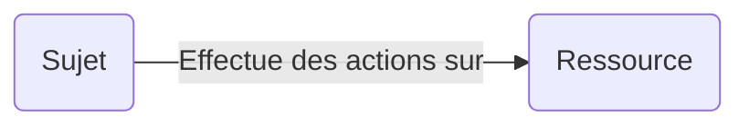
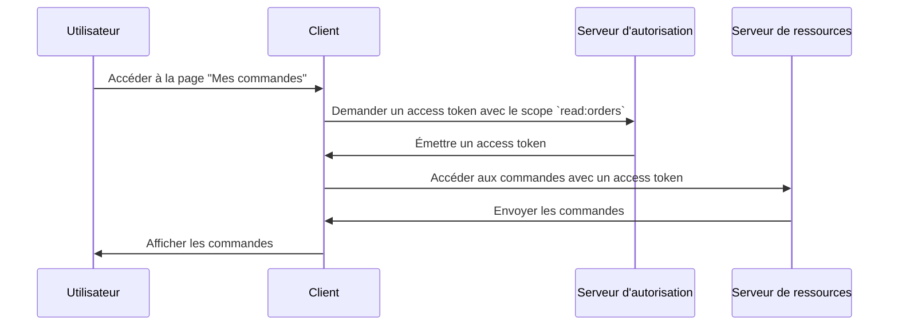

## Qu'est-ce que le contrôle d'accès (access control) ?

Le contrôle d'accès (access control) implique trois composants principaux :

- **Sujet** : Une entité qui effectue des actions sur les ressources. Les sujets peuvent être des utilisateurs, des services ou des appareils.
- **Ressource** : Une entité protégée par le contrôle d'accès. Les ressources peuvent être des fichiers, des bases de données, des APIs ou tout autre actif numérique.
- **Action** : Une opération qu'un sujet peut effectuer sur une ressource. Les actions peuvent être lire, écrire, exécuter ou toute autre opération.

> Le contrôle d'accès (access control) définit la restriction sélective de l'accès aux **ressources** en fonction du **sujet** et de l'**action**.

Voici quelques exemples concrets de contrôle d'accès :

- Un utilisateur (sujet) **peut** lire (action) ses commandes (ressource) dans un système de commerce électronique.
- Un utilisateur (sujet) **ne peut pas** supprimer (action) le profil d'un autre utilisateur (ressource) dans un réseau social.
- Un service (sujet) **peut** écrire (action) des données dans une base de données (ressource) dans une architecture de microservices.

Parfois, la ressource est ignorée dans les implémentations techniques et le contrôle d'accès est défini comme la restriction de qui (sujet) peut effectuer quelles actions. Par exemple, le cadre de base d'OAuth 2.0 spécifie uniquement les actions en utilisant des scopes (permissions) et ne définit pas les ressources.

Le support pour le contrôle d'accès peut varier en fonction du <Ref slug="authorization-server" /> ou du <Ref slug="identity-provider" />. Certains systèmes peuvent prendre en charge les [Resource Indicators for OAuth 2.0](https://datatracker.ietf.org/doc/html/rfc8707), une extension d'OAuth 2.0 qui permet aux clients de spécifier les ressources auxquelles ils souhaitent accéder.

## Modèles de contrôle d'accès (access control) ||access-control-models||

Décider des restrictions entre quelques sujets et ressources est simple, mais pas évolutif. Ainsi, l'industrie a développé de nombreux modèles de contrôle d'accès pour les gérer efficacement. Dans le contexte de <Ref slug="iam" />, voici quelques modèles de contrôle d'accès courants :

- <Ref slug="rbac" /> : Un modèle qui attribue des permissions à des rôles, puis attribue des rôles à des sujets. Par exemple, un rôle d'administrateur pourrait avoir accès à toutes les ressources, tandis qu'un rôle d'utilisateur pourrait avoir accès à des ressources limitées.
- <Ref slug="abac" /> : Un modèle qui utilise des attributs (propriétés) du sujet, de la ressource et de l'environnement pour prendre des décisions de contrôle d'accès. Par exemple, un utilisateur avec l'attribut "département=ingénierie" pourrait avoir accès aux ressources d'ingénierie.

Il existe également d'autres modèles de contrôle d'accès tels que [policy-based access control (PBAC)](https://csrc.nist.gov/glossary/term/policy_based_access_control). Chaque modèle a ses propres forces et faiblesses, et le choix du modèle dépend de votre cas d'utilisation et de vos exigences.

## Contrôle d'accès (access control) dans OAuth 2.0

Dans le contexte d'OAuth 2.0, le contrôle d'accès est généralement mis en œuvre à l'aide de <Ref slug="scope">scopes</Ref>. Habituellement, la valeur d'un scope est une chaîne qui combine la ressource et l'action. Par exemple, `read:orders` ou `write:profile`.

> [!Note]
> Le terme "scopes" est interchangeable avec "permissions" dans la plupart des cas.

Il convient de noter qu'OAuth 2.0 ne définit pas la structure et la signification des scopes. L'interprétation des scopes est laissée au <Ref slug="resource-server" />, et l'émission des scopes est laissée au <Ref slug="authorization-server" />.

Par exemple, un utilisateur (sujet) a besoin d'accéder à ses commandes (ressource) dans un système de commerce électronique. En exploitant OAuth 2.0, vous pouvez définir un scope `read:orders` et une application web (client) demandera ce scope au serveur d'autorisation. Voici un flux simplifié :

Dans ce flux, en fonction de l'architecture technique, le serveur de ressources peut être un service API ou le client (application web) lui-même tant qu'il a la capacité d'accéder à la ressource (commandes).

### Le paramètre d'indicateur de ressource

Bien que les gens définissent souvent des scopes avec la ressource et l'action (par exemple, `read:orders`, où `orders` est la ressource et `read` est l'action), l'évolutivité de cette approche est limitée lorsque le nombre de ressources et d'actions augmente. RFC 8707 introduit le paramètre `resource` (c'est-à-dire <Ref slug="resource-indicator">resource indicators</Ref>) dans OAuth 2.0, qui permet aux clients de spécifier les ressources auxquelles ils veulent accéder.

Le RFC spécifie que le paramètre `resource` doit être un URI représentant la ressource. Par exemple, au lieu d'utiliser simplement `orders`, vous pourriez utiliser `https://api.example.com/orders`. Cette méthode aide à prévenir les conflits de nommage et améliore la précision de la correspondance des ressources en permettant l'utilisation de l'URL réelle de la ressource.

### Support du serveur d'autorisation

OAuth 2.0 ne définit pas comment le serveur d'autorisation doit effectuer le contrôle d'accès. Il laisse les détails d'implémentation à la discrétion du serveur d'autorisation. Ainsi, le choix du serveur d'autorisation peut grandement affecter le mécanisme de contrôle d'accès. Par exemple, certains serveurs d'autorisation peuvent prendre en charge les resource indicators, tandis que d'autres peuvent ne pas le faire. Il est important de décider quel modèle de contrôle d'accès utiliser en fonction de vos exigences professionnelles, puis de choisir un serveur d'autorisation qui prend en charge ce modèle. Si vous n'êtes pas sûr du modèle de contrôle d'accès, <Ref slug="rbac" /> est suffisant pour la plupart des cas.

<SeeAlso slugs={["rbac", "abac", "resource-indicator", "authorization"]} />

<Resources
  urls={[
    "https://blog.logto.io/mastering-rbac",
    "https://blog.logto.io/rbac-and-abac",
    "https://datatracker.ietf.org/doc/html/rfc8707",
    "https://blog.logto.io/organization-and-role-based-access-control",
  ]}
/>
