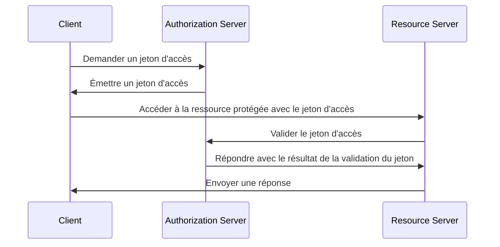
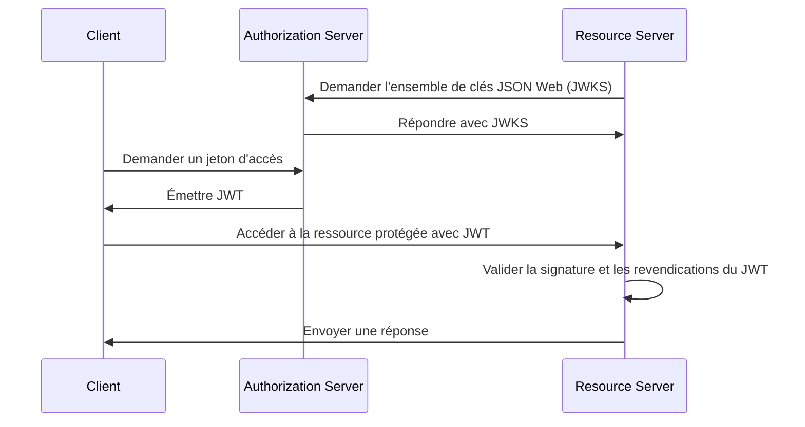
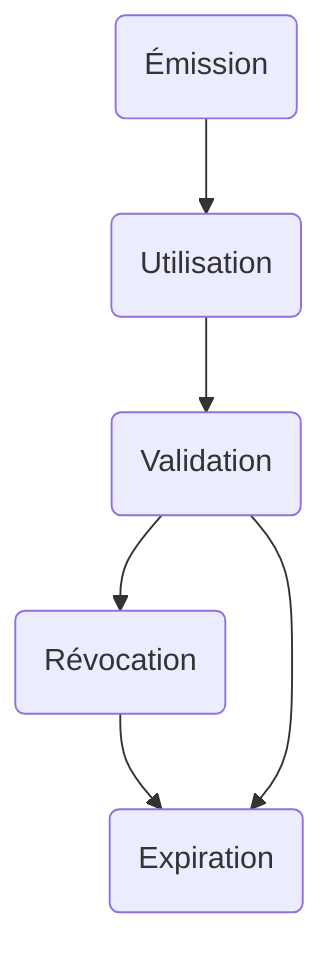

## Qu'est-ce qu'un jeton d'accès (access token) ?

Un jeton d'accès (access token) est un justificatif, généralement une chaîne de caractères, utilisé pour accéder aux ressources protégées. Dans le contexte d'OAuth 2.0 et OpenID Connect (OIDC), les <Ref slug="authorization-server">serveurs d'autorisation</Ref> peuvent émettre des jetons d'accès aux clients (applications) après une authentification et une autorisation réussies.

Bien que les RFCs pour OAuth 2.0 et OIDC ne spécifient pas les détails d'implémentation des jetons d'accès, il existe deux types courants de jetons d'accès utilisés en pratique :

- <Ref slug="opaque-token" /> : Une chaîne aléatoire qui n'a pas de signification ("opaque") pour le client. Le client présente le jeton au serveur de ressources, qui valide le jeton avec le serveur d'autorisation.
- <Ref slug="jwt" /> : Un jeton autonome qui contient des <Ref slug="claim">revendications</Ref> (par exemple, ID utilisateur, temps d'expiration) avec une signature numérique. Le serveur de ressources peut valider le jeton sans faire de requête supplémentaire au serveur d'autorisation.

## Comment fonctionne un jeton d'accès (access token) ?

Selon le type de jeton d'accès (access token), le flux d'utilisation d'un jeton d'accès (access token) peut varier.

Voici un exemple simplifié d'utilisation d'un jeton d'accès opaque (opaque access token) :

Voici un exemple simplifié d'utilisation d'un JWT :

La différence entre les deux types de jetons d'accès réside dans la façon dont le serveur de ressources valide le jeton :

- Le serveur de ressources doit effectuer une requête supplémentaire au serveur d'autorisation pour valider un jeton opaque chaque fois qu'il reçoit un jeton.
- Le serveur de ressources peut valider un JWT sans effectuer de requête supplémentaire au serveur d'autorisation parce que le jeton contient toutes les informations nécessaires et le serveur de ressources peut mettre en cache la clé publique à partir de l'ensemble de clés JSON Web (JWKS) du serveur d'autorisation.

Les jetons d'accès (access tokens) sont généralement de courte durée et ont un temps d'expiration (par exemple, 1 heure). Les clients doivent demander un nouveau jeton d'accès lorsque le jeton actuel expire.

## Quel type de jeton dois-je utiliser ?

Le choix entre un jeton opaque et un JWT dépend du cas d'utilisation et des exigences de sécurité de l'application. Voici une comparaison des deux types de jetons :

|                | Jeton Opaque                   | JWT                                                           |
|----------------|--------------------------------|---------------------------------------------------------------|
| Format         | Chaîne aléatoire               | Objets JSON autonomes                                         |
| Performance    | Nécessite une requête supplémentaire | Validation plus rapide                                         |
| Autonome       | Non                            | Oui                                                           |
| Taille du jeton | Plus petit                     | Plus grand                                                    |
| Révocation     | Instantanée                    | Nécessite l'expiration du jeton ou une interaction avec le serveur d'autorisation |
| Extensibilité  | Limitée                        | Revendications personnalisées                                  |
| Sans état      | Non                            | Oui                                                           |
| Sécurité       | Nécessite une validation du jeton | Nécessite une validation de la signature                      |
| Standard       | Non                            | Oui (RFC 7519)                                                |

Pour plus d'informations sur le choix entre les deux types de jetons, voir [Jeton opaque vs JWT](https://blog.logto.io/opaque-token-vs-jwt).

## Les rôles du serveur d'autorisation et du serveur de ressources

Dans la plupart des cas, le <Ref slug="authorization-server" /> a les responsabilités suivantes :

- Émet des jetons d'accès aux clients après une authentification et une autorisation réussies. Le serveur d'autorisation peut réduire les scopes (réduire les permissions à un sous-ensemble) ou rejeter la demande de jeton en fonction des politiques de contrôle d'accès (par exemple, consentement de l'utilisateur, <Ref slug="rbac" />, <Ref slug="abac" />).
- Vérifie si le jeton d'accès a été émis par le serveur d'autorisation et n'est pas expiré ou révoqué (<Ref slug="token-introspection" />).
- Fournit les informations sur le jeton (par exemple, scopes, temps d'expiration) via l'introspection du jeton ou le <Ref slug="userinfo-endpoint" />.

Vous pouvez remarquer que le serveur d'autorisation n'interprète pas la signification du jeton d'accès (access token). Par exemple, le jeton d'accès peut contenir un scope `read:orders`, mais le serveur d'autorisation ne sait pas ce que signifie le scope. Le serveur de ressources est responsable de l'interprétation du jeton d'accès et de l'application du <Ref slug="access-control" /> basé sur les scopes du jeton. Autrement dit, le <Ref slug="resource-server" /> a généralement les responsabilités suivantes :

- Valide les <Ref slug="claim">revendications</Ref> dans le jeton d'accès (par exemple, temps d'expiration, indicateur de ressource, scopes).
- Applique le contrôle d'accès basé sur les revendications du jeton (généralement les scopes).
- Fournit les ressources protégées si le jeton d'accès est valide.

## Cycle de vie du jeton d'accès (access token)

Le cycle de vie d'un jeton d'accès (access token) implique généralement les étapes suivantes :

<SeeAlso slugs={['opaque-token', 'jwt', 'token-introspection', 'userinfo-endpoint', 'access-control']} />

<Resources
  urls={[
    "https://blog.logto.io/opaque-token-vs-jwt",
    "https://blog.logto.io/oauth2-token-introspection",
    "https://blog.logto.io/understanding-tokens-in-oidc",
    {
      url: "https://datatracker.ietf.org/doc/html/rfc6749#section-1.4",
      result: {
        ogTitle: "OAuth 2.0 Access Token",
      },
    },
    "https://datatracker.ietf.org/doc/html/rfc7662",
  ]}
/>