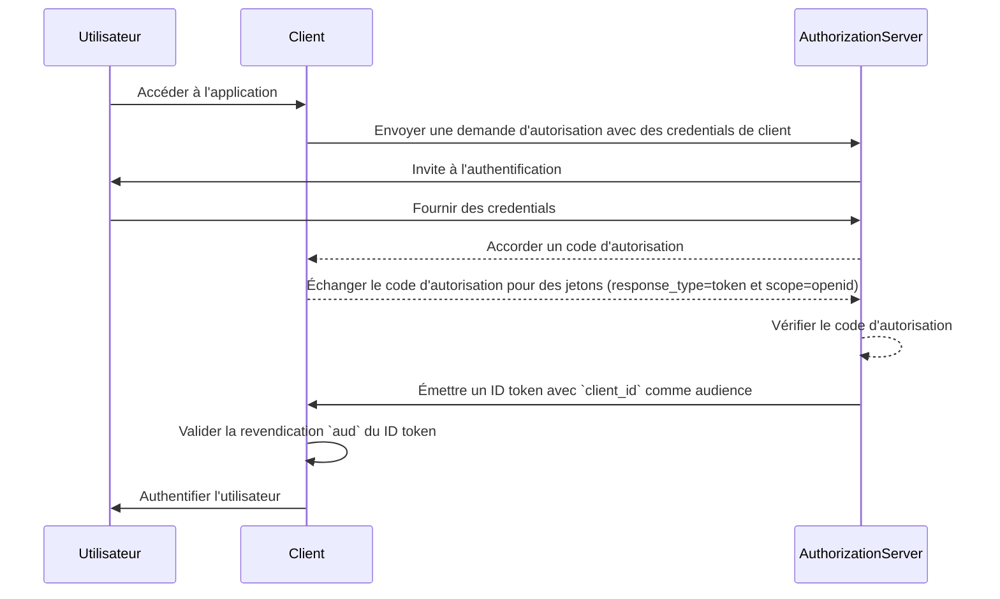
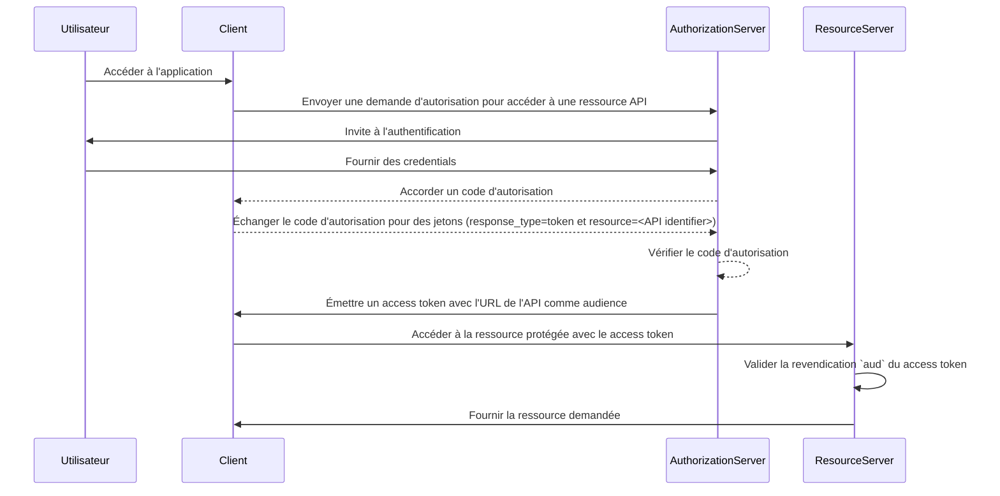

## Qu'est-ce que l'audience ?

Dans le contexte de l'authentification et de l'autorisation, l'audience est un composant clé qui définit les destinataires prévus d'un jeton d'autorisation. Appelée la revendication [aud](https://datatracker.ietf.org/doc/html/rfc7519#section-4.1.3) dans <Ref slug="jwt" />, cette revendication garantit que le jeton est seulement accepté par le service ou l'application désigné. En général, la revendication d'audience contient soit le client_id de l'application à laquelle le jeton est destiné, soit une URL représentant l'API ou la ressource que le jeton est autorisé à accéder. En spécifiant l'audience, cela sert de contrôle de sécurité pour éviter une utilisation abusive par des services ou utilisateurs non autorisés.

## Comment fonctionne l'audience ?

Lorsqu'un client demande un access token à un authorization server, la revendication d'audience est incluse dans la réponse du jeton. Cette valeur d'audience est ensuite validée par le resource server lorsque le jeton est présenté. Le resource server vérifie si la revendication d'audience dans le jeton correspond à son propre identifiant ou à l'identifiant du service qu'il protège. Si ce n'est pas le cas, le jeton sera rejeté, renforçant ainsi la sécurité dans les systèmes distribués, en particulier dans les scénarios impliquant plusieurs microservices ou API. En contrôlant la revendication d'audience, les développeurs peuvent s'assurer que les jetons sont utilisés dans le bon contexte, ajoutant un niveau de protection supplémentaire aux flux d'authentification et d'autorisation de leur application.

- **Demandeur** : L'application cliente spécifie la valeur d'audience lors de la demande d'un jeton.
- **Émetteur** : Le authorization server inclut la revendication d'audience dans la réponse du jeton.
- **Vérificateur** : Le destinataire du jeton vérifie la revendication d'audience par rapport à son propre identifiant. Si la revendication d'audience correspond à l'identifiant du destinataire, le jeton est considéré comme valide. Sinon, il est rejeté.

## Exemple d'audience dans JWT

### Audience claim dans un OpenID Connect (OIDC) ID token

```json
{
  "header": {
    "alg": "RS256",
    "typ": "JWT",
    "kid": "abc123"
  },
  "payload": {
    "iss": "https://auth.logto.io",
    "sub": "test_user",
    "aud": "client_id_foo",
    "exp": 1516239022,
    "iat": 1516239022,
    "nonce": "n-0S6_WzA2Mj",
    "primary_email": "foo@logto.io",
    "email_verified": true,
    "username": "foo"
  },
  "signature": "..."
}
```

Un <Ref slug="id-token" /> dans OpenID Connect (OIDC) est un jeton de sécurité qui contient des informations sur l'utilisateur authentifié, livré à l'application cliente après une authentification réussie. Contrairement aux access tokens, qui sont utilisés pour accorder la permission d'accéder à des ressources, les ID tokens sont spécifiquement conçus pour transmettre des informations sur l'identité de l'utilisateur à la partie de confiance (client). Ces jetons sont généralement encodés sous forme de JWTs (JSON Web Tokens) et incluent des revendications telles que l'identifiant de l'utilisateur (revendication sub), l'émetteur (revendication iss), et l'audience (revendication aud) entre autres.

Dans ce cas, la revendication `aud` spécifie l'audience prévue pour l'ID token, qui est l'application cliente. La valeur de la revendication `aud` correspond généralement au `client_id` de l'application qui a demandé le jeton. Lorsque l'application cliente reçoit l'ID token, elle peut vérifier la revendication d'audience pour s'assurer que le jeton a été émis pour sa consommation. Cette étape de validation aide à prévenir l'utilisation abusive du jeton et l'accès non autorisé aux informations utilisateur, renforçant ainsi la sécurité du processus d'authentification.



### Audience claim dans un access token

```json
{
  "header": {
    "alg": "RS256",
    "typ": "JWT",
    "kid": "abc123"
  },
  "payload": {
    "iss": "https://auth.logto.io",
    "sub": "test_user",
    "aud": "https://example.logto.app/api/users",
    "exp": 1516239022,
    "iat": 1516239022,
    "scope": "read write",
    "client_id": "client_id_foo"
  },
  "signature": "..."
}
```

Contrairement aux ID tokens, les access tokens sont utilisés pour autoriser l'accès à des ressources protégées, telles que des APIs ou services. La revendication `aud` dans un access token spécifie le destinataire prévu du jeton, qui est généralement l'API ou le service que le jeton est autorisé à accéder. Typiquement, le resource server qui héberge l'API a un domaine différent de l'application cliente qui a demandé le jeton. Dans ce cas, au lieu d'un `client_id`, la revendication `aud` contient l'URL du point d'accès API pour lequel le jeton est destiné. Cette URL est souvent appelée indicateur de ressource ou identifiant d'API qui identifie de manière unique la ressource cible.

Lorsque le resource server reçoit un access token, il valide la revendication `aud` pour s'assurer que le jeton est destiné à sa consommation. En vérifiant l'audience, le resource server peut empêcher un accès non autorisé à ses ressources et appliquer des politiques de contrôle d'accès basées sur l'audience prévue du jeton. Ce mécanisme aide à protéger les données sensibles et garantit que les access tokens sont utilisés dans le contexte approprié, renforçant ainsi la sécurité du système global.



## FAQs

### Pourquoi la revendication d'audience est-elle importante dans la validation des jetons ?

La revendication d'audience est cruciale dans la validation des jetons car elle garantit que le jeton n'est accepté que par le destinataire prévu. En vérifiant la revendication d'audience, le destinataire peut empêcher une utilisation abusive du jeton et un accès non autorisé aux ressources. Ce contrôle de sécurité est particulièrement important dans les systèmes distribués où plusieurs services interagissent les uns avec les autres, car il aide à appliquer des politiques de contrôle d'accès et à protéger les données sensibles.

### Un jeton peut-il avoir plusieurs audiences ?

Pour des raisons de sécurité, il est recommandé qu'un jeton ait une seule audience pour éviter toute ambiguïté et s'assurer que le jeton est utilisé dans le bon contexte. Cependant, certains scénarios peuvent nécessiter des jetons avec plusieurs audiences, par exemple lorsqu'un jeton est destiné à plusieurs services ou APIs au sein du même domaine. Dans de tels cas, les développeurs doivent examiner attentivement les implications de l'utilisation de jetons à audiences multiples et mettre en œuvre des mesures de sécurité appropriées pour atténuer les risques potentiels.

### Que dois-je utiliser comme identifiant d'API dans la revendication d'audience ?

Lors de la spécification de la revendication d'audience dans un access token qui représente une API ou un service, il est recommandé d'utiliser une URI absolue qui identifie de manière unique la ressource. Cette URI peut être l'URL de base du point d'accès API ou un chemin de ressource spécifique que le jeton est autorisé à accéder. En utilisant une URI comme identifiant d'API, vous pouvez vous assurer que la revendication d'audience est sans ambiguïté et représente précisément le destinataire prévu du jeton.
