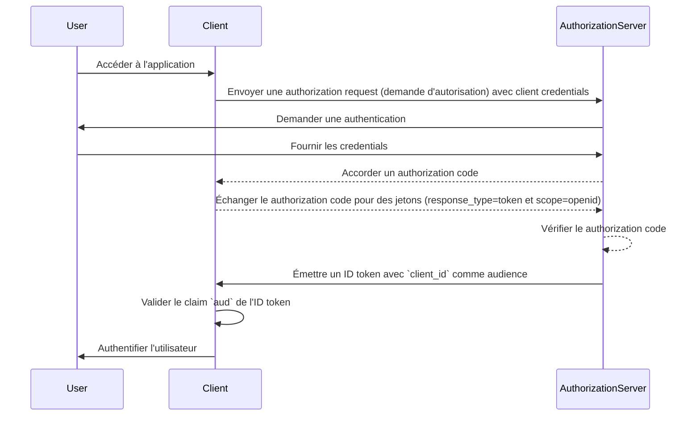
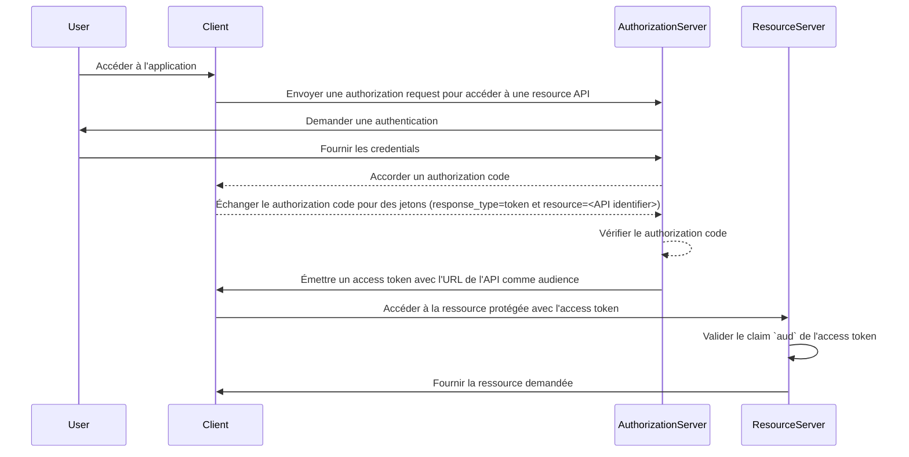

## Qu'est-ce que l'audience ?

Dans le contexte de <Ref slug="authentication" /> et <Ref slug="authorization" />, l'audience (audience) est un composant clé qui définit les destinataires prévus d'un jeton d'autorisation. Appelé [aud](https://datatracker.ietf.org/doc/html/rfc7519#section-4.1.3) claim dans <Ref slug="jwt" />, ce claim garantit que le jeton est accepté uniquement par le service ou l'application désignés. Généralement, le claim d'audience contient soit le client_id de l'application pour laquelle le jeton est destiné, soit une URL représentant l'API ou la ressource que le jeton est autorisé à accéder. En spécifiant l'audience, il sert de contrôle de sécurité pour empêcher une utilisation abusive par des services ou utilisateurs non autorisés.

## Comment fonctionne l'audience ?

Quand un client demande un <Ref slug="access-token" /> à un authorization server (serveur d'autorisation), le claim d'audience est inclus dans la réponse du jeton. Cette valeur d'audience est ensuite validée par le resource server (serveur de ressources) lorsque le jeton est présenté. Le resource server vérifie si le claim d'audience dans le jeton correspond à son propre identifiant ou à celui du service qu'il protège. Sinon, le jeton sera rejeté, renforçant la sécurité dans les systèmes distribués, en particulier dans les scénarios impliquant plusieurs microservices ou APIs. En contrôlant le claim d'audience, les développeurs peuvent s'assurer que les jetons sont utilisés dans le bon contexte, ajoutant ainsi une couche de protection supplémentaire aux workflows d'authentication (authentification) et authorization (autorisation) de leur application.

- **Requester (Demandeur)** : L'application cliente spécifie la valeur de l'audience lorsqu'elle demande un jeton.
- **Issuer (Émetteur)** : Le authorization server inclut le claim d'audience dans la réponse du jeton.
- **Verifier (Vérificateur)** : Le destinataire du jeton vérifie le claim d'audience avec son propre identifiant. Si le claim d'audience correspond à l'identifiant du destinataire, le jeton est considéré comme valide. Sinon, il est rejeté.

## Exemple d'audience dans JWT

### Claim d'audience dans un ID token OpenID Connect (OIDC)

```json
{
  "header": {
    "alg": "RS256",
    "typ": "JWT",
    "kid": "abc123"
  },
  "payload": {
    "iss": "https://auth.logto.io",
    "sub": "test_user",
    "aud": "client_id_foo",
    "exp": 1516239022,
    "iat": 1516239022,
    "nonce": "n-0S6_WzA2Mj",
    "primary_email": "foo@logto.io",
    "email_verified": true,
    "username": "foo"
  },
  "signature": "..."
}
```

Un <Ref slug="id-token" /> dans <Ref slug="openid-connect" /> est un jeton de sécurité qui contient des informations sur l'utilisateur authentifié, livré à l'application cliente après une authentification réussie. Contrairement aux access tokens, qui sont utilisés pour obtenir la permission d'accéder aux ressources, les ID tokens sont spécifiquement conçus pour transmettre des informations d'identité utilisateur à la partie de confiance (client). Ces jetons sont généralement encodés sous forme de JWTs et incluent des claims tels que l'identifiant de l'utilisateur (sub claim), l'issuer (iss claim), et l'audience (aud claim) parmi d'autres.

Dans ce cas, le claim `aud` spécifie l'audience prévue pour l'ID token, qui est l'application cliente. La valeur du claim `aud` correspond généralement au `client_id` de l'application qui a demandé le jeton. Lorsque l'application cliente reçoit l'ID token, elle peut vérifier le claim d'audience pour s'assurer que le jeton a été émis pour sa consommation. Cette étape de validation aide à prévenir l'utilisation abusive du jeton et l'accès non autorisé aux informations de l'utilisateur, améliorant ainsi la sécurité du processus d'authentication.



### Claim d'audience dans un access token

```json
{
  "header": {
    "alg": "RS256",
    "typ": "JWT",
    "kid": "abc123"
  },
  "payload": {
    "iss": "https://auth.logto.io",
    "sub": "test_user",
    "aud": "https://example.logto.app/api/users",
    "exp": 1516239022,
    "iat": 1516239022,
    "scope": "read write",
    "client_id": "client_id_foo"
  },
  "signature": "..."
}
```

Contrairement à l'ID token, les <Ref slug="access-token" /> sont utilisés pour autoriser l'accès aux ressources protégées, telles que les APIs ou les services. Le claim `aud` dans un access token spécifie le destinataire prévu du jeton, qui est typiquement l'API ou le service que le jeton est autorisé à accéder. En général, le resource server qui héberge l'API a un domaine différent de l'application cliente qui a demandé le jeton. Dans ce cas, au lieu d'un `client_id`, le claim `aud` contient l'URL du point d'accès API pour lequel le jeton est destiné. Cette URL est souvent connue sous le nom de resource indicator ou API identifier qui identifie de manière unique la ressource cible.

Quand le resource server reçoit un access token, il valide le claim `aud` pour s'assurer que le jeton est destiné à sa consommation. En vérifiant l'audience, le resource server peut empêcher l'accès non autorisé à ses ressources et appliquer des politiques d'accès en fonction de l'audience prévue du jeton. Ce mécanisme aide à protéger les données sensibles et garantit que les access tokens sont utilisés dans le contexte approprié, renforçant la sécurité du système global.



## FAQs

### Pourquoi le claim d'audience est-il important dans la validation des jetons ?

Le claim d'audience est crucial dans la validation des jetons car il assure que le jeton est uniquement accepté par le destinataire prévu. En vérifiant le claim d'audience, le destinataire peut prévenir l'utilisation abusive du jeton et l'accès non autorisé aux ressources. Ce contrôle de sécurité est particulièrement important dans les systèmes distribués où plusieurs services interagissent entre eux, car il aide à appliquer des politiques d'accès et à protéger les données sensibles.

### Un jeton peut-il avoir plusieurs audiences ?

Pour des raisons de sécurité, il est recommandé qu'un jeton ait une seule audience pour éviter toute ambiguïté et garantir que le jeton est utilisé dans le bon contexte. Cependant, certains scénarios peuvent nécessiter des jetons avec plusieurs audiences, par exemple lorsqu'un jeton est destiné à plusieurs services ou APIs au sein du même domaine. Dans de tels cas, les développeurs doivent soigneusement considérer les implications de l'utilisation de jetons multi-audience et mettre en œuvre des mesures de sécurité appropriées pour atténuer les risques potentiels.

### Que dois-je utiliser comme identifiant d'API dans le claim d'audience ?

Lors de la spécification du claim d'audience dans un access token qui représente une API ou un service, il est recommandé d'utiliser une URI absolue qui identifie de manière unique la ressource. Cette URI peut être l'URL de base du point d'accès API ou un chemin de ressource spécifique que le jeton est autorisé à accéder. En utilisant une URI comme identifiant d'API, vous pouvez vous assurer que le claim d'audience est sans ambiguïté et représente précisément le destinataire prévu du jeton.