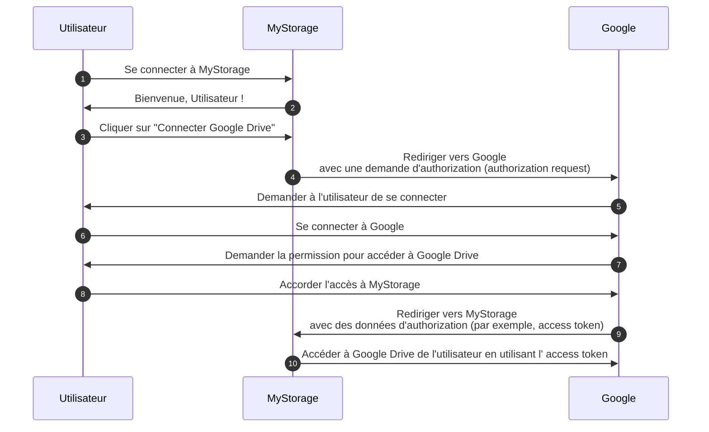

## Auth

Cette page est une clarification pour le terme "auth". Il est souvent utilisé comme une abréviation pour :

- <Ref slug="authentication" /> : Le processus de vérification de la propriété d'identité (par exemple, utilisateur ou service). Il répond à la question "Quelle identité possédez-vous ?"
- <Ref slug="authorization" /> : Le processus de détermination des actions qu'une identité peut effectuer sur une ressource. Il répond à la question "Que pouvez-vous faire ?"

> [!Note]
> Parfois, authentification et autorisation sont appelées respectivement "AuthN" et "AuthZ".

Ces deux concepts sont tous deux essentiels dans le domaine de l' <Ref slug="iam" />, mais ils sont fondamentalement différents. Voyons un exemple : une application web MyStorage a la capacité de télécharger des fichiers et de se connecter à Google Drive. Un flux utilisateur typique serait :

Dans ce flux, l'utilisateur effectue deux étapes d'authentification : une avec MyStorage (étape 1) et une autre avec Google (étape 6) ; et une étape d'autorisation : accorder l'accès à Google Drive (étape 8).

## De quoi voulez-vous parler ?

Lorsque vous voyez le terme "auth", il est important de préciser s'il se réfère à l'authentification ou à l'autorisation ; sinon, vous pourriez vous attendre à ce que les deux processus soient couverts (tout comme ce site le fait).

<SeeAlso slugs={["authentication", "authorization", "iam", "oauth-2.0", "openid-connect"]} />