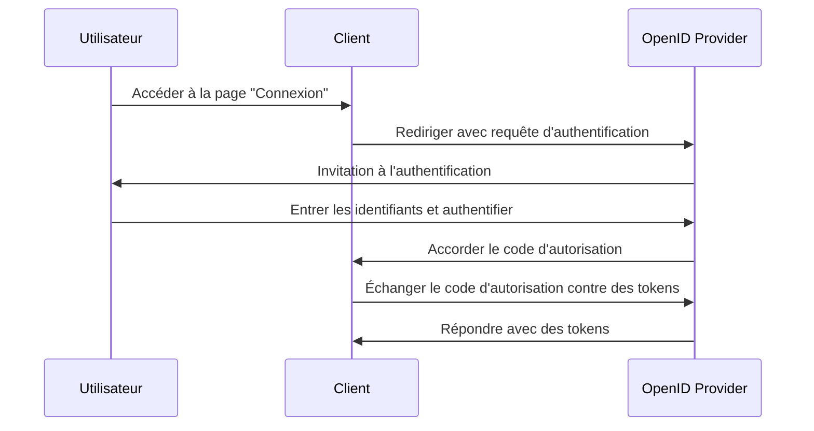

## Qu'est-ce qu'une requête d'authentification (Authentication request) ?

Bien que la signification d'une requête d'authentification puisse varier selon le contexte, nous nous concentrerons sur la définition dans la spécification OpenID Connect (OIDC). En OIDC, une requête d'authentification est une <Ref slug="authorization-request" /> au serveur d'autorisation pour authentifier un utilisateur.

La définition standard semble très déroutante car des termes similaires, tels que "requête d'autorisation" (authorization request), sont utilisés. Cela est dû au fait que l'OIDC est construit au-dessus de OAuth 2.0 qui est principalement conçu pour l'autorisation, et l'OIDC hérite de la terminologie OAuth 2.0 et l'étend pour supporter l'authentification.

Pour clarifier, ajoutons un peu de contexte à la définition :

> Une requête d'authentification (OpenID Connect) est une requête (d'autorisation OAuth 2.0) au serveur (d'autorisation OpenID Connect) pour authentifier un utilisateur.

Cela devient encore plus long ! Maintenant, supprimons toutes les parenthèses :

> Une requête d'authentification est une requête au serveur pour authentifier un utilisateur.

Après avoir supprimé tous les attributs, la définition devient simple. Voici les détails des termes :

- **Requête d'authentification (Authentication request)** : Le terme de la spécification OIDC.
- <Ref slug="authorization-request" /> : Le terme de la spécification OAuth 2.0. OIDC réutilise la spécification et l'étend.
- <Ref slug="authorization-server" /> : Le terme de la spécification OAuth 2.0. OIDC utilise également le terme <Ref slug="openid-connect" headingId="openid-provider-op" /> pour désigner la même entité capable d'authentifier les utilisateurs.

Dans les sections suivantes, nous utiliserons "OpenID Provider (OP)" pour désigner le serveur d'autorisation qui prend en charge OIDC.

## Comment fonctionne une requête d'authentification ?

Lorsqu'une application cliente souhaite authentifier un utilisateur, elle initie une requête d'authentification à l'OpenID Provider (OP). Comme nous l'avons mentionné plus tôt, la requête d'authentification est également une requête d'autorisation dans OAuth 2.0 ; donc, certains types de grants OAuth 2.0 (flux) peuvent être utilisés pour compléter le processus d'authentification.

OIDC définit trois types de grants (flux) pour supporter l'authentification :

1. <Ref slug="authorization-code-flow" /> : Le flux d'authentification le plus recommandé. Il est généralement utilisé avec <Ref slug="pkce" /> pour une meilleure sécurité et convient à la plupart des applications.
2. <Ref slug="implicit-flow" /> : Un flux simplifié qui est déprécié dans <Ref slug="oauth-2.1" /> en raison de problèmes de sécurité.
3. <Ref slug="hybrid-flow" /> : Une combinaison du flux de code d'autorisation et du flux implicite.

La requête d'authentification est la première étape du flux d'authentification OIDC. Les paramètres réels à inclure et les étapes à suivre dépendent du flux que vous choisissez. Cliquez sur les noms des flux ci-dessus pour en savoir plus sur chaque flux.

Voici un exemple simplifié de requête d'authentification utilisant le flux de code d'autorisation :

Une fois que le client reçoit les tokens, il peut les utiliser (par exemple, <Ref slug="access-token" />) pour accéder à des ressources protégées (par exemple, une API) pour le compte de l'utilisateur.

### Paramètres clés dans une requête d'authentification

Voici quelques paramètres clés dans une requête d'authentification :

- **`response_type`** : Le type de réponse que le client attend du serveur d'autorisation. Il peut être `code` pour le flux de code d'autorisation, `id_token` pour le flux implicite, ou `code id_token` pour le flux hybride.
- **`client_id`** : L'identifiant du client délivré par l'OpenID Provider (OP).
- **`redirect_uri`** : L'URI vers laquelle le serveur d'autorisation redirigera l'agent utilisateur après la requête d'authentification.
- **`scope`** : Les <Ref slug="scope">scopes</Ref> (permissions) demandés pour le <Ref slug="id-token" /> et le <Ref slug="access-token" />.
- **`resource`** : Le paramètre optionnel qui spécifie le <Ref slug="resource-indicator" /> pour les ressources demandées. Le serveur d'autorisation doit supporter [RFC 8707](https://datatracker.ietf.org/doc/html/rfc8707) pour utiliser ce paramètre.

Notez que les paramètres ci-dessus ne sont pas exhaustifs. Avant de faire une requête d'authentification, vous devriez vous référer à la liste complète des paramètres pour le flux spécifique que vous utilisez.

<SeeAlso slugs={["openid-connect", "oauth-2.0", "authorization-code-flow", "implicit-flow", "hybrid-flow"]} />

<Resources
  urls={[
    "https://openid.net/specs/openid-connect-core-1_0.html",
  ]}
/>