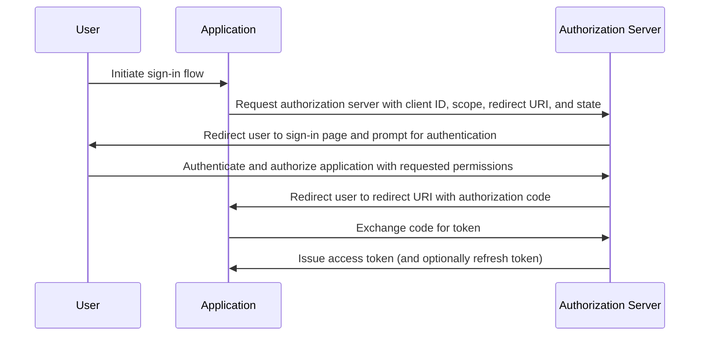

## Qu'est-ce que le flux du code d'autorisation (authorization code flow) ?

Le flux du code d'autorisation (authorization code flow ou authorization code grant), défini dans [OAuth 2.0 RFC 6749, section 4.1](https://datatracker.ietf.org/doc/html/rfc6749#section-4.1), est un mécanisme d'autorisation OAuth 2.0 largement utilisé qui permet aux applications d'obtenir un access token au nom d'un utilisateur. Ce flux est particulièrement adapté aux applications confidentielles (par exemple, les applications Web traditionnelles côté serveur) où le secret du client peut être stocké en toute sécurité.

Le flux du code d'autorisation (authorization code flow) est une méthode robuste et sécurisée pour obtenir des access tokens dans OAuth 2.0, en faisant un choix privilégié pour de nombreuses applications Web. Comprendre ce flux est essentiel pour les développeurs travaillant avec OAuth 2.0 et les intégrations API.

## Comment fonctionne le flux du code d'autorisation (authorization code flow) ?

Le flux du code d'autorisation (authorization code flow) implique les étapes suivantes :

1. **Initiation du flux** : L'utilisateur initie le flux en cliquant généralement sur un lien ou un bouton dans l'application pour se connecter. L'application redirige l'utilisateur vers le point d'autorisation du serveur d'autorisation (authorization server), transmettant l'ID client, le scope demandé, une redirect URI et un paramètre d'état. Le serveur d'autorisation valide les paramètres et demande à l'utilisateur de s'authentifier sur la page de connexion du serveur d'autorisation.
2. **Authentification et autorisation de l'utilisateur** : L'utilisateur s'authentifie auprès du serveur d'autorisation (authorization server) et accorde à l'application l'autorisation d'accéder aux ressources demandées.
3. **Génération de code et redirection** : Le serveur d'autorisation génère un code d'autorisation et redirige l'utilisateur vers l'application en utilisant la redirect URI fournie précédemment. Le code d'autorisation est inclus dans la chaîne de requête de la redirect URI.
4. **Échange de code** : L'application extrait le code d'autorisation de la chaîne de requête et fait une requête POST au point d'accès des jetons du serveur d'autorisation pour échanger le code d'autorisation contre un access token. L'application doit également inclure l'ID client, le secret client, la redirect URI, et le code d'autorisation dans la requête.
5. **Récupération du jeton d'accès** : Le serveur d'autorisation valide le code d'autorisation et émet un access token (et éventuellement un refresh token) à l'application après une validation réussie. L'application peut ensuite utiliser l'access token pour effectuer des requêtes API autorisées au nom de l'utilisateur.

Les étapes peuvent être illustrées par le diagramme de séquence suivant :



## Requête d'authentification (Authentication request)

Les paramètres de la requête sont les suivants :

- **client_id**: OBLIGATOIRE. Identifiant client OAuth 2.0 valide.
- **scope**: OBLIGATOIRE. Cette valeur spécifie un ensemble de ressources que l'utilisateur demande au serveur d'autorisation. Par exemple, `openid profile email`.
- **response_type**: OBLIGATOIRE. La valeur doit être `code` pour indiquer que l'application attend un code d'autorisation.
- **redirect_uri**: OBLIGATOIRE. L'URI vers laquelle la réponse d'authentification sera envoyée, et doit correspondre exactement à la redirect URI que le client a préenregistrée sur le serveur d'autorisation.
- **state**: RECOMMANDÉ. Une valeur opaque utilisée pour maintenir l'état entre la requête et le rappel. Elle est également utilisée pour prévenir les attaques de <Ref slug="csrf" />.
- **nonce**: OPTIONNEL. Une chaîne aléatoire utilisée pour associer une session client avec un ID token et pour atténuer les attaques par rejeu.
- **prompt**: OPTIONNEL. Liste d'espaces séparés, insensible à la casse, de valeurs de chaîne qui spécifie si le serveur d'autorisation doit demander une ré-authentification et un consentement à l'utilisateur final. Les valeurs définies sont :
  - **none**: Le serveur d'autorisation NE DOIT PAS afficher d'interface utilisateur pour l'authentification ou le consentement. Une erreur est renvoyée si un utilisateur final n'est pas déjà authentifié ou si le client n'a pas de consentement préconfiguré pour les Claims demandés ou ne remplit pas d'autres conditions pour traiter la demande. Le code d'erreur sera généralement `login_required`, `interaction_required`. Cela peut être utilisé comme méthode pour vérifier l'authentification et/ou le consentement existant.
  - **login**: Le serveur d'autorisation DEVRAIT demander à l'utilisateur final de se ré-authentifier. S'il ne peut pas ré-authentifier l'utilisateur final, il DOIT renvoyer une erreur, généralement `login_required`.
  - **consent**: Le serveur d'autorisation DEVRAIT demander le consentement de l'utilisateur final avant de renvoyer des informations au client. S'il ne peut pas obtenir le consentement, il DOIT renvoyer une erreur, généralement `consent_required`.
  - **select_account**: Le serveur d'autorisation DEVRAIT demander à l'utilisateur final de sélectionner un compte utilisateur. Cela permet à un utilisateur final qui a plusieurs comptes sur le serveur d'autorisation de sélectionner parmi les multiples comptes pour lesquels il pourrait avoir des sessions en cours. S'il ne peut pas obtenir un choix de sélection de compte fait par l'utilisateur final, il DOIT renvoyer une erreur, généralement `account_selection_required`.

[Définition complète des paramètres de requête](https://openid.net/specs/openid-connect-core-1_0.html#AuthRequest)

### Exemple de requête d'authentification (Authentication request)

```bash
curl -X GET "https://authorization-server.com/auth" \
  -d "response_type=code" \
  -d "client_id=YOUR_APPLICATION_ID" \
  -d "redirect_uri=https://yourapp.com/callback" \
  -d "scope=openid profile email" \
  -d "state=RANDOM_STRING_FOR_STATE"
```

Une réponse réussie typique :

```http
HTTP/1.1 302 Found
Location: https://yourapp.com/callback?
  code=YOUR_AUTHORIZATION_CODE
  &state=RANDOM_STRING_FOR_STATE
```

## Requête d'échange de jeton (Token exchange request)

Une fois que la requête d'authentification précédente a été répondue avec succès, le client sera automatiquement redirigé vers l'URI de rappel `https://yourapp.com/callback`, avec le code en tant que paramètre URI.

Le client est censé obtenir et traiter le `code` avec une demande d'échange de jeton subséquente, afin d'échanger pour le access token.

### Exemple de requête d'échange de jeton (Token exchange request)

```bash
curl -X POST "https://authorization-server.com/token" \
  -H "Content-Type: application/x-www-form-urlencoded" \
  -d "client_id=YOUR_CLIENT_ID" \
  -d "code=YOUR_AUTHORIZATION_CODE" \
  -d "redirect_uri=https://yourapp.com/callback" \
  -d "grant_type=authorization_code" \
```

## Avantages

- **Sécurité améliorée**: Le secret client n'est jamais exposé au navigateur de l'utilisateur, réduisant le risque d'imitation du client.
- **Code d'autorisation à usage unique** : Le code d'autorisation a une durée de vie courte et ne peut être utilisé qu'une seule fois, réduisant le risque d'interception et d'attaques par rejeu.
- **Jetons de courte durée** : Les access tokens émis dans ce flux sont de courte durée (généralement 1 heure), réduisant le risque d'accès non autorisé si le jeton est compromis.
- **Refresh token**: Le serveur d'autorisation peut éventuellement émettre un refresh token, permettant à l'application d'obtenir un nouveau access token sans nécessiter l'interaction de l'utilisateur.

## Quelle est la différence entre le flux du code d'autorisation (authorization code flow) et le flux implicite (implicit flow) ?

La principale différence entre le flux du code d'autorisation (authorization code flow) et le flux implicite (implicit flow) est la manière dont l'access token est obtenu :

- **Flux du code d'autorisation (Authorization code flow)** : L'application cliente reçoit d'abord un code d'autorisation à partir du point d'autorisation, puis l'échange contre un access token dans une requête POST subséquente au point de jeton.
- **Flux implicite (Implicit flow)** : L'application cliente reçoit directement l'access token du point d'autorisation.

## Quelle est la différence entre le flux du code d'autorisation (authorization code flow) et le flux des informations d'identification du client (client credentials flow) ?

La principale différence entre le flux du code d'autorisation (authorization code flow) et le flux des informations d'identification du client (client credentials flow) est le contexte dans lequel le flux est utilisé :

- **Flux du code d'autorisation (Authorization code flow)** : Utilisé lorsque l'application cliente doit accéder à des ressources au nom d'un utilisateur. Le flux implique l'authentification et l'autorisation de l'utilisateur.
- **Flux des informations d'identification du client (Client credentials flow)** : Utilisé lorsque l'application cliente doit accéder à des ressources en son propre nom. Le flux implique l'authentification du client mais pas l'authentification de l'utilisateur, le mieux adapté pour la communication machine-to-machine.

## Quels sont les cas d'utilisation typiques pour le flux du code d'autorisation (authorization code flow) ?

- Applications Web traditionnelles nécessitant l'authentification de l'utilisateur et l'accès aux APIs.
- Applications nécessitant un accès sécurisé aux données utilisateur provenant de services tiers.

<SeeAlso slugs={['device-flow', 'implicit-flow', 'client-credentials-flow']} />

<Resources urls={['https://datatracker.ietf.org/doc/html/rfc6749']} />