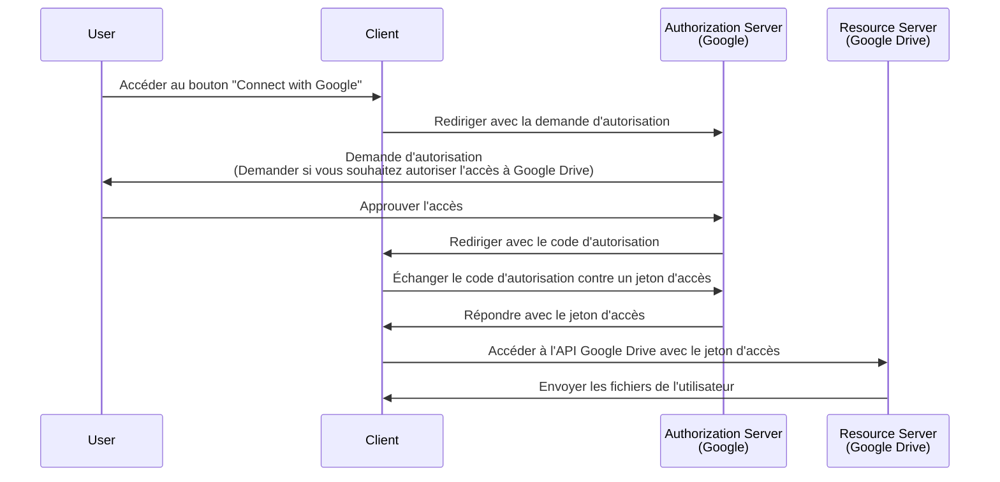

## Qu'est-ce qu'une demande d'autorisation (authorization request) ?

Selon le contexte, le terme "demande d'autorisation (authorization request)" peut se référer à différentes choses. Dans cet article, nous nous concentrerons sur la définition dans la spécification <Ref slug="oauth-2.0" />.

Dans OAuth 2.0, il existe plusieurs types de flux (grant types) qui définissent comment un <Ref slug="client" /> peut obtenir une autorisation (authorization) d'un utilisateur pour accéder à des ressources protégées.

> ![Note]
> Les "demandes d'autorisation (authorization requests)" sont souvent confondues avec les "demandes d'authentification (authentication requests)" dans le contexte de <Ref slug="openid-connect" />. Voir <Ref slug="authentication-request" /> pour les détails spécifiques à OIDC.

## Comment fonctionne une demande d'autorisation (authorization request) ?

Lorsqu'un client (application) souhaite accéder à des ressources protégées au nom d'un utilisateur, il initie une demande d'autorisation (authorization request) au <Ref slug="authorization-server" />. Le client doit indiquer le type de flux (grant type) demandé avec les paramètres nécessaires dans la requête.

Voici quelques types de flux (grant types) typiques pour l'autorisation des utilisateurs finaux dans OAuth 2.0 :

- <Ref slug="authorization-code-flow" /> : Le flux le plus recommandé pour l'autorisation des utilisateurs finaux. Il est généralement utilisé avec <Ref slug="pkce" /> pour une meilleure sécurité et convient à la plupart des applications.
- <Ref slug="implicit-flow" /> : Un flux simplifié qui est obsolète dans <Ref slug="oauth-2.1" /> en raison de problèmes de sécurité.
- [Resource owner password credentials (ROPC) grant](https://datatracker.ietf.org/doc/html/rfc6749#section-4.3) : Un flux où les informations d'identification de l'utilisateur sont échangées directement contre un jeton d'accès (access token). Ce flux n'est pas recommandé en raison des risques de sécurité.

Il existe également d'autres extensions, comme le <Ref slug="device-flow" /> pour les appareils avec des capacités d'entrée limitées. Chaque flux a ses propres caractéristiques et cas d'utilisation. Pour la plupart des applications web, le flux du code d'autorisation (authorization code flow) est le choix recommandé.

> L'autorisation <Ref slug="machine-to-machine" /> est généralement effectuée en utilisant le <Ref slug="client-credentials-flow" /> qui n'implique pas d'interaction utilisateur.

Par exemple, un client (application) peut demander l'autorisation d'accéder aux fichiers Google Drive d'un utilisateur. Voici un diagramme de séquence simplifié du flux du code d'autorisation (authorization code flow) :

Une fois que le <Ref slug="access-token" /> est obtenu, le client peut l'utiliser pour accéder aux fichiers Google Drive de l'utilisateur au nom de l'utilisateur.

### Paramètres clés dans une demande d'autorisation (authorization request)

La demande d'autorisation OAuth 2.0 inclut généralement les paramètres suivants :

- **`response_type`** : Le type de réponse attendu par le client. Les valeurs courantes sont `code` pour le flux du code d'autorisation et `token` pour le flux implicite.
- **`client_id`** : L'identifiant du client délivré par le serveur d'autorisation.
- **`redirect_uri`** : L'URI où le serveur d'autorisation envoie l'utilisateur après le processus d'autorisation.
- **`scope`** : Les <Ref slug="scope">scopes</Ref> (autorisations) demandés pour le jeton d'accès.
- **`resource`** : Le paramètre optionnel qui spécifie l'<Ref slug="resource-indicator" /> pour les ressources demandées. Le serveur d'autorisation doit prendre en charge [RFC 8707](https://datatracker.ietf.org/doc/html/rfc8707) pour utiliser ce paramètre.

Les paramètres ci-dessus ne sont pas exhaustifs. Les paramètres réels et leurs valeurs dépendent du type de flux et des exigences spécifiques de l'application.

<SeeAlso slugs={["oauth-2.0", "authentication-request", "authorization-code-flow", "implicit-flow", "device-flow"]} />

<Resources
  urls={[
    { url: "https://datatracker.ietf.org/doc/html/rfc6749#section-4", result: {
      ogTitle: "Obtaining Authorization in OAuth 2.0",
      ogDescription: " Pour demander un jeton d'accès, le client obtient l'autorisation du propriétaire de la ressource."
    } }
  ]}
/>