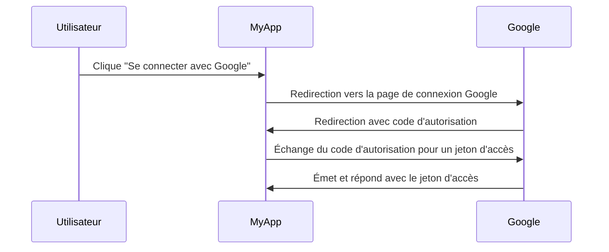

## Qu'est-ce qu'un serveur d'autorisation ?

Le terme "serveur d'autorisation" peut être un terme général qui se réfère à tout serveur qui effectue l'autorisation. Nous nous concentrerons sur la définition dans le contexte des cadres <Ref slug="oauth-2.0" /> et <Ref slug="openid-connect" />.

Dans OAuth 2.0, un serveur d'autorisation est un composant qui délivre des <Ref slug="access-token">jetons d'accès (access tokens)</Ref> aux <Ref slug="client">clients</Ref> après les avoir authentifiés et autorisés avec succès. Les jetons d'accès sont utilisés par les clients pour accéder à des ressources protégées au nom de l'utilisateur (propriétaire de la ressource).

Trop de termes ? Voyons un exemple concret : un utilisateur clique sur "Se connecter avec Google" sur une application "MyApp" qui utilise le <Ref slug="authorization-code-flow" /> pour la connexion Google.

Dans cet exemple, Google agit en tant que **serveur d'autorisation** qui délivre un jeton d'accès au **client** (MyApp) après la connexion réussie de l'utilisateur. Le client peut ensuite utiliser le **jeton d'accès (access token)** pour récupérer le profil de l'utilisateur (ressource protégée) sur Google.

### Serveur d'autorisation dans OpenID Connect (OIDC)

Étant donné qu'OpenID Connect est construit sur OAuth 2.0, il recycle certains termes et concepts d'OAuth 2.0. OIDC ajoute la capacité d'authentification au serveur d'autorisation d'OAuth 2.0, ce qui fait du serveur d'autorisation également un <Ref slug="openid-connect" headingId="openid-provider-op" />. Pour éviter toute ambiguïté, nous recommandons d'utiliser toujours le terme "OpenID Provider" lorsqu'on se réfère au serveur d'autorisation dans OIDC.

En plus de délivrer des jetons d'accès, le fournisseur OpenID (serveur d'autorisation) dans OIDC délivre également des <Ref slug="id-token">jetons d'identité (ID tokens)</Ref> aux clients. Les jetons d'identité contiennent des informations utilisateur et sont utilisés pour authentifier les utilisateurs.

## Comment fonctionne un serveur d'autorisation ?

Un serveur d'autorisation doit prendre en charge les <Ref slug="oauth-2.0-grant">subventions OAuth 2.0 (flux)</Ref> pour émettre des jetons d'accès aux clients. Un type de subvention consiste généralement en une série d'étapes que le client et le serveur d'autorisation suivent pour obtenir un jeton d'accès.

- Pour l'autorisation utilisateur, la plupart des types de subvention nécessitent que le client initie une <Ref slug="authorization-request" /> au serveur d'autorisation. Dans l'exemple de connexion avec Google ci-dessus, l'étape "Redirection vers la page de connexion Google" est une requête d'autorisation initiée par le client.
- Pour l'autorisation <Ref slug="machine-to-machine" />, le client peut utiliser le <Ref slug="client-credentials-flow" /> pour envoyer directement une <Ref slug="token-request" /> au serveur d'autorisation.

Le serveur d'autorisation doit également valider la requête du client, authentifier le client et vérifier l'identité de l'utilisateur avant d'émettre un jeton d'accès. Il peut également appliquer des mesures de sécurité supplémentaires, telles que <Ref slug="pkce" /> pour le <Ref slug="authorization-code-flow" />.

## Cas d'utilisation du serveur d'autorisation

Comme son nom l'indique, les serveurs d'autorisation sont utilisés pour gérer l'<Ref slug="authorization" />. Le serveur d'autorisation peut impliquer des parties premières et tierces :

- L'exemple de connexion avec Google ci-dessus.
- Un site e-commerce (client) demandant l'accès aux informations de paiement d'un utilisateur (ressource protégée) depuis un autre site web.
- Une application mobile (client) demandant l'accès aux données de localisation d'un utilisateur (ressource protégée) depuis un fournisseur de services de localisation.

Ou, il peut être utilisé uniquement pour une autorisation interne, telle que :

- Un utilisateur doit accéder à ses commandes (ressource protégée) sur un site e-commerce (client).
- Un service (client) doit accéder à une base de données (ressource protégée) dans une architecture microservices.

Dans les applications modernes, un serveur d'autorisation peut également être un <Ref slug="identity-provider" /> qui prend également en charge <Ref slug="openid-connect" /> pour l'authentification de l'utilisateur.

<SeeAlso slugs={["oauth-2.0", "authorization-request", "access-token"]} />
 
<Resources
  urls={[
    "https://blog.logto.io/ciam-102-authz-and-rbac",
    "https://tools.ietf.org/html/rfc6749",
  ]}
/>
