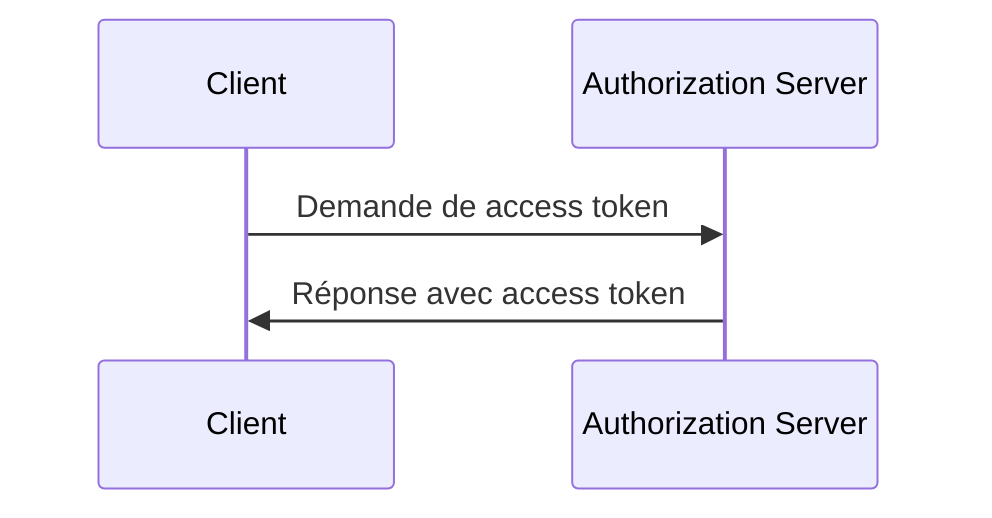
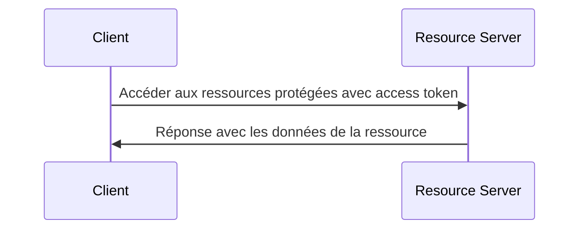

## Qu'est-ce que le flux d'informations d'identification client (client credentials flow) ?

Le flux d'informations d'identification client (Grant) est un type d'<Ref slug="oauth-2.0-grant" /> qui permet aux clients confidentiels d'obtenir des <Ref slug="access-token">access tokens</Ref> pour accéder à des ressources protégées. Habituellement, ce flux est utilisé pour la communication <Ref slug="machine-to-machine" /> où le client est un serveur ou un service.

> [!Note]
> Le flux d'informations d'identification client n'est pas adapté à l'autorisation de l'utilisateur final. Pour l'autorisation de l'utilisateur final, vous devriez utiliser une <Ref slug="authentication-request" /> ou une <Ref slug="authorization-request" />.

## Comment fonctionne le flux d'informations d'identification client (client credentials flow) ?

Le flux d'informations d'identification client (client credentials flow) est un processus simple en deux étapes :

1. **Token request** : Le client envoie une <Ref slug="token-request" /> avec ses informations d'identification (ID du client et secret du client) et les <Ref slug="scope">scopes</Ref> demandés.
2. **Token response** : Le <Ref slug="authorization-server" /> valide les informations d'identification du client et émet un access token si le client est autorisé.

Voici un diagramme de séquence simplifié du flux d'informations d'identification client :



Voici un exemple non normatif d'une demande de token dans le flux d'informations d'identification client :

```http
POST /token HTTP/1.1
Host: your-authorization-server.com
Content-Type: application/x-www-form-urlencoded

grant_type=client_credentials
  &client_id=YOUR_CLIENT_ID
  &client_secret=YOUR_CLIENT_SECRET
  &scope=read write
```

Le serveur d'autorisation validera les informations d'identification du client et émettra un access token si le client est autorisé. Une fois que le client reçoit l'access token, il peut l'utiliser pour accéder aux ressources protégées (par exemple, une API) pour son propre compte. Voici un exemple de la manière dont un client utilise l'access token pour accéder à une API :



Notez que le <Ref slug="resource-server" /> doit valider l'access token et appliquer les politiques d'<Ref slug="access-control" /> pour s'assurer que le client dispose des autorisations nécessaires pour accéder à la ressource.

### Paramètres clés dans une demande de token du flux d'informations d'identification client

Contrairement à d'autres flux OAuth 2.0, le flux d'informations d'identification client a une <Ref slug="token-request" /> simple avec les paramètres clés suivants :

- **`grant_type`** : Le type de grant doit être défini sur `client_credentials` pour indiquer le flux d'informations d'identification client.
- **`client_id`** : L'identifiant du client émis par le serveur d'autorisation.
- **`client_secret`** : Le secret du client émis par le serveur d'autorisation.
- **`scope`** : Les <Ref slug="scope">scopes</Ref> (autorisations) demandés pour l'access token.
- **`resource`** : Le paramètre optionnel qui spécifie le <Ref slug="resource-indicator" /> pour les ressources demandées. Le serveur d'autorisation doit prendre en charge [RFC 8707](https://datatracker.ietf.org/doc/html/rfc8707) pour utiliser ce paramètre.

## Considérations de sécurité

### Clients confidentiels

Le flux d'informations d'identification client est adapté aux <Ref slug="client" headingId="confidential-clients" /> (clients confidentiels) qui peuvent stocker en toute sécurité le secret du client. Si le client est un client public (par exemple, une application monopage), il ne doit pas utiliser le flux d'informations d'identification client car le secret du client peut être exposé.

### Expiration du token

Bien que l'access token obtenu dans le flux d'informations d'identification client puisse avoir une longue durée d'expiration, il est recommandé d'utiliser des access tokens de courte durée (par exemple, 1 heure) pour réduire le risque d'accès non autorisé si le token est compromis.

### Rotation du secret du client

Pour renforcer la sécurité, il est recommandé de faire tourner régulièrement le secret du client. Le serveur d'autorisation doit prendre en charge la rotation du secret du client sans affecter la capacité du client à obtenir des access tokens. Par exemple, le serveur d'autorisation doit prendre en charge plusieurs secrets de client pour une rétrocompatibilité pendant le processus de rotation.

<SeeAlso slugs={["machine-to-machine", "token-request", "access-token", "scope", "resource-indicator"]} />

<Resources
  urls={[
    "https://blog.logto.io/programmatic-authentication-methods",
    { 
      url: "https://datatracker.ietf.org/doc/html/rfc6749#section-4.4",
      result: {
        ogTitle: "Client Credentials Grant",
        ogDescription: "The client can request an access token using only its client credentials (or other supported means of authentication) when the client is requesting access to the protected resources under its control, or those of another resource owner that have been previously arranged with the authorization server."
      }
    }
  ]}
/>