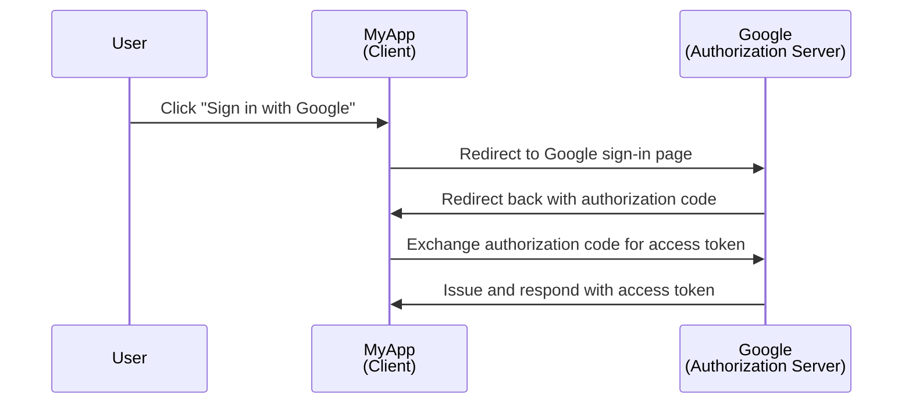
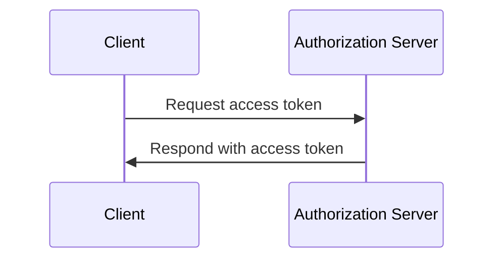

## Qu'est-ce qu'un client ?

Un client, dans le contexte de <Ref slug="oauth-2.0" /> et <Ref slug="openid-connect" />, est une application qui demande une authentication ou une authorization. Par exemple, lorsqu'un utilisateur clique sur "Se connecter avec Google" sur une application, l'application agit comme un **client** qui demande une authorization à Google.

> "Client" et "application" sont souvent utilisés de manière interchangeable dans le contexte de <Ref slug="iam" />.

Il existe plusieurs catégorisations des clients basées sur leurs capacités et niveaux de confiance, mais pour les frameworks, une distinction significative est entre clients publics et clients confidentiels. Cela affecte la façon dont le client peut obtenir des tokens et les types de grant qu'il peut utiliser.

### Clients publics ||public-clients||

Les clients publics sont des applications qui ne peuvent pas garder leurs identifiants confidentiels, ce qui signifie que le resource owner (propriétaire des ressources) (utilisateur) peut y accéder. Les exemples de clients publics incluent :

- Applications monopage (SPAs)
- Applications mobiles
- Applications de bureau

Vous pouvez argumenter que les applications mobiles et de bureau ont des capacités de stockage sécurisé, mais la plupart des frameworks les considèrent comme des clients publics parce qu'elles sont distribuées aux utilisateurs finaux et il est supposé que ces derniers peuvent accéder aux identifiants.

### Clients confidentiels ||confidential-clients||

Les clients confidentiels (privés) sont des applications qui peuvent stocker de manière confidentielle des informations sensibles sans les exposer aux resource owners (utilisateurs finaux). Les exemples de clients confidentiels incluent :

- Serveurs web
- Services backend

## Comment fonctionne un client ?

### Authentication (Authentification) et authorization (autorisation) de l'utilisateur

Lorsqu'un client souhaite authentifier un utilisateur, un client initie une <Ref slug="authorization-request" /> vers le <Ref slug="authorization-server" /> pour obtenir un <Ref slug="access-token" />. Le client doit inclure les paramètres nécessaires dans la requête, tels que le client ID, le redirect URI, et les scopes. Voici un diagramme de séquence simplifié du authorization code flow :

Dans cet exemple, Google agit comme le **authorization server** qui émet un access token au **client** (MyApp) après que l'utilisateur se soit connecté avec succès. Le client peut ensuite utiliser l'**access token** pour récupérer le profil de l'utilisateur (ressource protégée) sur Google.

Pour les clients OpenID Connect (OIDC), le client doit initier une <Ref slug="authentication-request" /> pour authentifier l'utilisateur. Cela utilise le même endpoint que la authorization request, mais les paramètres et la réponse sont différents.

### Communication machine-to-machine

Pour la communication <Ref slug="machine-to-machine" />, le client peut utiliser le <Ref slug="client-credentials-flow" /> pour envoyer directement une <Ref slug="token-request" /> au authorization server. Le client doit inclure le client ID, le client secret et les scopes dans la requête. Voici un diagramme de séquence simplifié du client credentials flow :

Le authorization server validera les client credentials et émettra un access token si le client est autorisé. Étant donné que le client doit envoyer le client secret, il est important d'utiliser le client credentials flow uniquement pour les clients confidentiels.

## Considérations de sécurité

### Types de clients

Le type de client (public ou privé) affecte les considérations de sécurité pour le client.

- Les clients publics ne doivent pas utiliser le client credentials flow car ils ne peuvent pas stocker en toute sécurité le client secret. Au lieu de cela, le <Ref slug="authorization-code-flow" /> avec <Ref slug="pkce" /> est recommandé pour authentifier les utilisateurs des clients publics.
- Les clients confidentiels peuvent utiliser le client credentials flow pour la communication machine-to-machine. Ils doivent stocker en toute sécurité le client secret et l'utiliser uniquement dans des environnements sécurisés.

### Stockage des tokens

Les clients doivent utiliser le plus haut niveau de sécurité possible pour stocker les tokens. Par exemple, dans les applications web, les cookies HTTP-only sont recommandés pour stocker les access tokens afin de prévenir les attaques XSS.

### Expiration des tokens

Les access tokens ont une durée de vie limitée pour réduire le risque d'accès non autorisé. Les clients doivent gérer l'expiration des tokens de manière appropriée en utilisant des <Ref slug="refresh-token">refresh tokens</Ref> pour obtenir de nouveaux access tokens.

### Révocation des tokens

Les clients doivent être préparés à gérer la révocation des tokens. Si l'utilisateur se déconnecte ou si le authorization server révoque le token, le client doit effacer le token du stockage côté client.

<SeeAlso slugs={["oauth-2.0", "oauth-2.0-grant", "openid-connect", "authorization-request", "authentication-request"]} />

<Resources
  urls={[
    "https://blog.logto.io/secure-cloud-apps-with-oauth-and-openid-connect",
    "https://datatracker.ietf.org/doc/html/rfc6749",
    "https://openid.net/specs/openid-connect-core-1_0.html"
  ]}
/>
