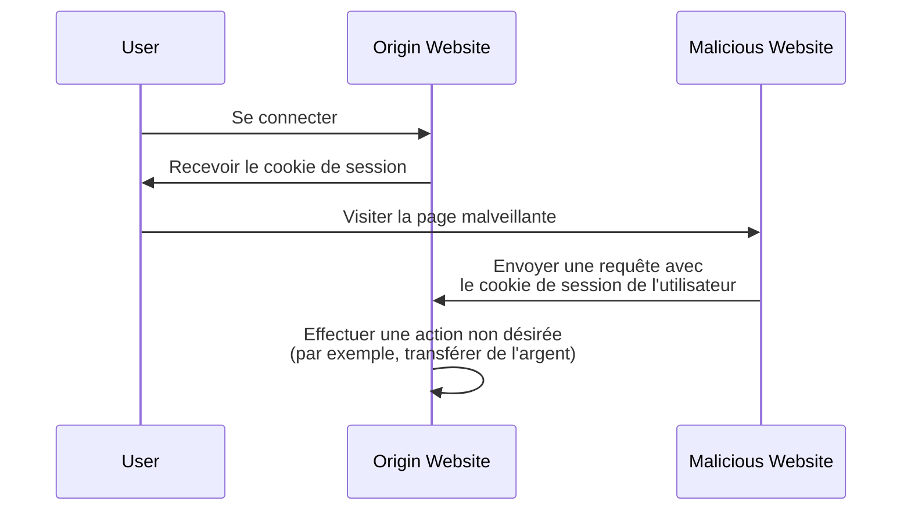

## Qu'est-ce que la contrefaçon de requête intersites (CSRF) ?

Lors du développement d'applications web, le CSRF est un terme souvent entendu qui suscite la crainte chez les développeurs et les professionnels de la sécurité. Il s'agit d'un type d'attaque qui trompe (ou manipule) les utilisateurs authentifiés pour qu'ils exécutent des actions non désirées sur une application web sans leur consentement.

Le CSRF est également connu sous le nom de "one-click attack" ou "session riding" car il s'appuie sur la session active de l'utilisateur pour effectuer des actions malveillantes.

## Comment fonctionne le CSRF ?

L'attaque CSRF fonctionne en exploitant la confiance qu'une application web a dans le navigateur de l'utilisateur. Voici comment cela se produit généralement :



Vous pouvez avoir certaines questions sur cette séquence. Explorons les raisons sous-jacentes.

### Pourquoi le site malveillant peut-il envoyer une requête au site d'origine ?

La Politique de même origine (SOP) est une fonctionnalité de sécurité dans les navigateurs web qui restreint la manière dont un document ou un script chargé depuis une origine peut interagir avec une ressource (par exemple, cookies, DOM) d'une autre origine. Cependant, la SOP n'empêche pas le navigateur d'envoyer des requêtes vers une autre origine.

Ainsi, bien que le site malveillant ne puisse pas directement lire ou modifier le cookie de session, il peut toujours envoyer des requêtes au site d'origine en utilisant la session active de l'utilisateur.

Vous pourriez argumenter que la plupart des applications web utilisent également [CORS](https://developer.mozilla.org/en-US/docs/Web/HTTP/CORS) pour empêcher les requêtes inter-origine non autorisées, mais le CSRF a encore un moyen de le contourner :

1. Attaques basées sur GET : Le site malveillant peut tromper l'utilisateur en visitant une URL qui effectue une action sur le site d'origine :

    - Une redirection vers `https://example.com/transfer?amount=1000&to=attacker`.
    - Une balise image qui charge `https://example.com/transfer?amount=1000&to=attacker`.

    C'est une raison importante pour laquelle les requêtes GET ne devraient pas avoir d'effets secondaires.

2. Attaques basées sur des formulaires : Le site malveillant peut créer un formulaire caché qui soumet des données au site d'origine. Par exemple, une requête POST à `https://example.com/transfer` avec des champs de formulaire cachés.

### Pourquoi le site malveillant a-t-il le cookie de session de l'utilisateur ?

Le navigateur de l'utilisateur envoie automatiquement des cookies au site d'origine lors de l'envoi de requêtes. C'est ainsi que le site d'origine sait que l'utilisateur est authentifié et peut effectuer des actions en son nom.

En fait, le site malveillant n'"a" pas le cookie de session ; il exploite simplement le comportement du navigateur pour envoyer le cookie avec la requête.

## Comment prévenir les attaques CSRF ?

Prévenir les attaques CSRF nécessite une approche à plusieurs niveaux impliquant à la fois le serveur et le client. Voici quelques techniques courantes pour atténuer les vulnérabilités CSRF :

### Utiliser des jetons anti-CSRF

Les jetons anti-CSRF sont des valeurs aléatoires qui sont générées par le serveur et incorporées dans les formulaires de l'application web. Lorsque le formulaire est soumis, le serveur valide le jeton pour s'assurer que la requête est légitime.

Par exemple, un champ input caché dans un formulaire HTML :

```html
<form action="/transfer" method="post">
  <input type="hidden" name="csrf_token" value="random_token_here" />
  <!-- Autres champs de formulaire -->
  <button type="submit">Transférer</button>
</form>
```

Avec cette approche, le site malveillant ne peut pas forger une requête car il ne connaît pas le jeton anti-CSRF. Le paramètre `state` dans <Ref slug="redirect-uri" /> est un concept similaire.

### Utiliser des cookies SameSite

L'attribut `SameSite` dans les cookies peut prévenir les attaques CSRF en restreignant quand les cookies sont envoyés au serveur :

| Valeur `SameSite` | Description                                                                          |
|-------------------|--------------------------------------------------------------------------------------|
| `Strict`          | Les cookies sont uniquement envoyés dans un contexte de première partie.             |
| `Lax`             | Les cookies sont envoyés dans un contexte de première partie et avec des requêtes GET de sites externes. |
| `None`            | Les cookies sont envoyés dans tous les contextes. Nécessite l'attribut `Secure`.      |

En définissant l'attribut `SameSite` sur `Strict` ou `Lax` sans effets secondaires dans vos requêtes GET, vous pouvez prévenir les attaques CSRF.

De plus, l'attribut `Secure` devrait toujours être défini pour s'assurer que le cookie est uniquement envoyé via des connexions HTTPS.

### Vérifier les en-têtes

1. **En-tête Origin** : L'en-tête `Origin` est envoyé par le navigateur pour indiquer l'origine de la requête. Le serveur peut vérifier cet en-tête pour s'assurer que la requête provient d'une origine attendue.
2. **En-tête Referer** : L'en-tête `Referer` contient l'URL de la page précédente. Bien qu'il puisse être usurpé, il peut toujours être utilisé comme une couche de protection supplémentaire.

<SeeAlso slugs={["authorization-code-flow", "redirect-uri"]} />

<Resources
  urls={[
    'https://blog.logto.io/csrf',
    "https://cheatsheetseries.owasp.org/cheatsheets/Cross-Site_Request_Forgery_Prevention_Cheat_Sheet.html",
  ]}
/>
